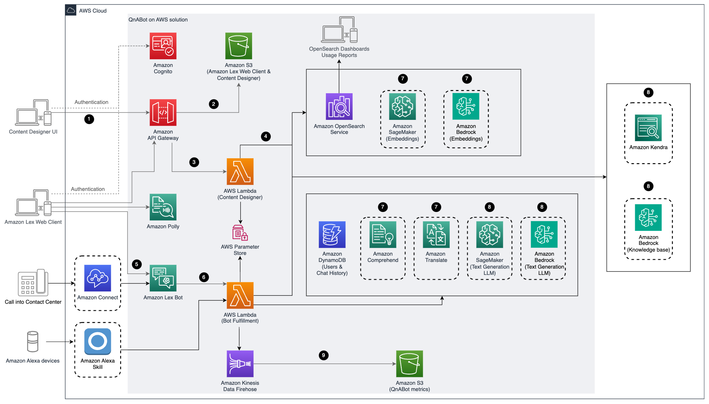

# QnABot on AWS

## Overview

QnABot on AWS is a multi-channel, multi-language conversational interface (chatbot) that responds to your customer’s questions, answers, and feedback. It allows you to deploy a fully functional chatbot across multiple channels including chat, voice, SMS, and Amazon Alexa. The solution’s content management environment, and contact center integration wizard allow you to set up and customize an environment that provides the following benefits:

-   Enhance your customer’s experience by providing personalized tutorials and question and answer support with intelligent multi-part interaction

-   Reduce call center wait times by automating customer support workflows

-   Implement the latest machine learning technology to create engaging, human-like interactions for chatbots

## Architecture Overview

Deploying this solution with the default parameters deploys the following components in your AWS account (bordered components are optional).



Figure 1: QnABot on AWS architecture

The high-level process flow for the solution components deployed with the AWS CloudFormation template is as follows:

1.	The admin deploys the solution into their AWS account, opens the Content Designer UI or [Amazon Lex](https://aws.amazon.com/lex/) web client, and uses [Amazon Cognito](https://aws.amazon.com/cognito/) to authenticate.

2. After authentication, [Amazon API Gateway](http://aws.amazon.com/api-gateway/) and [Amazon S3](http://aws.amazon.com/s3/) deliver the contents of the Content Designer UI.

3. The admin configures questions and answers in the Content Designer and the UI sends requests to Amazon API Gateway to save the questions and answers.

4. The `Content Designer` [AWS Lambda](http://aws.amazon.com/lambda/) function saves the input in [Amazon OpenSearch Service](http://aws.amazon.com/opensearch-service/) in a questions bank index. If using [text embeddings](source/docs/semantic_matching_using_LLM_embeddings/README.md), these requests will first pass through a LLM model hosted on [Amazon Bedrock](https://aws.amazon.com/bedrock/) or [Amazon SageMaker](https://aws.amazon.com/sagemaker/) to generate embeddings before being saved into the question bank on OpenSearch.

5. Users of the chatbot interact with Amazon Lex via the web client UI, [Amazon Alexa](https://developer.amazon.com/en-US/alexa) or [Amazon Connect](https://aws.amazon.com/connect/).

6. Amazon Lex forwards requests to the `Bot Fulfillment` AWS Lambda function. Users can also send requests to this Lambda function via Amazon Alexa devices.

7. The `Bot Fulfillment` AWS Lambda function takes the users input and uses [Amazon Comprehend](https://aws.amazon.com/comprehend/) and [Amazon Translate](https://aws.amazon.com/translate/) (if necessary) to translate non-Native Language requests to the Native Language selected by the user during the deployment and then looks up the answer in in Amazon OpenSearch Service. If using LLM features such as [text generation](source/docs/LLM_Retrieval_and_generative_question_answering/README.md) and  [text embeddings](source/docs/semantic_matching_using_LLM_embeddings/README.md), these requests will first pass through various LLM model hosted on Amazon Bedrock or Amazon SageMaker to generate the search query and embeddings to compare with those saved in the question bank on OpenSearch.

8.	If an [Amazon Kendra](https://aws.amazon.com/kendra/) index is [configured for fallback](source/docs/Kendra_Fallback_README.md), then the `Bot Fulfillment` AWS Lambda function forwards the request to Kendra if no match is returned from the OpenSearch question bank. The text generation LLM can optionally be used to create the search query and to synthesize a response from the returned document excerpts. Alternatively, if a [Bedrock Knowledge Base](https://aws.amazon.com/bedrock/knowledge-bases/) ID is [configured](source/docs/LLM_Retrieval_and_generative_question_answering/README.md), then the `Bot Fulfillment` AWS Lambda function forwards the request to the Bedrock Knowledge Base if no match is returned from the OpenSearch question bank. The `Bot Fulfillment` AWS Lambda function leverages the RetrieveAndGenerate API to fetch the relevant results for an user query, augment the foundational model's prompt and return the response.

9. User interactions with the `Bot Fulfillment` function generate logs and metrics data, which is sent to [Amazon Kinesis Data Firehose](http://aws.amazon.com/kinesis/data-firehose/) then to Amazon S3 for later data analysis.

Refer to the [implementation guide](https://docs.aws.amazon.com/solutions/latest/qnabot-on-aws) for detailed instructions on deploying QnABot in your AWS account.

Alternatively, if you want to custom deploy QnABot on AWS, refer to the details below.

## Custom deployment of QnABot on AWS

### Environment Prerequisites

-   Run Linux. (tested on Amazon Linux)
-   Install npm >10.0.0 and node >18.X.X ([instructions](https://nodejs.org/en/download/))
-   Install and configure git lfs ([instructions](https://git-lfs.com/))
-   Clone this repo.
-   Set up an AWS account. ([instructions](https://AWS.amazon.com/free/))
-   Configure AWS CLI and a local credentials file. ([instructions](https://docs.AWS.amazon.com/cli/latest/userguide/cli-chap-welcome.html))

### Build a version

Navigate to the root directory of QnABot (directory will be created once you have cloned this repo).

Start from the /source directory.

```shell
cd source
```

Install node.js modules of QnABot:

```shell
npm install
```

Next, set up your configuration file:

```shell
npm run config
```

now edit `config.json` for the following parameters:

| param              | description                                                                 |
| ------------------ | --------------------------------------------------------------------------- |
| region             | the AWS region to launch stacks in                                          |
| profile            | the AWS credential profile to use                                           |
| namespace          | a logical name space to run your templates in such as dev, test and/or prod |
| devEmail(required) | the email to use when creating admin users in automated stack launches      |

Next, use the following command to launch a CloudFormation template to create the S3 bucket to be used for Lambda code and CloudFormation templates. Wait for this template to complete (you can watch progress from the command line or [AWS CloudFormation console](https://console.AWS.amazon.com/cloudformation/home))

```shell
npm run bootstrap
```

Finally, use the following command to launch template to deploy the QnABot in your AWS account. When the stack has completed you will be able to log into the Designer UI (The URL is an output of the template). A temporary password to the email in your config.json:

```shell
npm run up
```

If you have an existing stack you can run the following to update your stack:

```shell
npm run update
```

## Testing

### Running Unit Tests

To run unit tests execute the following command from the root folder:

```shell
npm test
```

To update the test snapshots when modifying the /website or /templates directory, execute the following command:

```shell
npm run test:update:snapshot
```

### Running Regression Tests

**NOTE: Running regression tests will create, modify, and delete content and settings from the Content Designer. Only run regression tests on non-production bots where loss or modification of content and settings is acceptable.**

This runs integration tests against a deployed QnABot deployment in your account. Before running the tests follow the above steps to build and deploy a version or deploy using the template from the QnABot landing page: [Launch QnABot](https://docs.aws.amazon.com/solutions/latest/qnabot-on-aws/step-1-launch-the-stack.html). 


1. Start from the /.nightswatch directory:
```bash
cd .nightswatch
```

2. Install the dependencies of the automated testing:

```bash
brew install python@3
brew install geckodriver
brew install --cask chromedriver
pip3 install virtualenv
```

3. Set up a virtual environment for testing, and install the project dependencies into it.

```bash
python3 -m virtualenv venv
source ./venv/bin/activate
pip install -r requirements.txt
```

4. Ensure you are logged in to the AWS CLI.

Set the following environment variables to point to the a QnA Bot deployment under test:

```bash
export CURRENT_STACK_REGION='<QNA BOT Region>'
export CURRENT_STACK_NAME='<QNA BOT Cloudformation Stack Name>'
export EMAIL='<admin user e-mail>
```

Optionally provide a username and password for an Admin user to test with. If these environment variables are not set then a default 'QnaAdmin' user will be created during the initial test. If you want to run a specific test then provide a username since the default user will only be created in the initial test.

```bash
export USER='<QNA BOT existing admin user>'
export PASSWORD='<QNA BOT existing admin password>'
```

If you'd like to launch the browser while running tests then also set the below env variable:

```bash
export HEADLESS_BROWSER='false'
```

If you'd like to see to start and end time for each test:

```bash
export TIMESTAMPS='true'
```

If you want to use a specific AWS profile for the test. If not set, the regression test will use the current AWS session that it's running in.

```bash
export TEST_ACCOUNT_PROFILE_NAMES='<AWS profile name>'
```

5. The LLM and Kendra tests will only run if the deployed bot has these features enabled. Follow the steps in the Implementation Guide to enable these features to test them:
 - LLM
   - Set LLMApi to SAGEMAKER. For more information, please [Enabling LLM support](https://docs.aws.amazon.com/solutions/latest/qnabot-on-aws/enabling-llm-support.html). If stack update fails, check your quota for __ml.g5.12xlarge for endpoint__ usage as mentioned in the note of this article.
 - Kendra 
   - Create an index and note the Index ID. For IAM role, you can create a custom new role for this from the dropdown. [Creating an index](https://docs.aws.amazon.com/kendra/latest/dg/create-index.html)
   - Update deployed stack's parameters KendraWebPageIndexId, KendraFaqIndexId and AltSearchKendraIndexes with Index ID created in the previous step.

6. Run the regression tests from within the test folder:

```bash
cd functional
pytest -v
```

## Publishing
Power users interested in releasing a custom QnABot can use the following instructions for publishing the deployment artifacts available to external users.

Create an S3 bucket to host the templates from (see $DIST_OUTPUT_BUCKET below). You will also need regional buckets for each region your users will deploy from. The regional buckets must be named $DIST_OUTPUT_BUCKET-$AWS_REGION. You will need to provide appropriate access permissions to the buckets for your targeted users. Please refer to the below links for buckets security and access control best practices:
- https://docs.aws.amazon.com/AmazonS3/latest/userguide/access-control-block-public-access.html#access-control-block-public-access-policy-status
- https://docs.aws.amazon.com/AmazonS3/latest/userguide/access-control-best-practices.html
- https://docs.aws.amazon.com/AmazonS3/latest/userguide/security.html

**NOTE: All buckets must have versioning enabled, otherwise the stack will fail to deploy.**

Set the following environment variables for your custom QnABot:

```shell
export DIST_OUTPUT_BUCKET='<name of the bucket to upload artifacts to>'
export SOLUTION_NAME='<name of your custom bot>'
export VERSION='<bot version>'
export AWS_REGIONS=("us-east-1" "us-west-2" "ap-southeast-1" "ap-southeast-2" "ca-central-1" "eu-west-1" "ap-northeast-1" "eu-central-1" "eu-west-2" "ap-northeast-2")
```

The above variables will determine the bucket URL path where your bot will be hosted from. The AWS_REGIONS array is a list of all regions QnABot supports. The list can be modified as necessary if your bot version will not be deployed in certain regions.

Run the following commands to upload the current local version to the specified bucket:
```shell
cd deployment
./build-s3-dist.sh $DIST_OUTPUT_BUCKET $SOLUTION_NAME $VERSION
aws s3 cp global-s3-assets/  s3://$DIST_OUTPUT_BUCKET/$SOLUTION_NAME/$VERSION/ --recursive --acl bucket-owner-full-control
```

Create S3 buckets for each region if they do not already exist. These buckets will need to be configured for public use:
```shell
for region in "${AWS_REGIONS[@]}";
do
  if aws s3api head-bucket --bucket "$DIST_OUTPUT_BUCKET-$region" 2>/dev/null
  then 
    echo "Bucket exists: s3://$DIST_OUTPUT_BUCKET-$region"
  else 
    aws s3api create-bucket --bucket "$DIST_OUTPUT_BUCKET-$region"
    echo "Created bucket: s3://$DIST_OUTPUT_BUCKET-$region"
  fi
done
```

Run the below command for each region:
```shell
for region in "${AWS_REGIONS[@]}";
do
  if aws s3api head-bucket --bucket "$DIST_OUTPUT_BUCKET-$region" 2>/dev/null
  then 
    aws s3 cp regional-s3-assets/ s3://$DIST_OUTPUT_BUCKET-$region/$SOLUTION_NAME/$VERSION/ --recursive --acl bucket-owner-full-control 
  else 
    echo "Bucket not found: s3://$DIST_OUTPUT_BUCKET-$region"
  fi
done

```

The template can be deployed from the following URL for all regions:
```shell
echo https://$DIST_OUTPUT_BUCKET.s3.amazonaws.com/$SOLUTION_NAME/$VERSION/qnabot-on-aws-main.template
```

### Publishing best practices
1. Never overwrite a published artifact when it is available to external users. Increment the version to upload new artifacts and keep previous versions immutable. Enable bucket versioning to recover artifacts. You may also decide to have a 'latest' version which will always contain the latest version of your bot.
1. After uploading the artifacts, deploy and test from the S3 URL before releasing to any external users.

## Run Webpack in Development Mode

In order to run Webpack in Development Mode, make sure to have the following
- Existing deployment of QnABot on AWS

Navigate to the root directory of QnABot (directory will be created once you have cloned this repo).

```shell
npm install
```

Next, assign the environment variable, `ASSET_BUCKET_NAME` located in package.json in the npm script `dev mode`. This is the name of the bucket QnABot loads ./website assets to and is usually named \<stack-name\>-bucket-\<randomly-generated-chars\>.

Once set up correctly, run
```shell
npm run dev-mode
```

This should set Webpack to development mode and upload assets in ./website/build to `ASSET_BUCKET_NAME`. This will also watch for any changes in ./website and reload assets into your bucket if the assets change.

## Designer UI Compatibility

Currently the only browsers supported are:

-   Chrome
-   Firefox

## Built With

-   [Vue](https://vuejs.org/)
-   [Webpack](https://webpack.github.io/)

## License

Refer to [LICENSE.txt](LICENSE.txt) file for details.

## New features

Refer to [CHANGELOG.md](CHANGELOG.md) file for details of new features in each version.

A [workshop](https://qnabot.workshop.aws) is also available that walks you through QnABot features.

## QnABot Deployable Solution Versions

As QnABot evolves over the years, it makes use of various services and functionality which may go in and out of support. This section serves as a reference to the deployable solution versions along with links to their Public and VPC CloudFormation templates.

_Note: **Deployable solution versions** refers to the ability to deploy the version of QnABot in their AWS accounts. **Actively supported versions** for QnABot is only available for the latest version of QnABot._

### Deployable Versions
- [v6.0.0](https://github.com/aws-solutions/qnabot-on-aws/releases/tag/v6.0.0) - [Public](https://solutions-reference.s3.amazonaws.com/qnabot-on-aws/v6.0.0/qnabot-on-aws-main.template)/[VPC](https://solutions-reference.s3.amazonaws.com/qnabot-on-aws/v6.0.0/qnabot-on-aws-vpc.template)
- [v5.5.2](https://github.com/aws-solutions/qnabot-on-aws/releases/tag/v5.5.2) - [Public](https://solutions-reference.s3.amazonaws.com/qnabot-on-aws/v5.5.2/qnabot-on-aws-main.template)/[VPC](https://solutions-reference.s3.amazonaws.com/qnabot-on-aws/v5.5.2md/qnabot-on-aws-vpc.template)
  - We recommend to upgrade to this version as it fixes an issue with the testall functionality which may introduce a high number of versions stored in the testall S3 bucket when Content Designer has no Q&As.
- [v5.5.1](https://github.com/aws-solutions/qnabot-on-aws/releases/tag/v5.5.1) - [Public](https://solutions-reference.s3.amazonaws.com/qnabot-on-aws/v5.5.1/qnabot-on-aws-main.template)/[VPC](https://solutions-reference.s3.amazonaws.com/qnabot-on-aws/v5.5.1/qnabot-on-aws-vpc.template)
- [v5.5.0](https://github.com/aws-solutions/qnabot-on-aws/releases/tag/v5.5.0) - [Public](https://solutions-reference.s3.amazonaws.com/qnabot-on-aws/v5.5.0/qnabot-on-aws-main.template)/[VPC](https://solutions-reference.s3.amazonaws.com/qnabot-on-aws/v5.5.0/qnabot-on-aws-vpc.template)
  - _Vue has been upgraded from Vue 2 to 3. We highly recommend to use or upgrade to this version due to Vue 2 reaching End of Life (EOL), which affects all previous versions of QnABot. For more information, see [below](#upcomingrecent-deprecations)._
- [v5.4.5](https://github.com/aws-solutions/qnabot-on-aws/releases/tag/v5.4.5) - [Public](https://solutions-reference.s3.amazonaws.com/qnabot-on-aws/v5.4.5/qnabot-on-aws-main.template)/[VPC](https://solutions-reference.s3.amazonaws.com/qnabot-on-aws/v5.4.5/qnabot-on-aws-vpc.template)
  - _For those upgrading from `v5.4.X` to later versions, if you are upgrading from a deployment with LLMApi set to SAGEMAKER then set this value to DISABLED before upgrading. After upgrading, return this value back to SAGEMAKER._
- [v5.4.4](https://github.com/aws-solutions/qnabot-on-aws/releases/tag/v5.4.4) - [Public](https://solutions-reference.s3.amazonaws.com/qnabot-on-aws/v5.4.4/qnabot-on-aws-main.template)/[VPC](https://solutions-reference.s3.amazonaws.com/qnabot-on-aws/v5.4.4/qnabot-on-aws-vpc.template)
- [v5.4.3](https://github.com/aws-solutions/qnabot-on-aws/releases/tag/v5.4.3) - [Public](https://solutions-reference.s3.amazonaws.com/qnabot-on-aws/v5.4.3/qnabot-on-aws-main.template)/[VPC](https://solutions-reference.s3.amazonaws.com/qnabot-on-aws/v5.4.3/qnabot-on-aws-vpc.template)
  - _We do not recommend to use this version due to a potential issue with the testall functionality which may introduce a high number of versions stored in the testall S3 bucket. Please use the latest version available._
- [v5.4.2](https://github.com/aws-solutions/qnabot-on-aws/releases/tag/v5.4.2) - [Public](https://solutions-reference.s3.amazonaws.com/qnabot-on-aws/v5.4.2/qnabot-on-aws-main.template)/[VPC](https://solutions-reference.s3.amazonaws.com/qnabot-on-aws/v5.4.2/qnabot-on-aws-vpc.template)
  - _We do not recommend to use this version due to a potential issue with the testall functionality which may introduce a high number of versions stored in the testall S3 bucket. Please use the latest version available._
- [v5.4.1](https://github.com/aws-solutions/qnabot-on-aws/releases/tag/v5.4.1) - [Public](https://solutions-reference.s3.amazonaws.com/qnabot-on-aws/v5.4.1/qnabot-on-aws-main.template)/[VPC](https://solutions-reference.s3.amazonaws.com/qnabot-on-aws/v5.4.1/qnabot-on-aws-vpc.template)
- [v5.4.0](https://github.com/aws-solutions/qnabot-on-aws/releases/tag/v5.4.0) - [Public](https://solutions-reference.s3.amazonaws.com/qnabot-on-aws/v5.4.0/qnabot-on-aws-main.template)/[VPC](https://solutions-reference.s3.amazonaws.com/qnabot-on-aws/v5.4.0/qnabot-on-aws-vpc.template)
  - _Note: Lambda Runtimes have been updated this release. Solution now uses: [nodejs18 and python3.10]_
- [v5.3.4](https://github.com/aws-solutions/qnabot-on-aws/releases/tag/v5.3.4) - [Public](https://solutions-reference.s3.amazonaws.com/qnabot-on-aws/v5.3.4/qnabot-on-aws-main.template)/[VPC](https://solutions-reference.s3.amazonaws.com/qnabot-on-aws/v5.3.4/qnabot-on-aws-vpc.template)
- [v5.3.3](https://github.com/aws-solutions/qnabot-on-aws/releases/tag/v5.3.3) - [Public](https://solutions-reference.s3.amazonaws.com/qnabot-on-aws/v5.3.3/qnabot-on-aws-main.template)/[VPC](https://solutions-reference.s3.amazonaws.com/qnabot-on-aws/v5.3.3/qnabot-on-aws-vpc.template)
- [v5.3.2](https://github.com/aws-solutions/qnabot-on-aws/releases/tag/v5.3.2) - [Public](https://solutions-reference.s3.amazonaws.com/qnabot-on-aws/v5.3.2/qnabot-on-aws-main.template)/[VPC](https://solutions-reference.s3.amazonaws.com/qnabot-on-aws/v5.3.2/qnabot-on-aws-vpc.template)
- [v5.3.1](https://github.com/aws-solutions/qnabot-on-aws/releases/tag/v5.3.1) - [Public](https://solutions-reference.s3.amazonaws.com/qnabot-on-aws/v5.3.1/qnabot-on-aws-main.template)/[VPC](https://solutions-reference.s3.amazonaws.com/qnabot-on-aws/v5.3.1/qnabot-on-aws-vpc.template)
- [v5.3.0](https://github.com/aws-solutions/qnabot-on-aws/releases/tag/v5.3.0) - [Public](https://solutions-reference.s3.amazonaws.com/qnabot-on-aws/v5.3.0/qnabot-on-aws-main.template)/[VPC](https://solutions-reference.s3.amazonaws.com/qnabot-on-aws/v5.3.0/qnabot-on-aws-vpc.template)
- [v5.2.7](https://github.com/aws-solutions/qnabot-on-aws/releases/tag/v5.2.7) - [Public](https://solutions-reference.s3.amazonaws.com/qnabot-on-aws/v5.2.7/qnabot-on-aws-main.template)/[VPC](https://solutions-reference.s3.amazonaws.com/qnabot-on-aws/v5.2.7/qnabot-on-aws-vpc.template)
- [v5.2.6](https://github.com/aws-solutions/qnabot-on-aws/releases/tag/v5.2.6) - [Public](https://solutions-reference.s3.amazonaws.com/qnabot-on-aws/v5.2.6/qnabot-on-aws-main.template)/[VPC](https://solutions-reference.s3.amazonaws.com/qnabot-on-aws/v5.2.6/qnabot-on-aws-vpc.template)
- [v5.2.5](https://github.com/aws-solutions/qnabot-on-aws/releases/tag/v5.2.5) - [Public](https://solutions-reference.s3.amazonaws.com/qnabot-on-aws/v5.2.5/qnabot-on-aws-main.template)/[VPC](https://solutions-reference.s3.amazonaws.com/qnabot-on-aws/v5.2.5/qnabot-on-aws-vpc.template)
- [v5.2.4](https://github.com/aws-solutions/qnabot-on-aws/releases/tag/v5.2.4) - [Public](https://solutions-reference.s3.amazonaws.com/qnabot-on-aws/v5.2.4/qnabot-on-aws-main.template)/[VPC](https://solutions-reference.s3.amazonaws.com/qnabot-on-aws/v5.2.4/qnabot-on-aws-vpc.template)
- [v5.2.3](https://github.com/aws-solutions/qnabot-on-aws/releases/tag/v5.2.3) - [Public](https://solutions-reference.s3.amazonaws.com/qnabot-on-aws/v5.2.3/qnabot-on-aws-main.template)/[VPC](https://solutions-reference.s3.amazonaws.com/qnabot-on-aws/v5.2.3/qnabot-on-aws-vpc.template)
- [v5.2.2](https://github.com/aws-solutions/qnabot-on-aws/releases/tag/v5.2.2) - [Public](https://solutions-reference.s3.amazonaws.com/qnabot-on-aws/v5.2.2/qnabot-on-aws-main.template)/[VPC](https://solutions-reference.s3.amazonaws.com/qnabot-on-aws/v5.2.2/qnabot-on-aws-vpc.template)
- [v5.2.1](https://github.com/aws-solutions/qnabot-on-aws/releases/tag/v5.2.1) - [Public](https://solutions-reference.s3.amazonaws.com/qnabot-on-aws/v5.2.1/qnabot-on-aws-main.template)/[VPC](https://solutions-reference.s3.amazonaws.com/qnabot-on-aws/v5.2.1/qnabot-on-aws-vpc.template)
  - _Note: Lambda Runtimes have been updated this release. Solution now uses: [nodejs16 and python3.9]_

### Undeployable Versions
- All solutions less than `v5.2.1` are no longer deployable due to Lambda Runtime deprecations.

### Upcoming/Recent deprecations
- nodejs16 will enter [Phase 1 deprecation](https://docs.aws.amazon.com/lambda/latest/dg/lambda-runtimes.html#runtime-support-policy) on Mar 11, 2024.
- Vue 2 will reach [End of Life](https://v2.vuejs.org/lts/) (EOL) on December 31st, 2023.

### Why would a solution version no longer be deployable?
For QnABot, the most common reason is due to [AWS Lambda Runtimes being deprecated](https://docs.aws.amazon.com/lambda/latest/dg/lambda-runtimes.html#runtime-support-policy). When a Lambda runtime has been marked as deprecated, customers can no longer create new Lambda functions in their AWS account. This means that older versions of our solutions that make use of those runtimes will fail to deploy. This makes it hard for the community to provide support as we are unable to deploy a similar environment to investigate issues and reproduce bug reports.

### What should I do if my version of the solution is no longer deployable?
If you've currently got an existing deployment working for you, there is nothing requiring you to update. However, it is **_strongly_** recommended that you build a plan to test and migrate production deployments to a supported version. The further away a deployment gets from `latest` the greater risk it is at to experiencing instability (especially with regards to deployment).

And for those looking to get started with the solution for the first time, it is always recommended you use the latest version. It is the most secure, stable, and feature-rich version of QnABot!

### How do I update my solution version?
In most cases, a simple [Update Stack operation](https://docs.aws.amazon.com/solutions/latest/qnabot-on-aws/update-the-solution.html) should allow you to migrate your instance onto a newer version while maintaining your data on the new deployment.

> Note: For those upgrading from `v5.4.X` to later versions, if you are upgrading from a deployment with LLMApi set to SAGEMAKER then set this value to DISABLED before upgrading. After upgrading, return this value back to SAGEMAKER.

The team _**strongly**_ recommends that any upgrades (especially between minor/major versions) first be tested on a non-production instance to check for any regressions. This is critical if you have made custom modifications to your deployment, integrate with external services, or are jumping between multiple versions.

Some additional precautions you can take are:

 - export all of your questions using the Content Designer UI ([instructions](https://docs.aws.amazon.com/solutions/latest/qnabot-on-aws/use-qnabot-on-aws.html#importing-and-exporting-chatbot-answers))
 - export all of your settings using the Content Designer UI (click `Export Settings` at the bottom of settings page)
 - backup DynamoDB table ([instructions](https://docs.aws.amazon.com/solutions/latest/qnabot-on-aws/amazon-dynamodb-backups.html)) 
 - create a manual snapshot of your OpenSearch Domain ([instructions](https://docs.aws.amazon.com/opensearch-service/latest/developerguide/managedomains-snapshots.html))

 ---
## Collection of operational metrics
This solution collects anonymized operational metrics to help AWS improve the quality and features of the solution. For more information, including how to disable this capability, please see the [implementation guide](https://docs.aws.amazon.com/solutions/latest/qnabot-on-aws/general-reference.html).

---

Copyright Amazon.com, Inc. or its affiliates. All Rights Reserved.

Licensed under the Apache License, Version 2.0 (the "License");
you may not use this file except in compliance with the License.
You may obtain a copy of the License at

    http://www.apache.org/licenses/LICENSE-2.0

Unless required by applicable law or agreed to in writing, software
distributed under the License is distributed on an "AS IS" BASIS,
WITHOUT WARRANTIES OR CONDITIONS OF ANY KIND, either express or implied.
See the License for the specific language governing permissions and
limitations under the License.
