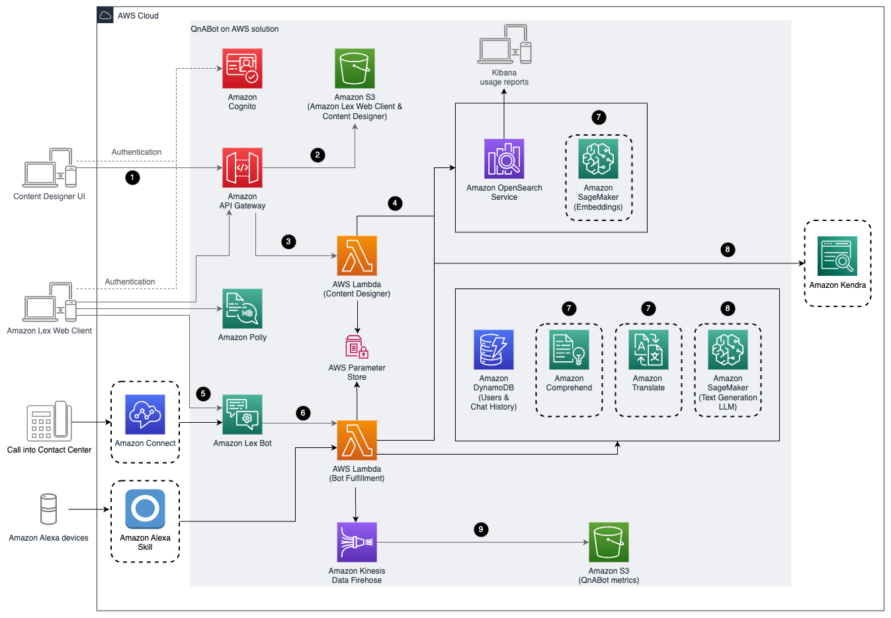

# A Question and Answer Bot Using Amazon Lex and Amazon Alexa

> Build a chat bot to answer questions.

## Overview

This repository contains code for the QnABot, described in the AWS AI blog post [“Creating a Question and Answer Bot with Amazon Lex and Amazon Alexa”](https://aws.amazon.com/blogs/ai/creating-a-question-and-answer-bot-with-amazon-lex-and-amazon-alexa/).

Refer to [Getting Started](#getting-started) to launch your own QnABot, or [Automated Deployment](https://docs.aws.amazon.com/solutions/latest/aws-qnabot/automated-deployment.html) for detailed implementation instructions.

**See all the new features list for 4.7.3** [Fulfillment Lambda Provisioned Concurrency](CHANGELOG.md#473---2021-08-04)

**New features in 4.6.0** [Improved Kendra integration and Kibana dashboards. Additional settings to filter Kendra responses based on confidence levels](CHANGELOG.md#460---2021-04-30).

**New features in 4.5.0** [Kendra Web Crawler, Comprehend PII Detection, Translate Custom Terminology, Increased deployment regions](CHANGELOG.md#450---2021-03-07).

## Architecture Overview

 
The AWS CloudFormation template deploys the following workflows and services:

1. The admin deploys the solution into their AWS account, opens the Content Designer UI, and uses Amazon Cognito to authenticate.

2. After authentication, Amazon CloudFront
and Amazon S3 deliver the contents of the Content Designer UI.

3. The admin configures questions and answers in the Content Designer and the UI sends requests to Amazon API Gateway to save the questions and answers.

4. The Content Designer AWS Lambda
function saves the input in Amazon OpenSearch Service (successor to Amazon ElasticSearch Service) in a questions bank index.

5. Users of the chatbot interact with Amazon Lex via the web client UI or Amazon Connect.

6. Amazon Lex forwards requests to the AWS Lambda (Bot Fulfillment) function. (Users can also send requests to this Lambda function via Amazon Alexa devices).

7. The Bot Fulfillment function takes the users input and uses Amazon Comprehend
and Amazon Translate (if necessary) to translate non-English requests to English and then looks up the answer in in Amazon OpenSearch Service. If Amazon Kendra index is configured and provided at the time of deployment, the Bot Fulfillment function also sends a request to the Amazon Kendra index.

8. User interactions with Bot Fulfillment functions generate logs and metrics data, which is sent to Amazon Kinesis Data Firehose then to Amazon S3 for later data analysis. 
## Upgrade Notes

During an upgrade, we recommend that existing QnABot content first be exported and downloaded from the Content Designer prior to
the upgrade. In this release we expect upgrade to be smooth but just in case you should always have your QnABot content preserved.

## Prerequisites

- Run Linux. (tested on Amazon Linux)
- Install npm >7.10.0 and node >12.15.1. ([instructions](https://nodejs.org/en/download/))
- Clone this repo.
- Set up an AWS account. ([instructions](https://AWS.amazon.com/free/?sc_channel=PS&sc_campaign=acquisition_US&sc_publisher=google&sc_medium=cloud_computing_b&sc_content=AWS_account_bmm_control_q32016&sc_detail=%2BAWS%20%2Baccount&sc_category=cloud_computing&sc_segment=102882724242&sc_matchtype=b&sc_country=US&s_kwcid=AL!4422!3!102882724242!b!!g!!%2BAWS%20%2Baccount&ef_id=WS3s1AAAAJur-Oj2:20170825145941:s))
- Configure AWS CLI and a local credentials file. ([instructions](https://docs.AWS.amazon.com/cli/latest/userguide/cli-chap-welcome.html))

## Getting Started

Two approaches can be used to get started. Deploy from pre-created repositories or clone the repo and build a version yourself.

### Pre-created deployment

Sign in to the AWS Management Console and select the button to launch
the `aws-qnabot.template` AWS CloudFormation template.
Alternatively, you can download the template as a starting point for your
own implementation. The template launches in the US East (N. Virginia) Region by default. To launch the solution in a
different AWS Region, use the Region selector in the console navigation bar.

<a target="_blank" href="https://us-east-1.console.aws.amazon.com/cloudformation/home?region=us-east-1#/stacks/new?stackName=QnABot&templateURL=https://solutions-reference.s3.amazonaws.com/aws-qnabot/latest/aws-qnabot-main.template"><span></span></a> 

The solution is supported in the following Regions:

| Region   |
|----------|
| Northern Virginia |
| Oregon |
| Ireland |
| Sydney |
| London |
| Frankfurt |
| Singapore |
| Tokyo |
| Canada Central |

### Clone the git repo and build a version

First, install all prerequisites:

```shell
npm install
```

Next, set up your configuration file:

```shell
npm run config
```

now edit config.json with you information.

| param | description |
|-------|-------------|
|region | the AWS region to launch stacks in |
|profile| the AWS credential profile to use |
|namespace| a logical name space to run your templates in such as dev, test and/or prod |
|devEmail(required) | the email to use when creating admin users in automated stack launches |

Next, use the following command to launch a CloudFormation template to create the S3 bucket to be used for lambda code and CloudFormation templates. Wait for this template to complete (you can watch progress from the command line or [AWS CloudFormation console](https://console.AWS.amazon.com/cloudformation/home))

```shell
npm run bootstrap
```

Finally, use the following command to launch template to deploy the QnA bot in your AWS account. When the stack has completed you will be able to log into the Designer UI (The URL is an output of the template). A temporary password to the email in your config.json:

```shell
npm run up
```

If you have an existing stack you can run the following to update your stack:

```shell
npm run update
```

#### Designer UI Compatibility

Currently the only browsers supported are:

- Chrome
- FireFox
We are currently working on adding Microsoft Edge support.

## Built With

- [Vue](https://vuejs.org/)
- [Webpack](https://webpack.github.io/)

## License

Refer to [LICENSE.md](LICENSE.md) file for details.

## New features
Refer to [CHANGELOG.md](CHANGELOG.md) file for details of new features in each version.

A [workshop](https://qnabot.workshop.aws) is available
that will walk you through QnABot features.

## Known Behavior
When deploying the Cloudformation stack rarely, the custom resource creating Amazon OpenSearch Service resources timesout and causes the deployment fail. Deleting the failed deployment and re-deploying the Cloudformation stack fixes this issue.

---

Copyright Amazon.com, Inc. or its affiliates. All Rights Reserved.

Licensed under the Apache License, Version 2.0 (the "License");
you may not use this file except in compliance with the License.
You may obtain a copy of the License at

    http://www.apache.org/licenses/LICENSE-2.0

Unless required by applicable law or agreed to in writing, software
distributed under the License is distributed on an "AS IS" BASIS,
WITHOUT WARRANTIES OR CONDITIONS OF ANY KIND, either express or implied.
See the License for the specific language governing permissions and
limitations under the License.