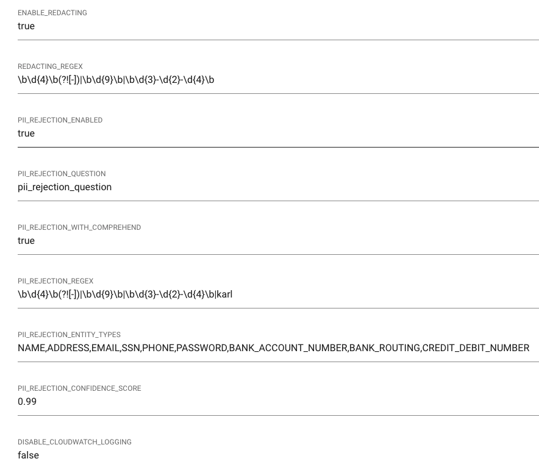

# Personally Identifiable Information Rejection

QnABot can now detect Personally Identifiable Information (PII) using [Amazon Comprehend](https://docs.aws.amazon.com/comprehend/latest/dg/how-pii.html) and regular expressions

Setting | Description |
---------|----------|
 PII_REJECTION_ENABLED | set to "true" to enable pii rejection |
 PII_REJECTION_QUESTION | If PII is found, the user's request (question) will change to this phrase|
 PII_REJECTION_WITH_COMPREHEND | Enable's Personal Identifiable Information detection with Amazon Comprehend |
 PII_REJECTION_REGEX | Used to find PII based on a regular expression |
 PII_REJECTION_IGNORE_TYPES | Do not detect the specified list of [entity types](https://aws.amazon.com/blogs/machine-learning/detecting-and-redacting-pii-using-amazon-comprehend/) |

