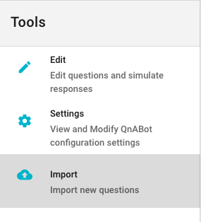
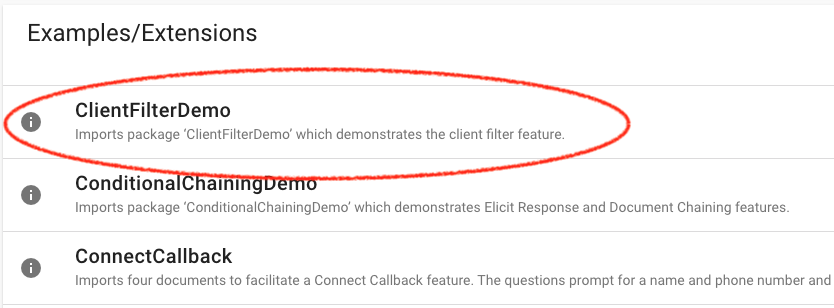
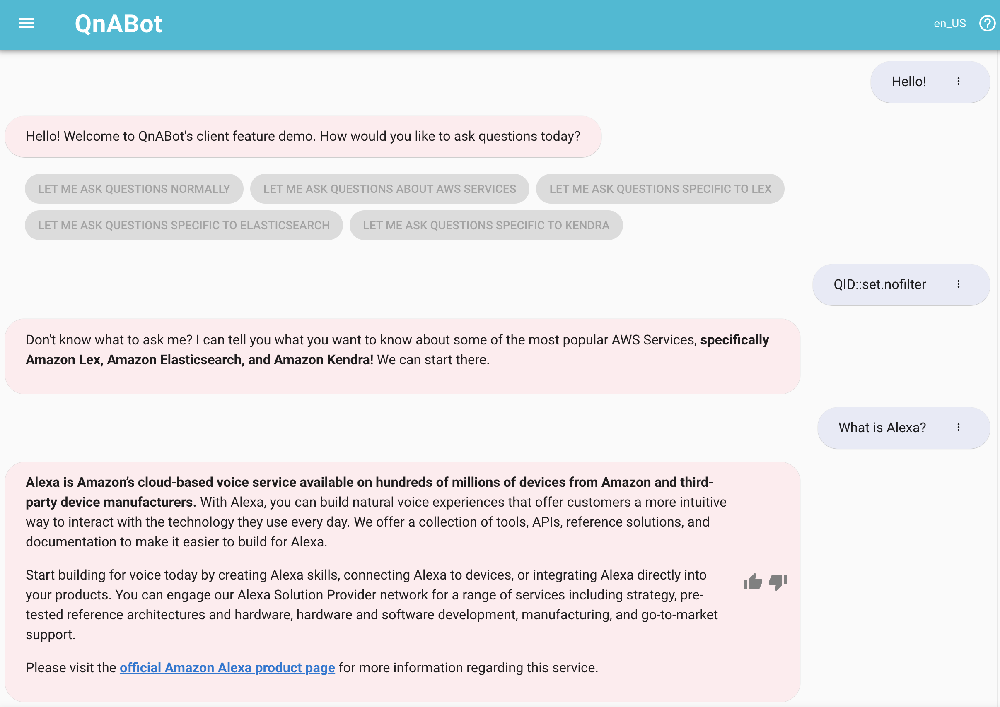
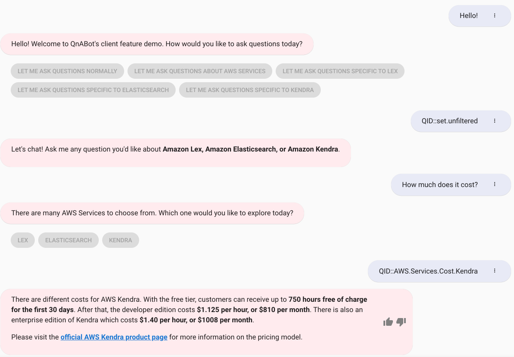

# Client Filters

Client filtering allows you to curate different answers for the same question based on the audience.

For example, within a university that operates several colleges, each with different webpages on one website, there will be questions and answers that remain the same across the university and also questions and answers specific to each college. Client filtering enables users to deploy and manage one QnABot instance while still being able to answer the same question differently depending on the audience.

In the included example question bank, we use client filtering for a user looking to explore several AWS Services.

## Importing the sample question bank

Choose **Import** from the Tools menu.



Expand the dropdown menu under **Examples/Extensions** and load the **ClientFilterDemo** question bank.



The sample question bank is pre-loaded with questions tagged with client filters.

## Sample Flows Demonstrating Client Filtering

### QnABot Client

Please greet the bot in the QnABot Client with **"Hello!"**. Select **"Let me ask questions normally"** to begin.

You can ask the bot a general question that has **no filter**, such as "What is Alexa?" QnABot will respond to the question as it normally does



### Sample Flow #2: Questions that have answers with and without a client filter applied

Please greet the bot in the QnABot Client with **"Hello!"**. Select **"Let me ask questions about AWS Services"** to begin.



There are several questions in the **"clientfilterdemo"** bank which do not have a client filter set. These questions have been created to demonstrate the next level of specificity when filtering content in conversation streams. A general question such as "How much does it cost?" can be asked, and further options are presented by the bot to specify a service. In the above example, select **"Kendra"** to get a more refined response from the bot.

<!--- TODO: add a note here about QID bubbles -->

### Sample Flow #3: Filtered

Please greet the bot in the QnABot Client with **"Hello!"**. Select **"Let me ask questions Lex"** to begin.


Client filtering enables the user to ask general questions but still receive pertinent responses to the Amazon Lex Service. Even though the same question has been presented as in Sample Flow 2, "How much does it cost?", the client filter has been set to **"lex"**, so only answers with the corresponding filter will be returned in the QnABot client.


To further demonstrate the filter, the bot will only respond with Amazon Lex related answers unless the filter is otherwise changed.

## Implementation

Client filtering works based on matching the QNAClientFilter session attribute to a value specified in the client filter field in the Content Designer.  The session attribute can be set when using QnABot on a website using [Lex Web UI](https://github.com/aws-samples/aws-lex-web-ui), with [Amazon Connect](https://docs.aws.amazon.com/connect/latest/adminguide/how-to-use-session-attributes.html) when using it as part of a call center contact flow, or using [Handlebars](https://catalog.us-east-1.prod.workshops.aws/v2/workshops/20c56f9e-9c0a-4174-a661-9f40d9f063ac/en-US/qna/handlebars) within the Content Designer.

Once you import the sample question bank, there are examples of setting the session attribute in the ```set.es```,```set.kendra```, and ```set.lex``` sample questions.

## Resources

**[Official QnABot Workshop](https://qnabot.workshop.aws/)**  
**[How do I deploy my own QnABot?](https://github.com/aws-samples/aws-ai-qna-bot)**  
**[Where can I see other features of QnABot?](https://github.com/aws-samples/aws-ai-qna-bot/tree/master/docs)**  
