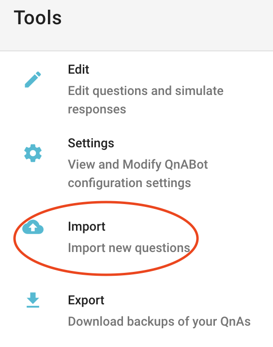
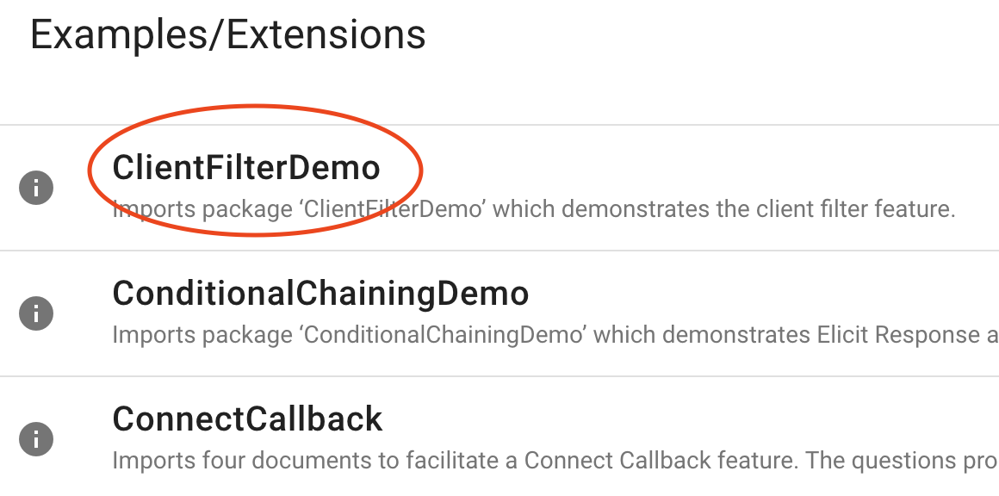
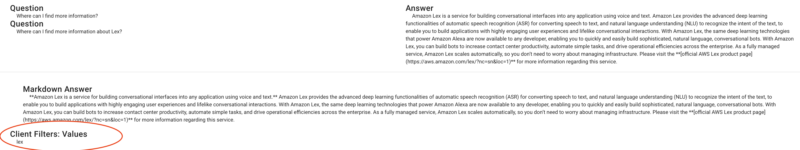
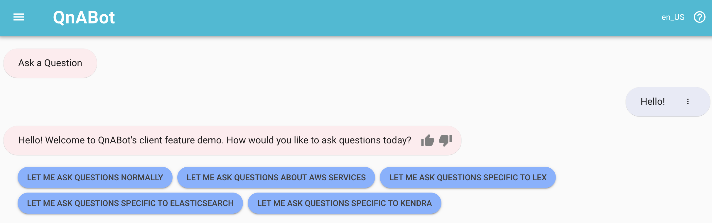
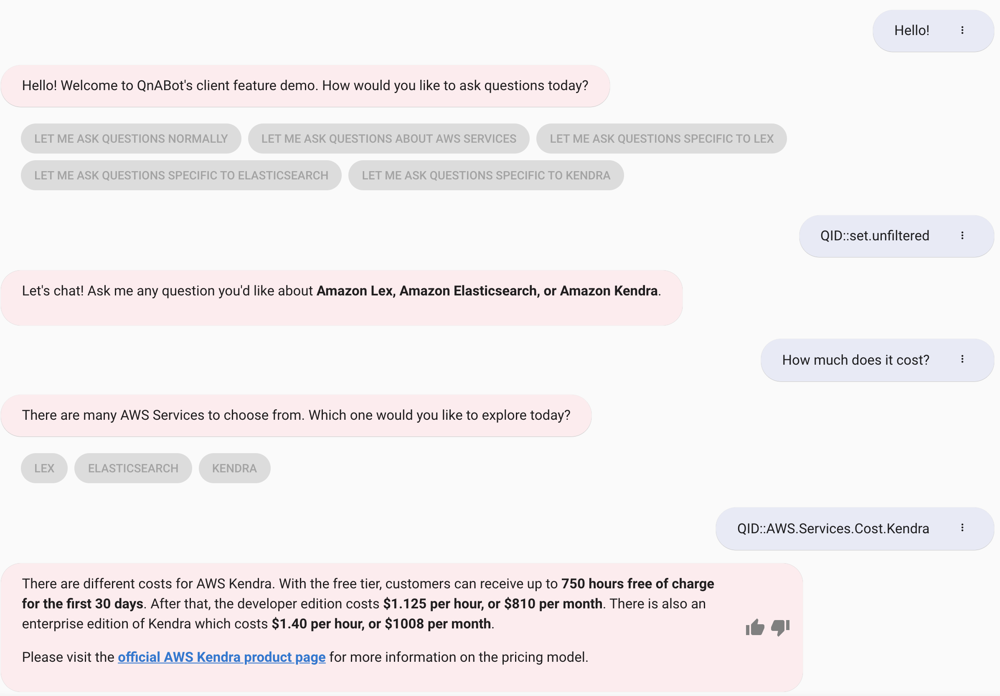
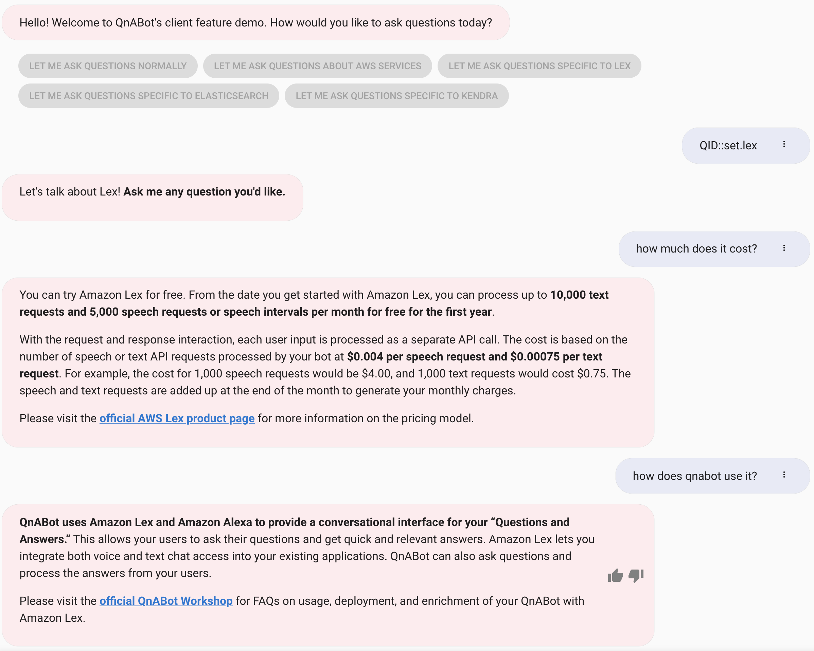
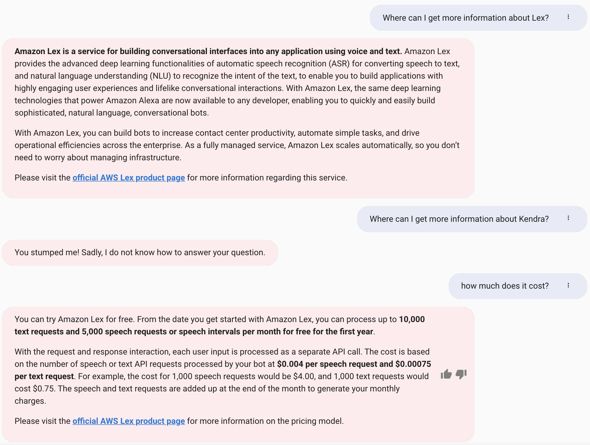

# Client Filter Feature Demo

The Client Feature branch demonstrates how QnABot's abilities are enhanced when paired with Amazon's LexWebUI project. Client features present a LexWebUI session attribute "QnAClientFilter" that matches a "Client Filter" from question settings to automatically filter QnABot's responses to questions that might be the same or similar for different groups of users talking to the bot.

## Enabling custom settings

QnABot needs the client filter setting to be enabled. Choose **Settings** from the Tools Menu.

Scroll down until you see **ES_ENABLE_CLIENT_FILTERS** in the Settings tab. Change the value to be **true**.

## Importing the sample question bank

Choose **Import** from the Tools menu.

Expand the dropdown menu under **Examples/Extensions** and load the **ClientFilterDemo** question bank.

<!--- TODO: change me to correct clientfilterdemobank -->

The sample question bank is pre-loaded with questions tagged with client filters.

<!--- TODO: change me to correct clientfilterdemobank with picture of client filter in questions setting -->

## Sample Flows Demonstrating Client Filtering
Client filtering tackles practical applications of QnABot on websites that cater to different groups of traffic. For example, within a university that operates several colleges, each with different webpages on one website, there will be questions and answers that remain the same across the university and also questions and answers specific to each college. Client filtering enables users to deploy and manage one QnABot ContentDesigner while still being able to adhere different question banks for different users. In the following examples, this demo explores the benefits of client filtering for a user looking to explore several AWS Services.

<!--- TODO: think about keeping or taking this out -->
The following examples are sample flows that demonstrate different ways client features enhance the QnABot Client. For consistency, the first sample flow (without the client feature functionality) is used to contrast the different options between using the QnABot with and without client filters. 

**QnABot Content Designer**
Optionally, questions from the demo question bank can be changed or ammended through the QnABot Content Designer.

**QnABot Client**

### Sample Flow #1: No Filter
> Note: Regardless of whether the **ES_ENABLE_CLIENT_FILTERS** setting is enabled, QnABot requires client filters in each question for the feature to work as expected. Without additional client features, QnABot questions will answer questions by matching keyword content filters.

Please greet the bot in the QnABot Client with **"Hello!"**. Select **"Let me ask questions normally"** to begin.
You can ask the bot a general question that has **no filter**, such as "What is Alexa?" QnABot will respond to the question by matching keyword filters as opposed to client filters.

When prompted with a follow up question, notice how QnABot cannot return an answer. For demonstration purposes, the follow up answer regarding more information about Amazon Alexa is embedded in another question that has a **"lex"** client filter. Since QnABot did not present a corresponding **"lex"** client filter, the QnABot blocked the user from seeing any answers that might have been returned through keyword filters instead. To receive responses pertinent to filtered topics, the client filter must be set.

### Sample Flow #2: Unfiltered
Please greet the bot in the QnABot Client with **"Hello!"**. Select **"Let me ask questions about AWS Services"** to begin.

There are several questions in the **"clientfilterdemo"** bank that have client filters of **"unfiltered"**. These questions have been created to demonstrate the next level of specificity when filtering content in conversation streams. The QnABot Session Attribute must match **"unfiltered"** but the answers aren't specific to a certain service yet. A general question such as "How much does it cost?" can be asked, and further options are presented by the bot to specify a service. In the above example, select **"Kendra"** to get a more refined response from the bot.

<!--- TODO: add a note here about QID bubbles -->

### Sample Flow #3: Filtered
Please greet the bot in the QnABot Client with **"Hello!"**. Select **"Let me ask questions Lex"** to begin.

Client filtering enables the user to ask general questions but still receive pertinent responses to the Amazon Lex Service. Even though the same question has been presented as in Sample Flow 2, "How much does it cost?", the client filter has been set to **"lex"**, so only answers with the corresponding filter will be returned in the QnABot client. The **"unfiltered"** questions from Sample Flow 2 will no longer be able to respond with a general answer with choices. 

To further demonstrate the filter, the bot will only respond with Amazon Lex related answers unless the filter is otherwise changed.

## Resources
**[Official QnABot Workshop](https://qnabot.workshop.aws/)**  
**[How do I deploy my own QnABot?](https://github.com/aws-samples/aws-ai-qna-bot)**  
**[Where can I see other features of QnABot?](https://github.com/aws-samples/aws-ai-qna-bot/tree/master/docs)**  

