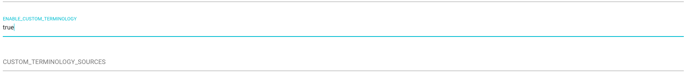
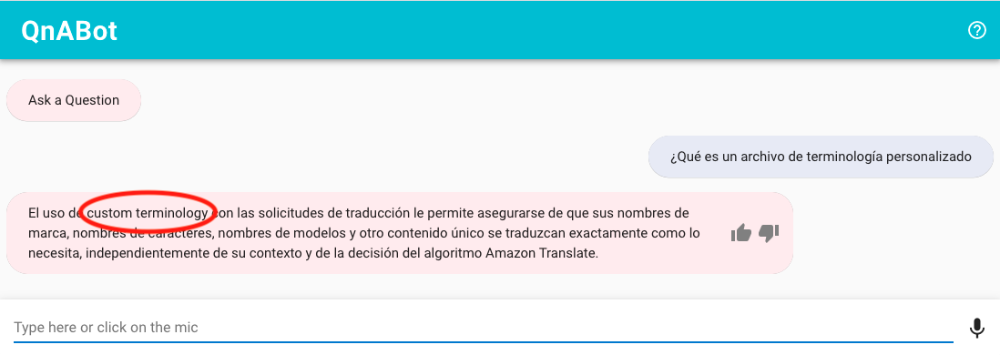

# Using Custom Terminologies with Amazon Translate

QnABot now supports Amazon Translate's [custom terminology](https://docs.aws.amazon.com/translate/latest/dg/how-custom-terminology.html) feature.

Using custom terminology with your translation requests enables you to make sure that your brand names, character names, model names, and other unique content is translated exactly the way you need it, regardless of its context and the Amazon Translate algorithm’s decision.

First create a [comma separated file to import.](https://docs.aws.amazon.com/translate/latest/dg/creating-custom-terminology.html)

en | fr | de | es |
---|-----|---|----
 custom terminology| custom terminology| custom terminology| custom terminology|

Then go to the Tools menu and choose **Import Custom Terminology**

You will then see the following dialog

Enter a description and click on **Choose File**

Once the file is successfully uploaded, you should see the following

Now let's see what it does...

Let's go back to the Content Designer and enter a question.

And let's ask the question in Spanish

We consider "custom terminology" to be a branded feature that shouldn't be translated.  We have already uploaded a custom terminology file.  But, we still need to enable custom terminology support.

Go to settings in the **Tools** menu and enable custom terminology sources

And now let's ask the question again, and see that our file worked...

