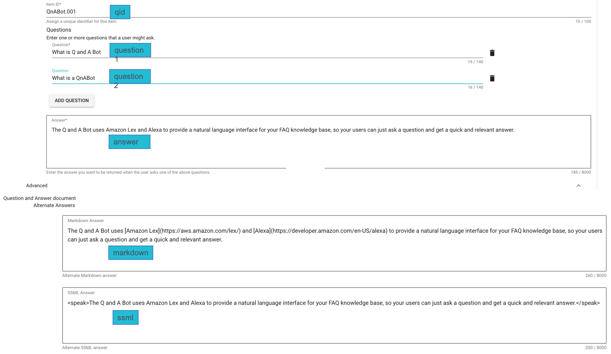
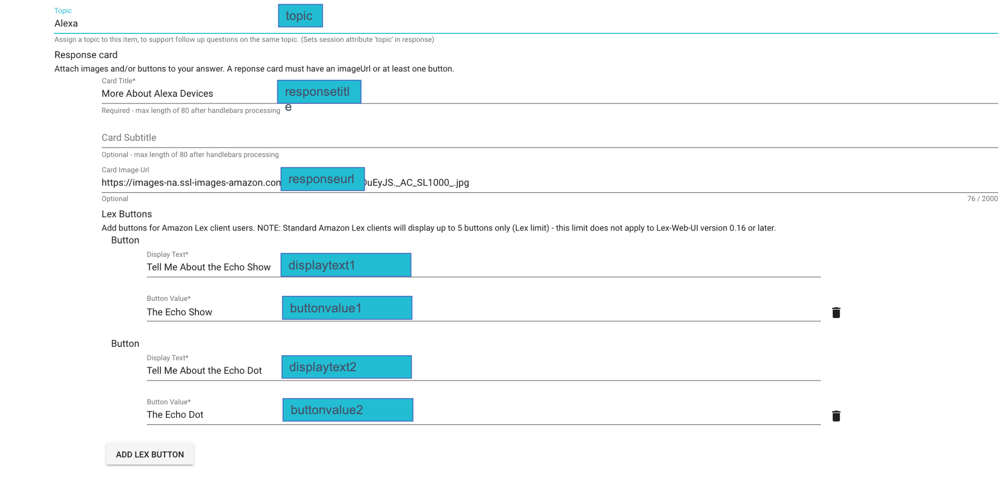
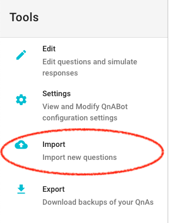
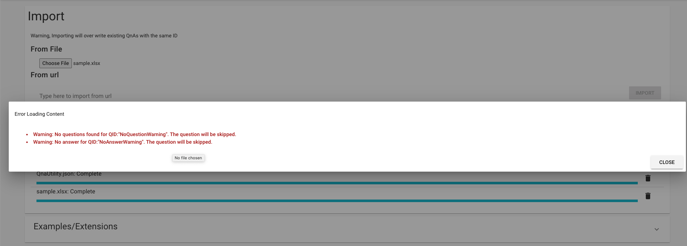

# Excel Workbook Import

QnABot now supports importing questions and answers from Microsoft Excel (xlsx) workbooks.

A [sample](./sample.xlsx) Excel workbook is included. Each column in the Excel sheet maps to a field in the Content Designer.

## Basic Fields

Excel Column | Content Designer Field| Description
---------|----------|---------
 qid | Item ID | Assign a unique identifier for this item
 question1...question(n) | Question | One or more questions for the item. Each question should be in a separate column numbered question1, question2, ...
 answer | Answer | The answer you want to be returned when the user asks one of the questions you specified.
 markdown | Markdown Answer | Alternate [Markdown](https://guides.github.com/features/mastering-markdown/) answer.
 ssml | SSML Answer | Alternate [SSML](https://developer.amazon.com/en-US/docs/alexa/custom-skills/speech-synthesis-markup-language-ssml-reference.html) answer.

## Topics and Response Cards

Excel Column | Content Designer Field| Description
---------|----------|---------
 topic | Topic| Assign a topic to this item, to support follow up questions on the same topic
 cardtitle | Card Title | Required - max length of 80
 cardimageurl | Card Image Url | The web address of an image that will appear on the response card
 displaytext1...displaytext(n) | Display Text | The text of the button. Each button text should be in a separate column numbered button1, button2, ...
 buttonvalue...buttonvalue(n) | Button Value| The value of the button. Each button value should be in a separate column numbered button1, button2, ...

## Importing the Microsoft Excel file

Choose *Import* from the Menu and then choose *From File*

After your import is complete, a dialog showing any import errors will be displayed.

