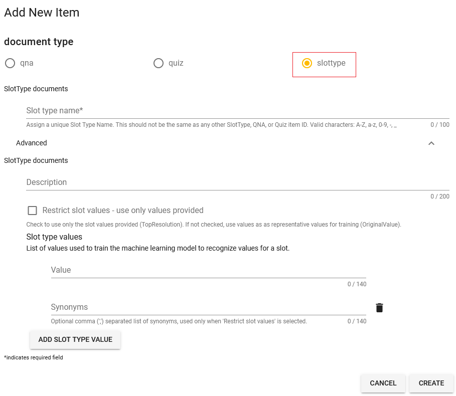

# Intent and Slot matching -- an early implementation
QnABot suppprts different types of question and answer workflows. For example:
- you can create a question and answer experience to help answer frequently asked questions. In this model, the user aks a question and QnABot responds with the most relevant answer to the question (from the list of created {qids}). For more information: https://docs.aws.amazon.com/solutions/latest/qnabot-on-aws/create-chatbot-content-and-load-sample-qanda-data.html
- build a diagnostic or questionnaire based workflow, where a question from a user can result with QnABot asking follow-up question(s). If you are creating a survey or building a diagnostic workflow where you may require inputs to different questions, you can use ResponseBots and Document Chaining capabilities of QnABot. For more information: https://docs.aws.amazon.com/solutions/latest/qnabot-on-aws/configuring-the-chatbot-to-ask-the-questions-and-use-response-bots.html

Both of these options provide flexibility in creating a interactive chat experience. However, there are cases such as: accepting dynamic user input in a question, ability to automatically ask a question for a given input - without needing to setup document chaining, validating user input against an available list of options, provide a more richer conversational experience. 
With this early implementation of Intent and Slot matching capability in QnABot, you can now build a more richer conversational experience. 

QnABot now supports creating dedicated custom Intents for a QnABot {qid}. You can extend QnABot to support one or more related intents. For example, you might create an intent that makes a car reservation, or assists an agent during a live chat or call (via Amazon Connect). 

The {qid} setup is made of the following attributes: 

- **Intent** – an intent represents an action that the user wants to perform. . For each intent, you provide the following required information:
  - Intent name – descriptive name for the intent by providing a {qid}. For example: `IntentSlotMatching.Example.Q1`
  - Sample utterances – how a user might convey the intent. For example, a user might say "*book a car*" or "*make a car reservation*"
- **Slot** – an intent can require zero or more slots, or parameters. You add slots as part of the {qid} configuration. At runtime, Amazon Lex V2 prompts the user for specific slot values. The user must provide values for all required slots before Amazon Lex V2 can fulfill the intent.
- **Slot type** – each slot has a type. Slot types define the values that users can supply for your intent slot(s). You can create your own slot type, or you can use [built-in slot types](https://docs.aws.amazon.com/lexv2/latest/dg/howitworks-builtins-slots.html).


## Creating Custom Intent with Slots and Slot Type
- To get started, create a QnABot question as you would normally do by providing a `Item ID ({qid})` and `Questions/Utterances`. 
  - The {qid} will be the custom Intent to represent an action the user wants to perform. 
- Expand the `Advanced` option
- Check the option for `Create a dedicated bot intent for this item during LEX REBUILD`. 
- Slot(s) can be configured to be either required or optional. Should a conversation flow require user input, then check the `Slot Required` option. 
- For each slot, you provide the Slot Type and one or more prompts that Amazon Lex V2 sends to the client to elicit values from the user. A user can reply with a slot value when input may be needed. You can create your own slot type, or you can use [built-in slot types](https://docs.aws.amazon.com/lexv2/latest/dg/howitworks-builtins-slots.html).


- To create a custom slot type, choose the new question of type `slottype`. 




## Import Sample {qid} Intent and Slot Type
In the QnABot Designer, click on the `Tools` menu link on the top left and select `Import`. From the `Examples/Extensions` section, click `Load` for `IntentSlotMatching` to load sample {qid} Intent and Slot Types.
This example will import:
- `IntentSlotMatching.Example.Q1` -- a {qid} of type `qna` with custom intent and slot
- `IntentSlotMatching_Example_slottype_CarType` and `IntentSlotMatching_Example_slottype_Confirmation` {qids} of type `slottype` with sample slot values


## Lex Rebuild
Once you have loaded the questions, click the `Edit` option from the `Tools` menu and choose `LEX REBUILD` from the top right edit card menu (`⋮`). This will re-train Amazon Lex using the newly added questions as training data.


## Testing the Experience
Click the `Tools` menu and choose `QnABot Client` from the options.

Try the below conversation flow: 

````
User: Book a Car

Bot: In what city do you need to rent a car?
User: Seattle

Bot: What day do you want to start your rental?
User: Today

Bot: What day do you want to return this car?
User: next sunday

Bot: What type of car would you like to rent? Our most popular options are economy, midsize, and luxury.
User: economy

Bot: Okay, should I go ahead and book the reservation?
User: yes

Bot: Okay, I have confirmed your reservation. The reservation details are below:
    Car Type: economy
    Pick up City: Seattle
    Pick up Date: 2022-05-30
    Return Date: 2022-06-12
````


## Additional Notes and Considerations
- Topics, and ClientFilters are not supported when a {qid} is enabled with custom Intent. 
- Bot locale must be set to user's locale for QnABot multi-language text interactions. 
- Slot value can be stored in session variables and accessed via `qnabotcontext.slots.slotName`. When a slot value is stored in a session attribute, it is used automatically as the value for other slots with the same name without reprompting the user. This can be beneficial for use cases, where you are capturing a users' profile information in order to support different conversational workflows, and dont want to ask the same profile informaton again from the user. 
- Always initiate a LEX REBUILD when enabling {qids} with custom intent and slots. This will create the custom intent(s), slot(s), and slot type(s) in Amazon Lex V2, and will also train Amazon Lex using the added/updated {qids} as training data. 


## Additional Example Implementation
Also take a look at a example implementation showcasing the use of Intent and Slot matching. 
- Integration with Canvas LMS -- an early example implementation - https://github.com/aws-solutions/aws-qnabot/blob/main/docs/canvaslms_integration.md

----


