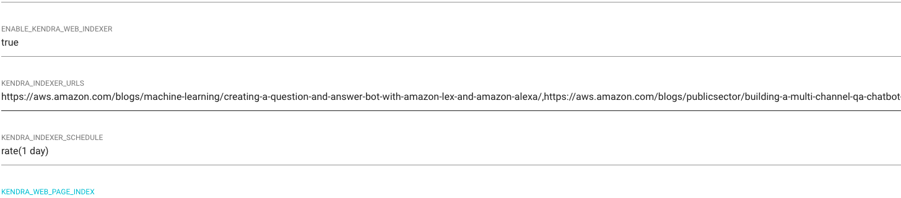
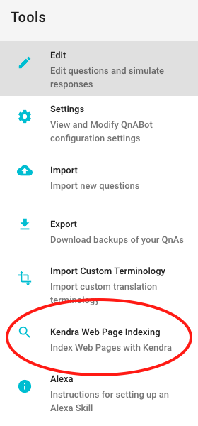
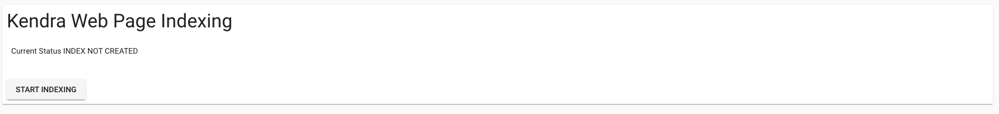

# Kendra Web Indexer Integration

Please read the [Kendra Integration](../../workshops/kendra/README.md) for instructions about configuring Kendra

QnABot can now index your website with Kendra and answer questions based on what it has found.

Go to the Settings option in the Tools menu

1. Enable the indexer by setting _ENABLE_WEB_PAGE_INDEXER_ to true
1. Tell QnABot which web pages to index by specifying a comma separated list of addresses in _KENDRA_INDEXER_URLS_
1. The indexer can be optionally configured to run on a schedule by setting the _KENDRA_INDEXER_SCHEDULE_
   It supports standard [CloudWatch Events rate syntax](https://docs.aws.amazon.com/AmazonCloudWatch/latest/events/ScheduledEvents.html#RateExpressions)
1. Tell QnABot which Kendra index to use by adding your Kendra IndexId to the setting _KENDRA_WEB_PAGE_INDEX_

After you save your settings, go back to the Tools Menu and then choose **Kendra Web Page Indexing**

If your settings are correct, the first time you choose the option, you should see the following dialog.

Just press **Start Indexing** to index your web pages to Kendra.  

The Content Designer will show you a history of your indexing.

