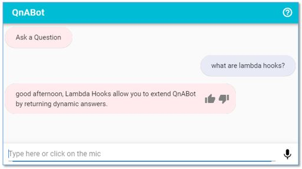

# Extending QnABot with Lambda hook functions

Content Designer gives you the ability to dynamically generate answers by letting you specify your own Lambda ‘hook’ function for any item. When you specify the name, or ARN, of a Lambda function in the Lambda Hook field for an item, QnABot will call your function any time that item is matched to a user’s question. Your Lambda function can run code to integrate with other services, perform actions, and generate dynamic answers.

QnABot comes with a simple Lambda Hook function example that you can explore:

1. Log in to the Content Designer, and choose **Import** from the tools menu ( ☰ ).
2. Open Examples/Extensions, and choose **LOAD** from the ‘GreetingHook’ example.


3. When the import job has completed, return to the edit page, and examine the item “GreetingHookExample.” Note that the Lambda Hook field is populated with a Lambda function name.
4. Use the Web UI to say “_What are lambda hooks?_”. Note that the answer is prepended with a dynamic greeting based on the current time of day – in this case ‘_good afternoon_’:
    
5. Inspect the example function (ExampleJSLambdahook) using the [AWS Lambda console](https://console.aws.amazon.com/lambda/home?region=us-east-1#/functions/qna-QnABot-hello?tab=graph).

Choose **Lambda Hooks** from the Content Designer tools menu ( **☰**) to display additional information to help you create your own Lambda hook functions.

---------

The Lambda hook receives the current QnABot response in the `res` attribute of the input event of your Lambda handler.
You can override values from this event in your Lambda hook code.
For example, you can pass a dynamically retrieved answer by overriding the value of the incoming `event.res.message` attribute from the incoming event.
You can then send the modified response in the Lambda return value.
Here is a simplistic code snippet:

```python
def handler(event, context):
    event['res']['message']="Hi! This is your Custom Python Hook speaking!"
    return event
```

## Adding your own Lambda hooks from the repository

1. Navigate to the `aws-ai-qna-bot/templates/examples/extensions/` folder in your local repository.
2. Create javascript (node.js) lambda hooks under `./js_lambda_hooks`.
3. Create python3 lambda hooks under `./py_lambda_hooks`.
4. Create a new subdirectory for your new lambda hook, e.g MyLambdaHook
5. Create a code file with your lambda function source code in the new subdirectory:

    - the file name should be the same as your directory name, with .py or .js suffix as appropriate, eg MyLambdaHook.py
    - the code must contain a lambda function named 'handler', and handle standard lambda parameters and returns.
    - if your lambda code relies on any packages not provided by Lambda, you can bundle these with your functions by creating a requirements.txt (python) or a package.json (javascript) file in the same directory. During the build process the listed packages will be downloaded and packaged/installed with your function.

## [](#reference-your-lambda-hooks-from-content-designer)Reference your Lambda hooks from Content Designer

In Content Designer, use the following syntax to reference your Lambda hook function:

- QNA:EXT*LambdaHookName (e.g _QNA:EXTMyLambdaHook_)

The ARN of your installed lambda hook will be referenced at runtime by the QnABot Fulfillment function using environment variables. I.e. the fulfillment function is set up (during installation) with environment variable `EXTMyLambdaHook` and the value is the ARN of your installed function.
Using the environment variable indirection is preferable to using your function ARN, since you can maintain separate function instances for different QnABot stacks / environments, and you can easily export/import content that does not contain ARN references to specific function instances in specific accounts and regions.

## [](#add-new-content-packages-for-content-designer-import-examplesextensions-listing)Add new content packages for Content Designer Import Examples/Extensions listing

Add importable content packages in the `./ui_imports/content` folder using two files as follows:

- \<name>.json -- the JSON representation of the QnA documents to be imported (can be a file that was previous exported from Content Designer.
- \<name>.txt -- a short tagline description of the content that will be displayed in the Content Designer listing.

## Preprocessing and postprocessing Lambda hooks

You can also add Lambda hooks globally that run before (preprocessing) and after every question is run via the settings page.


## [](#notes)NOTES

- The `Makefile` residing in the extensions folder creates separate zip packages for each separate Lambda hook function
- Lambda hook functions use nodejs12.x or python3.6 only at this time
- Lambda hook functions will be allocated 2048MB memory (defined in index.js)
