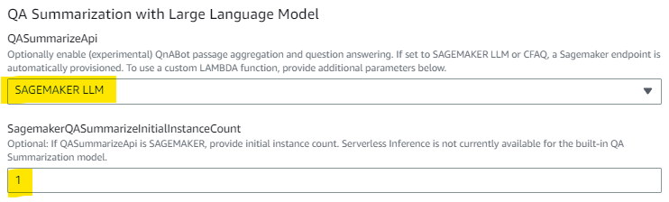
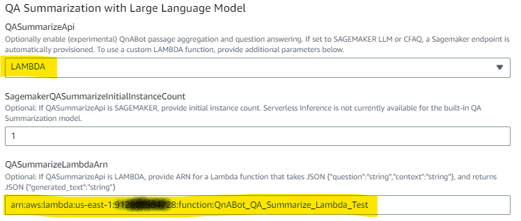
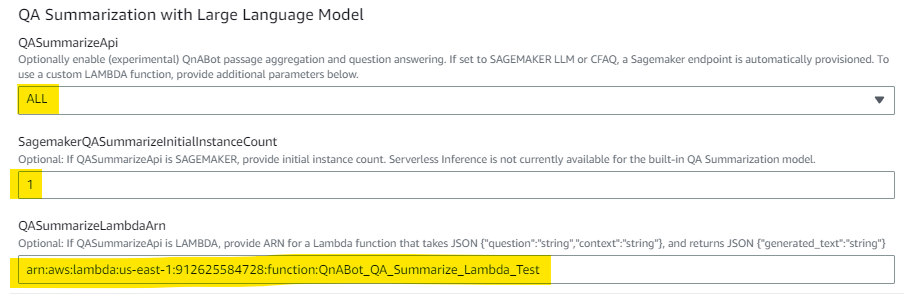

# QA Summarization with Large Language Model

QnABot can now use a large language model to generate answers from Kendra search results, or from text passges created or imported directly into QnAbot. Some of the benefits include:
- Reduce the number of FAQs to be maintained by using generative AI to synthesize a concise answer from existing documents in a Kendra index, or document passages stored in QnABot.
- Generated answers can be short, concise, an suitable for voice channel contact center bots as well as wel / text bots.
- Fully comnpatible with QnABot's multi-language support

Example:
With the new QA Summarization feature enabled, QnABot can answer questions from the [AWS WhitePapers in a Kendra index](https://catalog.us-east-1.prod.workshops.aws/workshops/df64824d-abbe-4b0d-8b31-8752bceabade/en-US/200-ingesting-documents/230-using-the-s3-connector/231-ingesting-documents) such as:
- *"What is Dynamo DB?"* -> **Amazon’s Highly Available Key-value Store** or 
- *"What frameworks does AWS have to help people design good architectures?"* -> **Well-Architected Framework**  

It can even generate answers to yes/no questions, like:
- *"Is Lambda a database service?"* -> **No**. 

    

Even if you aren't (yet) using AWS Kendra (and you should!) QnABot can answer questions based on passages created or imported into Content Designer, such as:
- *"Where did Humpty Dumpty sit?"* -> **On the wall**, 
- *"Did Humpty Dumpty sit on the wall?"* -> **yes**, 
- *"Did Humpty Dumpty sit on the ground"* -> **No**  

all from a text passage item that contains the nursery rhyme. For best results when using native passage retrieval in QnABot, be sure to enable [Semantic Search using Text Embeddings](../semantic_matching_using_LLM_embeddings/README.md).


  


**For now this is an Experimental feature. We encourage you to try it on non-production instances initially, to validate accuracy and business value.**

With this release, QnaBot can  use 
1. A State of the Art open source LLM model hosted on an Amazon SageMaker endpoint - see https://huggingface.co/philschmid/flan-t5-xxl-sharded-fp16 
2. An experimental model called "Conversational FAQ", or CFAQ - see https://github.com/aws-samples/aws-lex-sample-conversational-faq
3. CUSTOMIZABLE: Use any LLM model or API you like, via a user provided Lambda function - explore alternate pretrained LLM models and APIs.
4. ALL of the above - you can enable them all to compare and contrast their accuracy and effectiveness.

### 1. Amazon Sagemaker LLM

QnABot provisions a Sagemaker endpoint running the Hugging Face flan-t5-xxl-sharded-fp16 model - see https://huggingface.co/philschmid/flan-t5-xxl-sharded-fp16. 
  
By default a 1-node ml.g5.xlarge endpoint is automatically provisioned. For large volume deployments, add additional nodes by setting the parameter `SagemakerQASummarizeInitialInstanceCount`. Please check [SageMaker pricing documentation](https://aws.amazon.com/sagemaker/pricing/) for relevant costs and information on Free Tier eligibility. 

#### Deploy Stack for SageMaker LLM

- *(for Kendra Fallback)* set `DefaultKendraIndexId` to the Index Id (a GUID) of your existing Kendra index containing ingested documents 
- *(for text passage queries)* set `QASummarizeApi` to SAGEMAKER LLM (see  [Semantic Search using Text Embeddings](../semantic_matching_using_LLM_embeddings/README.md))
- set `SagemakerQASummarizeInitialInstanceCount` - default is '1'. Set to a larger number for high volume deployments. Serverless Inference is not currently available for the built-in QA Summarization models.



  
### 2. Amazon Sagemaker CFAQ

QnABot provisions a Sagemaker endpoint running the AWS experimental CFAQ model - see https://github.com/aws-samples/aws-lex-sample-conversational-faq.

*NOTE: Currently the CFAQ model is optimized to summarize Kendra Fallback queries. It does not work with QnAbot text passage documents. This may change in later QnABot builds.*

By default a 1-node ml.t3.2xlarge endpoint is automatically provisioned. For large volume deployments, add additional nodes by setting the parameter `SagemakerQASummarizeInitialInstanceCount`. Please check [SageMaker pricing documentation](https://aws.amazon.com/sagemaker/pricing/) for relevant costs and information on Free Tier eligibility. 

#### Deploy Stack for SageMaker CFAQ

- *(for Kendra Fallback)* set `DefaultKendraIndexId` to the Index Id (a GUID) of your existing Kendra index containing ingested documents 
- set `QASummarizeApi` to SAGEMAKER CFAQ
- set `SagemakerQASummarizeInitialInstanceCount` - default is '1'. Set to a larger number for high volume deployments. Serverless Inference is not currently available for the built-in QA Summarization models.


### 3. Lambda function

Use a custom Lambda function to experiment with LLMs of your choice. Provide your own lambda function that takes a *question*, *context*, and a QnABot *settings* object. Your Lambda function can invoke any LLM you choose, and return the prediction in a JSON object containing the key, `generated_text`. You provide the ARN on your Lambda function when you deploy of update QnABot.  

#### Deploy Stack for Embedding models invoked by a custom Lambda Function

- *(for Kendra Fallback)* set `DefaultKendraIndexId` to the Index Id (a GUID) of your existing Kendra index containing ingested documents 
- *(for text passage queries)* set `QASummarizeApi` to SAGEMAKER LLM (see  [Semantic Search using Text Embeddings](../semantic_matching_using_LLM_embeddings/README.md))
- set `QASummarizeApi` to LAMBDA
- set `QASummarizeLambdaArn` to the ARN of your Lambda function 



Your Lambda function is passed an event of the form:
```
{
  "question": "string", // utterance / question from bot user
  "context":"string",   // context of kendra query results or QnABot passage tect - the context from which the LLM should answer 
  "settings":{} // settings object containing key / value pairs for all QnABot settings
}
```
and must return a JSON structure of the form:
```
{"generated_text":"string"}
```

The *settings* object passed to your Lambda function has all the settings tat you see in QnAbot Content Designer **Settings** page, including (but not limimted to):

- **QA_SUMMARY_LAMBDA_PROMPT_FORMAT**: 'Answer the question based on the following context, or answer "I don\'t know".<br>Context: <CONTEXT><br>Question: <QUESTION><br>Answer:'  
  - Use this setting to configure how your lambda constructs a prompt for the LLM

- **QA_SUMMARY_LAMBDA_MODEL_PARAMS**: '{"model_params":"tbd"}'
  - Use this setting to configure LLM specific parameter values so you can experiment and optimize your LLM behavior without making code changes.

Here's an example of a minimal Lambda function for testing. Of course you need to extend it to actually invoke your LLM!
```
def lambda_handler(event, context):
    print(event)
    prompt_format = event["settings"]["QA_SUMMARY_LAMBDA_PROMPT_FORMAT"]
    prompt = prompt_format.replace("<CONTEXT>",event["context"]).replace("<QUESTION>",event["question"])
    generated_text = f"This is the prompt: {prompt}" # REPLACE WILL LLM INFERENCE API CALL
    return {
        'generated_text': generated_text
    }
```

### 3. Enable all QA Summarization options, for comparitive testing.

Not sure which options to use? Experiment with them all!

- *(for Kendra Fallback)* set `DefaultKendraIndexId` to the Index Id (a GUID) of your existing Kendra index containing ingested documents 
- *(for text passage queries)* set `QASummarizeApi` to SAGEMAKER LLM (see  [Semantic Search using Text Embeddings](../semantic_matching_using_LLM_embeddings/README.md))
- set `QASummarizeApi` to ALL
- set `QASummarizeLambdaArn` to the ARN of your Lambda function, OR leave it blank if you just want to explore the two SageMaker model options.
 



### Settings

When QnABot stack is installed, open Content Designer **Settings** page:

**ENABLE_DEBUG_RESPONSES** set to TRUE to add additional debug information to the QnABot response, including any language translations (if using multi language mode), and inference time for your LLM model(s). 

**ES_SCORE_TEXT_ITEM_PASSAGES:** should be "true" to enable the new QnABot text passage items to be retrieved and used as input context for geneartive QA Summary answers. NOTE - 'qna' items are queried first, and in none meet the score threshold, then QnABot queries the text field of 'text' items

**EMBEDDINGS_TEXT_PASSAGE_SCORE_THRESHOLD:** Applies only when Embeddings are enabled (recommended) and if ES_SCORE_TEXT_ITEM_PASSAGES is true. If embedding similarity score on text item field is under threshold the match is rejected. Default is 0.80.

**ALT_SEARCH_KENDRA_INDEXES:** must be set to the Id (not the name) of your Kendra index where you have ingested documents of web pages that you want to use as source passages for generative answers. If you plan to use only QnABot text passage items instead of Kendra, leave this setting blank. 

*Scroll to the bottom of the settings page and observe the new QA_SUMMARY settings:*

**QA_SUMMARY_SAGEMAKER_LLM_ENABLE:**  Set to TRUE or FALSE to enable or disable SAGEMAKER LLM QA summarization.. There are similar settings to enable/disable Qa Summary with SAGEMAKER CFAQ (`QA_SUMMARY_SAGEMAKER_CFAQ_ENABLE`) and LAMBDA (`QA_SUMMARY_LAMBDA_ENABLE`).  *Note: Disable/Enable the feature only if you initially installed the stack with it enabled.. If you enable it in Settings without having depoloyed it, QnABot will error.*

**QA_SUMMARY_SAGEMAKER_LLM_PROMPT_FORMAT:** Configure the prompt used for the SageMaker LLM (Flan-T5-XXL). There is a similar setting to configure the prompt when you provide your own LAMBDA (`QA_SUMMARY_LAMBDA_PROMPT_FORMAT`)- see example above.

**QA_SUMMARY_SAGEMAKER_LLM_MODEL_PARAMS:** A JSON object representing LLM configuration parameters. There are similar settings for SAGEMAKER CFAQ (`QA_SUMMARY_SAGEMAKER_CFAQ_MODEL_PARAMS`) and LAMBDA (`QA_SUMMARY_LAMBDA_MODEL_PARAMS`).

**QA_SUMMARY_SAGEMAKER_LLM_PREFIX_MESSAGE:** A message that is displayed as a prefix to the generated text from the model. There are similar settings for the prefixes used for SAGEMAKER CFAQ (`QA_SUMMARY_SAGEMAKER_CFAQ_PREFIX_MESSAGE`) and LAMBDA (`QA_SUMMARY_LAMBDA_PREFIX_MESSAGE`)


*Scroll to the bottom of the settings page and observe the new EMBEDDINGS settings:*

**EMBEDDINGS_ENABLE:** to enable / disable use of semantic search using embeddings, set `EMBEDDINGS_ENABLE` to FALSE.
  - Set to FALSE to disable the use of embeddings based queries. 
  - Set to TRUE to re-enble the use of embeddings based queries after previously setting it to FALSE. NOTE - Setting TRUE when the stack has `EmbeddingsAPI` set to DISABLED will cause failures, since the QnABot stack isn't provisioned to support generation of embeddings. 
  - If you disable embeddings, you will likely also want to re-enable keyword filters by setting `ES_USE_KEYWORD_FILTERS` to TRUE. 
  - If you add, modify, or import any items in Content Designer when set `EMBEDDINGS_ENABLE` is false, then embeddings won't get created and you'll have to reimport or re-save those items after reenabling embeddings again  
    
**EMBEDDINGS_SCORE_THRESHOLD:** to customize the score threshold, change the value of `EMBEDDINGS_SCORE_THRESHOLD`. Unlike regular elasticsearch queries, embeddings queries always return scores between 0 and 1, so we can apply a threshold to separate good from bad results. 
  - If embedding similarity score is under threshold the match it's rejected and QnABot reverts to
     - Trying to find a match on the answer field, only if ES_SCORE_ANSWER_FIELD is set to TRUE (see above). 
     - Kendra fallback 
     - or no_hits
  - Use the Content Designer TEST tab to see the hits ranked by score for your query results.
  - The default is 0.85 for now but you may well need to modify this based on your embedding model and your experiments.

**EMBEDDINGS_SCORE_ANSWER_THRESHOLD:** to customize the answer score threshold, used only when ES_SCORE_ANSWER_FIELD is TRUE (see above), change the value of `EMBEDDINGS_SCORE_ANSWER_THRESHOLD`. 
  - If embedding similarity score for answer field query is under threshold the match it's rejected and QnABot reverts to Kendra fallback or no_hits
  - Use the Content Designer TEST tab to see the hits ranked by score for your answer field query results. Select to "Score on answer field" checkbox to see answer field scores.
  - The default is 0.80 for now but you may well need to modify this based on your embedding model and your experiments.


### Try it!

Use it with your Kendra index to ask questions that can be answered from web pages that you've crawled or documents that you've ingested using a Kendra data source connector. If you're not sure how to load documents into Kendra, see the Kendra Essentials Workshop: [Ingesting AWS WhitePapers into a Kendra index](https://catalog.us-east-1.prod.workshops.aws/workshops/df64824d-abbe-4b0d-8b31-8752bceabade/en-US/200-ingesting-documents/230-using-the-s3-connector/231-ingesting-documents)

OR

Use the new **QnABot Text item** to directly create your own passages of text in QnABot's embedded OpenSearch store. 
In Content Designer, choose **Add**, select **text**, enter an Item ID and a Passage, and choose **Create**.


QnABot save your passage, allow with text embeddings for the passage, assuming you have Embeddings enabled as discussed above. 

Test your queries using the TEST tab in Content Designer. To test matches for text item passages, select the appropriate drop down before choosing SEARCH. Compare scores on "qna questions" to the configured threshold setting `EMBEDDINGS_SCORE_THTRESHOLD` and for passages to the thershold setting `EMBEDDINGS_TEXT_PASSAGE_SCORE_THRESHOLD`. You may need to adjust thresholds to get the desired behavior when using the bot with the web client.

You can also import your passages frm a JSON file using Contemt Designer import. From the Tools menu on the top left, choose **Import**, open **Examples/Extensions** and choose the LOAD button next to **TextPassage-NurseryRhymeExamples** to import two nursery rhyme text items.
To import your own passages create and import a JSON file with the structure similar to below:
```
{
  "qna": [
    {
      "passage": "Humpty Dumpty sat on the wall,\nHumpty Dumpty had a great fall,\nAll the king's horses and all the king's men,\nCouldn't put Humpty together again.",
      "type": "text",
      "qid": "0.HumptyDumpty"
    }
  ]
}
```

