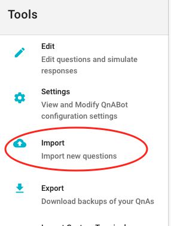
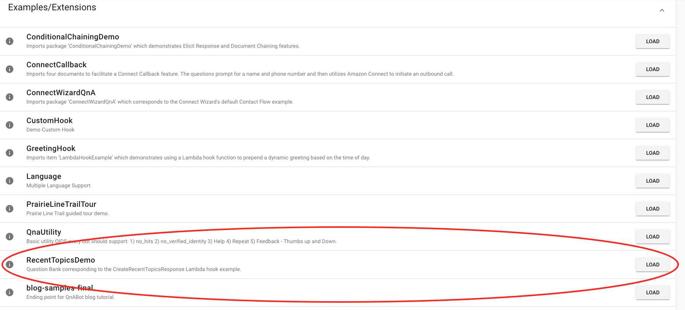

# Create Recent Topics Response Walkthrough

The CreateRecentTopicsResponse Lambda hook demonstrates how you can extend QnABot with custom functionality.

The Lambda hook allows you to add buttons to a question with the recent topics answered by QnABot.

## Importing the sample question bank

Choose *Import* from the Tools menu.

Load the *RecentTopicsDemo* question bank.

The sample question bank is loaded with questions tagged with topics.

QnABot stores the topics of questions answered in a DynamoDB table per user.

## Importing custom settings

QnABot needs three pieces of information to display the buttons - the topic, the text that should be displayed on the button and the question
that should be asked based on the button selected.

The configuration for the buttons is done by adding custom settings in the Setting window.

- Download the [recent topics settings](./recent_topics_settings.json) json file from the QnABot repository.
- Go to the Settings screen, choose "Import Settings" and import the recent_topics_settings.json file.

- You should now see the custom settings loaded.

Notice the format of a setting that maps a topic to a button is:

- topic::\<topic\> -- the name of the topic for QnABot to remember.
- \<display text\>::\<QID\> -- the display text of the button and the ID of the question to be asked when the button is selected separated by two colons (::)

## Configuring the Lambda hook

You can have a combination of static buttons and dynamic buttons generated by the CreateRecentTopicsResponse Lambda hook.

Edit the *PreviousTopics* question and expand the *Advanced* section.

- The *Card Title* is required. But is not displayed.
- Under *Lex Buttons* a button with the text "Ask Another Question" will always be displayed.  If chosen, the answer for the question with an ID of General.001 will be returned to the user.
- The Lambda hook (QNA:EXTCreateRecentTopicsResponse) will be called with the parameters specified under *Lambda Hook Arguments*. This tells the Lambda hook to return the most recent topic (*"start":"0"*) and return at most five (*"end":5*) buttons.

## Adding a topic to be recalled

Let's add another question.

- In Content Designer, click "Add" to add a question.
  - Item ID - Textract.001
  - Question - "What is Amazon Textract
  - Answer `Amazon Textract is a machine learning service that automatically extracts text, handwriting and data from scanned documents that goes beyond simple optical character recognition (OCR) to identify, understand, and extract data from forms and tables.`

- Expand the "Advanced" Section
  - Markdown Answer `Amazon Textract is a machine learning service that automatically extracts text, handwriting and data from scanned documents that goes beyond simple optical character recognition (OCR) to identify, understand, and extract data from forms and tables.`
  - Topic - "Textract"
  - click on "Create"

- Now edit the AI.001 question and expand the "Advanced" section to add another button.
  - Click "ADD LEX BUTTON"
  - Display Text - Amazon Textract
  - Button Value - QID::Textract.001
  - Click "Update"

- Finally, you will need to add a custom setting.
  - Click "ADD NEW SETTING"
  - Click "Save"

