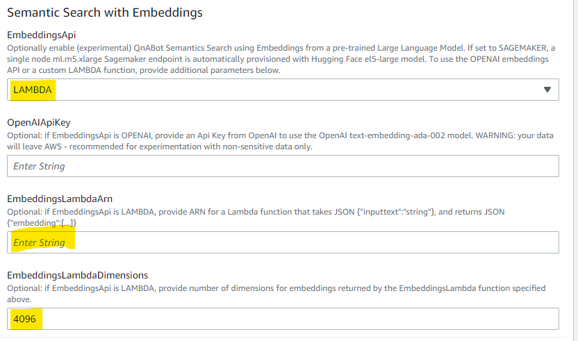

# Semantic question matching, using Large Language Model Text Embeddings

QnABot can now use text embeddings to provide semantic search capability, with the goal of improved accuracy with much less tuning compared to standard Opensearch keyword based matching. Some of the benefits include:
- Improved FAQ accuracy from semantic matching vs. keyword matching (comparing the meaning vs. comparing individual words)
- Less training utterances required to match a diverse set of queries.
- Better multi-language support, since translated utterances only need to match the meaning of the stored text, not the wording.

Example: With semantic matching enabled, *"What's the address of the White House?"* matches *"Where does the President live?"*, and *"How old are you?"* matches *"What is your age"*. These examples do not match using keywords as they do not share any of the same words.
  
For now this is an Experimental feature. We encourage you to try it on non-production instances initially, to validate expected accuracy improvements, and to test for any regression issues. 

With this release, QnaBot can now use 
1. PREFERRED: Embeddings from a Text Embedding model hosted on an Amazon SageMaker endpoint - see https://huggingface.co/intfloat/e5-large
2. CUSTOMIZABLE: Embeddings from a user provided Lambda function - explore alternate pre-trained and/or fine tuned embeddings models. 

## 1. Amazon Sagemaker (PREFERRED)

QnABot provisions a Sagemaker endpoint running the Hugging Face el5-large model - see https://huggingface.co/intfloat/e5-large. 
  
By default a 1-node ml.m5.xlarge endpoint is automatically provisioned. For large volume deployments, add additional nodes by setting the parameter `SagemakerInitialInstanceCount`. Please check [SageMaker pricing documentation](https://aws.amazon.com/sagemaker/pricing/) for relevant costs and information on Free Tier eligibility. 
  
By setting the parameter `SagemakerInitialInstanceCount` to `0`, a [Serverless Sagemaker endpoint](https://docs.aws.amazon.com/sagemaker/latest/dg/serverless-endpoints.html) is enabled. A serverless endpoint can save you money by scaling down to zero when not in use, however, there is a 'cold start' time of approximately 2 minutes during which QnABot requests, imports, or add/modify items operations will time out or be delayed. QnABot creates the endpoint with default 4GB model memory, and max concurrency of 50 requests.  


### Deploy Stack for SageMaker Embeddings

- set `EmbeddingsAPI` to SAGEMAKER
- set `SagemakerInitialInstanceCount` - default is '1'. Set to a larger number for high volume deployments, or set to 0 to enable a Serverless endpoint (only for cold-start delay tolerant deployments!). 


## 2. Lambda function

Use a custom Lambda function to use any Embedding API or embedding model on Sagemaker to generate embeddings.

*See [QnABot on AWS Sample Plugins](https://github.com/aws-samples/qnabot-on-aws-plugin-samples/blob/develop/README.md) for a plugin to integrate QnABot with our Amazon Bedrock service (in preview) for embeddings. Note that the plugin project is listed here for reference only and is a separate project from the QnABot project.*

### Deploy Stack for Embedding models invoked by a custom Lambda Function

- set `EmbeddingsAPI` to LAMBDA
- set `EmbeddingsLambdaArn` to the ARN of your Lambda function 
- Set `EmbeddingsLambdaDimensions` to match the number of dimensions returned by your Lambda function



Your Lambda function is passed an event of the form:
```
{
  "inputType": "string", // value 'q' for question, 'a' for answer
  "inputText":"string"   // string of question of answer to use to generate embeddings 
}
```
and must return a JSON structure of the form:
```
{"embedding":[...]}
```
where the length of the embedding array matches the value you specify for the stack parameter `EmbeddingsLambdaDimensions`.


## Settings

When QnABot stack is installed, open Content Designer **Settings** page:

**ES_USE_KEYWORD_FILTERS:** The setting `ES_USE_KEYWORD_FILTERS` should now default to `FALSE`. While you can use keyword filters with embeddings based semantic queries, they significantly limit the power of semantic search by forcing keyword matches (preventing matches based on different words with similar meanings).

**ES_SCORE_ANSWER_FIELD:** If set to true, QnABot executes embedding vector searches on embeddings generated on answer field if no match is found (above EMBEDDINGS_SCORE_THRESHOLD) on question fields. This allows QnABot to find matches based on the contents on the answer field as well as the questions. Only the plain text answer field is used (not the Markdown or SSML alternatives). Matches on the answer field must score above EMBEDDINGS_SCORE_ANSWER_THRESHOLD.
  - EMBEDDINGS_SCORE_THRESHOLD - see below
  - EMBEDDINGS_SCORE_ANSWER_THRESHOLD - see below


*Scroll to the bottom of the settings page and observe the new EMBEDDINGS settings:*

**EMBEDDINGS_ENABLE:** to enable / disable use of semantic search using embeddings, set `EMBEDDINGS_ENABLE` to FALSE.
  - Set to FALSE to disable the use of embeddings based queries. 
  - Set to TRUE to re-enable the use of embeddings based queries after previously setting it to FALSE. NOTE - Setting TRUE when the stack has `EmbeddingsAPI` set to DISABLED will cause failures, since the QnABot stack isn't provisioned to support generation of embeddings. 
  - If you disable embeddings, you will likely also want to re-enable keyword filters by setting `ES_USE_KEYWORD_FILTERS` to TRUE. 
  - If you add, modify, or import any items in Content Designer when set `EMBEDDINGS_ENABLE` is false, then embeddings won't get created and you'll have to reimport or re-save those items after reenabling embeddings again  
    
**EMBEDDINGS_SCORE_THRESHOLD:** to customize the score threshold, change the value of `EMBEDDINGS_SCORE_THRESHOLD`. Unlike regular elasticsearch queries, embeddings queries always return scores between 0 and 1, so we can apply a threshold to separate good from bad results. 
  - If embedding similarity score is under threshold the match it's rejected and QnABot reverts to
     - Trying to find a match on the answer field, only if ES_SCORE_ANSWER_FIELD is set to TRUE (see above).
     - Text item passage query 
     - Kendra fallback 
     - or no_hits
  - Use the Content Designer TEST tab to see the hits ranked by score for your query results.
  - The default is 0.85 for now but you will likely need to modify this based on your embedding model and your experiments.

**EMBEDDINGS_SCORE_ANSWER_THRESHOLD:** to customize the answer score threshold, used only when ES_SCORE_ANSWER_FIELD is TRUE (see above), change the value of `EMBEDDINGS_SCORE_ANSWER_THRESHOLD`. 
  - If embedding similarity score for answer field query is under threshold the match it's rejected and QnABot reverts to Text item passage query, Kendra fallback or no_hits
  - Use the Content Designer TEST tab to see the hits ranked by score for your answer field query results. For **Match on**, choose *qna item answer* to see answer field scores.
  - The default is 0.80 for now but you will likely need to modify this based on your embedding model and your experiments.

**EMBEDDINGS_TEXT_PASSAGE_SCORE_THRESHOLD:** to customize the passage score threshold, change the value of `EMBEDDINGS_TEXT_PASSAGE_SCORE_THRESHOLD`. 
  - If embedding similarity score for text item passage field query is under threshold the match it's rejected and QnABot reverts to Kendra fallback or no_hits
  - Use the Content Designer TEST tab to see the hits ranked by score for your answer field query results. For **Match on**, choose *text item passage* to see passage field scores.
  - The default is 0.80 for now but you will need likely to modify this based on your embedding model and your experiments.