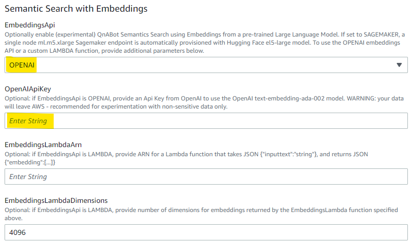

# Semantic question matching, using Large Language Model Text Embeddings

QnABot can now use text embeddings to provide semantic search capability, with the goal of improved accuracy with much less tuning compared to standard Opensearch keyword based matching.

For now this is an Experimental feature. We encourage you to try it on non-production instances initially, to validate expected accuracy improvements, and to test for any regression issues. 

With this release, QnaBot can now use 
1. PREFERRED: Embeddings from a Text Embedding model hosted on an Amazon SageMaker endpoint - see https://huggingface.co/intfloat/e5-large
2. NON PRODUCTION EXPERIMENTAL AND LOW VOLUME USE: Embeddings from OpenAI text-embedding-ada-002 model - see https://beta.openai.com/docs/guides/embeddings
3. CUSTOMIZABLE: Embeddings from a user provided Lambda function - explore alternate pretrained and/or fine tuned embeddings models. 

## 1. Amazon Sagemaker (PREFERRED)

QnABot provisions a single node ml.m5.xlarge Sagemaker endpoint running the Hugging Face el5-large model - see https://huggingface.co/intfloat/e5-large. Please check SageMaker pricing documentation for relevant costs.

### Deploy Stack for SageMaker Embeddings

- set `EmbeddingsAPI` to SAGEMAKER


No additional Embedding parameters are required. SageMaker endpoint provisioning is automated. 

## 2. Open AI (NON PRODUCTION EXPERIMENTAL AND LOW VOLUME USE)

QnABot provides easy access to OpenAI text embeddings (text-embedding-ada-002 model) for experimentation purposes - see https://beta.openai.com/docs/guides/embeddings 
Be aware that:
 - data will leave AWS as it is sent to OpenAI's text embedding API service. It is not recommended to use this option for sensitive data.
 - API calls are subject to rate limiting. 
 - You incur costs from openAI (not AWS)

### Deploy stack for OpenAI Embeddings
To enable OpenAI embeddings when you install QnABot:
- set `EmbeddingsAPI` to OPENAI
- set `OpenAIApiKey` to the value of your OpenAI API Key - see https://beta.openai.com/account/api-keys  



Deploy QnABot stack.
  

## 3. Lambda function

Use a custom Lambda function to use any API or Embedding model on Sagemaker to generate embeddings.  

### Deploy Stack for Embedding models invoked by a custom Lambda Function

- set `EmbeddingsAPI` to LAMBDA
- set `EmbeddingsLambdaArn` to the ARN of your Lambda function 
- Set `EmbeddingsLambdaDimensions` to match the number of dimensions returned by your Lambda function


Your Lambda function is passed an event of the form:
```
{"inputtext":"string"}
```
and must return a JSON structure of the form:
```
{"embedding":[...]}
```
where the length of the embedding array matches the value you specify for the stack parameter `EmbeddingsLambdaDimensions`.


## Settings

When QnABot stack is installed, open Content Designer **Settings** page:

**ES_USE_KEYWORD_FILTERS:** The setting `ES_USE_KEYWORD_FILTERS` should now default to `FALSE`. While you can use keyword filters with embeddings based semantic queries, they significantly limit the power of semantic search by forcing keyword matches (preventing matches based on different words with similar meanings).

**ES_SCORE_ANSWER_FIELD:** If set to true, QnABot executes embedding vector searches on embedding generated on the concetenate content of both question and answer fields. Only the plain text answer field is used (not the Markdown or SSML alternatives). This allows QnABot to find matches based on the contents on the answer field as well as the questions.


*Scroll to the bottom of the settings page and observe the new EMBEDDINGS settings:*

**EMBEDDINGS_ENABLE:** to enable / disable use of semantic search using embeddings, set `EMBEDDINGS_ENABLE` to FALSE
  - If you disable embeddings, you will likely also want to re-enable keyword filters by setting `ES_USE_KEYWORD_FILTERS` to TRUE. 
  - If you add, modify, or import any items in Content Designer when set `EMBEDDINGS_ENABLE` is false, then embeddings won't get created and you'll have to reimport or re-save those items after reenabling embeddings again  
    
**EMBEDDINGS_SCORE_THRESHOLD:** to customize the score threshold, change the value of `EMBEDDINGS_SCORE_THRESHOLD`. Unlike regular elasticsearch queries, embeddings queries always return scores between 0 and 1, so we can apply a threshold to separate good from bad results. 
  - If embedding similarity score is under threshold the match it's rejected and QnABot reverts to Kendra fallback or no_hits
  - Use the Content Designer TEST tab to see the hits ranked by score for your query results.
  - The default is 0.80 for now but you may well need to modify this based on your embedding model and your experiments.

**EMBEDDINGS_API:** Set during deployment based on stack parameter. Valid values are DISABLED, OPENAI, SAGEMAKER, and LAMBDA. Do not modify in Settings, but rather update your QnABot CloudFormation stack to set a new value for `EmbeddingsApi` and assciated parameters to ensure that permissions, index dimension settings are updated, and that stored embeddings are recomputed with the new model.  

**OPENAI_API_KEY:** Modify if needed to update your OpenAI Api Key.

**EMBEDDINGS_SAGEMAKER_ENDPOINT:** Set during deployment to the EndpointName of the provisioned SageMaker Embeddings Endpoint. Do not modify this setting.

**EMBEDDINGS_LAMBDA_ARN:** Set during deployment based on stack parameter. Do not modify in Settings, but rather update your QnABot  CloudFormation stack to set a new value for `EmbeddingsLambdaArn` and `EmbeddingsLambdaDimensions` to ensure that permissions, index dimension settings are updated, and that stored embeddings are recomputed with the new Lambda.


