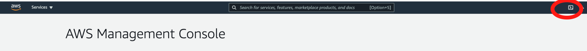

# Using AWS Cloud9 to Deploy QnABot

QnABot can be installed via a properly configured [AWS Cloud 9](https://aws.amazon.com/cloud9/) instance.  The AWS Cloud9 instance requires at least 25GB of storage space.  The bash commands below will create an AWS Cloud9 environment in the default VPC.  

## Launching AWS CloudShell

The most straightforward method to run the commands below is via [AWS CloudShell](https://aws.amazon.com/cloudshell/)

Log into the AWS Console and click on the Cloudshell icon.



## Creating the AWS Cloud9 environment

If you have made changes to your [default VPC settings](https://docs.aws.amazon.com/vpc/latest/userguide/default-vpc.html), deleted your default VPC or the script below does not work, please [see the requirements for Cloud 9](https://docs.aws.amazon.com/cloud9/latest/user-guide/vpc-settings.html).

```bash

#set this to the name of your environment
ENVIRONMENT_NAME=QNABOT

# Create the AWS Cloud9 instance
CLOUD9_ID=$(aws cloud9 create-environment-ec2 --name $ENVIRONMENT_NAME --description "QnABot build environment" --instance-type t2.medium  --automatic-stop-time-minutes 120  --owner-arn $(aws sts get-caller-identity | jq -r ".Arn")  | jq -r ".environmentId")

STACKNAME="aws-cloud9-$ENVIRONMENT_NAME-$CLOUD9_ID"

# Wait for the AWS Cloud9 instance to be created
CLOUD9_STATUS=""
while [[ $CLOUD9_STATUS != ready  &&  $CLOUD9_STATUS != error  ]]; do CLOUD9_STATUS=$(aws cloud9 describe-environment-status --environment-id $CLOUD9_ID | jq -r ".status");echo "WAITING...";sleep 10; done

#Check to make sure it was successfully created
#If status == error, Go to the CloudFormation page in the AWS console and find the stack printed below.

echo $CLOUD9_STATUS
echo $STACKNAME

```

## Increasing the storage of the volume attached to the AWS Cloud 9 instance

The following set of bash commands will resize the volume attached to your Cloud 9 instance.  

### Setting the name of the CloudFormation variable

If you were able to run the bash commands above, the $STACKNAME will already be defined.  If you had to create the AWS Cloud9 environmnent manually, set the STACKNAME variable. Then run the commands below to increase the size of the volume. The name of the CloudFormation stack will start with "aws-cloud9"

```bash
STACKNAME=aws-cloud9....
```

### Resize the attached volume and reboot your instance

```bash
# AWS Cloud9 by default creates an environment with 10GB of storage.  QnABot requires more. 

## Get the instance id of the EC2 instance used for the environment

INSTANCE_ID=$(aws cloudformation describe-stack-resource  --stack-name $STACKNAME --logical-resource-id Instance | jq -r ".StackResourceDetail.PhysicalResourceId")

## Get the attached volume of the EC2 instance that backs your build environment,


VOLUME_ID=$(aws ec2 describe-volumes --filters Name="attachment.instance-id",Values=$INSTANCE_ID | jq -r ".Volumes[0].VolumeId")

## Change the size of the volume to 25

aws ec2 modify-volume --size 25 --volume-id $VOLUME_ID

## Reboot the instance
aws ec2 reboot-instances --instance-ids $INSTANCE_ID 
```

## Install Node v12 and the latest version of npm

Log into your AWS Account and go to [AWS Cloud 9 Service home page](https://console.aws.amazon.com/cloud9/home#). Choose "Open IDE".

QnABot requires [Node v12](https://nodejs.org/en/about/releases/) and npm 7.  

Check to see which version of Node installed by typing ```node -v``` in the terminal.  If the version is not 12, type the folowing commands

```bash
sudo yum -y update
curl -o- https://raw.githubusercontent.com/creationix/nvm/v0.33.0/install.sh | bash        
nvm install v12
```

And now install the latest version of [npm](https://www.npmjs.com/).

```bash
npm install latest-version
```

## Initialize the environment

```bash
git clone https://github.com/aws-solutions/aws-qnabot.git
sudo yum install jq
```

Follow the steps in the main readme [Clone the git repo and build a version](https://github.com/aws-samples/aws-ai-qna-bot#clone-the-git-repo-and-build-a-version)

## Alternate QnABot Deployment using CloudFormation

As an alternative to using ```npm run up``` and ```npm run update``` to deploy QnABot, you can use ```cloudformation deploy```.

This will let you choose your stack name instead of having a stack name appended with ```-dev-master```

After you run ```npm run bootstrap``` following the instructions above:

```bash
BUCKET=<YOUR S3 Bootstrap Bucket Name>

npm run upload

aws cloudformation deploy --template-file build/templates/master.json --stack-name <YOUR STACKNAME> --region us-east-1 --s3-bucket $BUCKET --parameter-overrides BootstrapBucket=$BUCKET BootstrapPrefix=artifacts/aws-ai-qna-bot Email=admin@example.com  --capabilities CAPABILITY_IAM CAPABILITY_AUTO_EXPAND
```

## Creating additional Content Designer administrators

You can create additional Content Designer admins by running the following commands


```bash
export STACKNAME=<YOUR QnABot Stack Name>

COGNITO_USERPOOL=$(aws cloudformation describe-stack-resource  --stack-name $STACKNAME --logical-resource-id UserPool | jq -r ".StackResourceDetail.PhysicalResourceId")

aws cognito-idp admin-create-user --user-pool-id $COGNITO_USERPOOL --username <username> --user-attributes Name=email,Value=<email address> Name="email_verified",Value="true"  --desired-delivery-mediums EMAIL

aws cognito-idp admin-add-user-to-group --user-pool-id $COGNITO_USERPOOL --username <username> --group-name Admins
```
