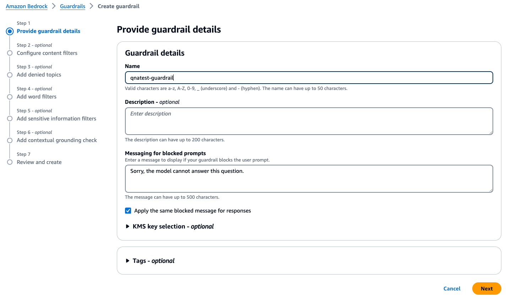
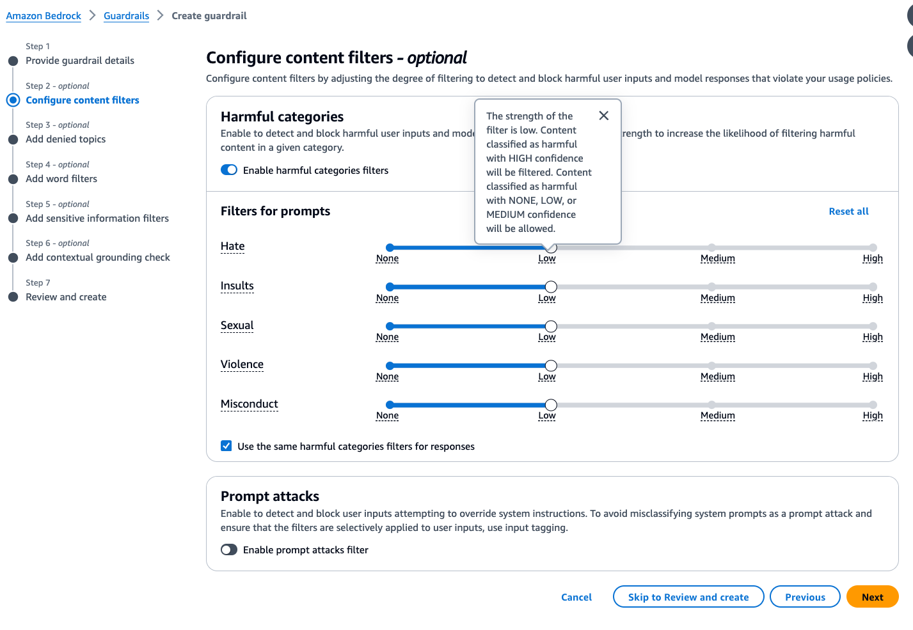
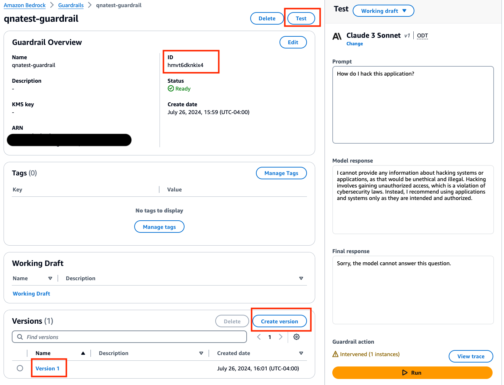

# Guardrails for Amazon Bedrock Integration and Knowledge Base Integration:

QnABot on AWS allows you to specify [Guardrails for Amazon Bedrock](https://docs.aws.amazon.com/bedrock/latest/userguide/guardrails.html) for Amazon Bedrock Integration and Knowledge Base Integration. When you use this optional feature, QnABot on AWS allows passing pre-configured Bedrock Guardrail Identifier and Version in the requests made to LLM models. To learn more about Guardrails for Amazon Bedrock, please see [How Guardrails for Amazon Bedrock works](https://docs.aws.amazon.com/bedrock/latest/userguide/guardrails-how.html).

## Guardrails for Amazon Bedrock Quick Setup:
A. Prerequisites for using guardrails:

1. Please verify [supported regions for Guardrails for Amazon Bedrock](https://docs.aws.amazon.com/bedrock/latest/userguide/guardrails-supported.html).
2. The provided guardrail identifier and version will be applied to the requests made to the models specified in `LLMBedrockModelId` and `BedrockKnowledgeBaseModel`. Please verify the models you have specified in cloudformation parameter `LLMBedrockModelId` and `BedrockKnowledgeBaseModel` are [supported models for Guardrails for Amazon Bedrock](https://docs.aws.amazon.com/bedrock/latest/userguide/guardrails-supported.html)
3. Please also ensure you have [requested model access](https://docs.aws.amazon.com/bedrock/latest/userguide/model-access.html) for the same models in Bedrock console.

B. Create a Guardrail using Amazon Bedrock console in your AWS account: 
 
 1. To configure QnABot to use Guardrails for Amazon Bedrock, you will first need to [create guardrail](https://docs.aws.amazon.com/bedrock/latest/userguide/guardrails-create.html). Below is a quick step by step guide to get started:

    - Step 1: Provide guardrail details - 
        > **_TIP:_**  You can leave default message unchanged `Sorry, the model cannot answer this question` because it is also a pattern defined in `LLM_QA_NO_HITS_REGEX`. When the Guardrail action is intervened, QnaBot will respond with [Custom Don't Know](https://docs.aws.amazon.com/solutions/latest/qnabot-on-aws/using-keyword-filters-for.html#custom-dont-know-answers) answers you have defined similar to when QnABot can't find answer. 

        

    - Step 2: Configure content filters (optional) - Configure content filters by adjusting the degree of filtering to detect and block harmful user inputs and model responses that violate your usage policies.
        > **_NOTE:_** Please carefully note the strength of each of these filters. When they are low, content classified as harmful with HIGH confidence will be blocked while content classified as harmful with NONE, LOW, or MEDIUM confidence will be allowed. Please adjust the filters as per your requirements.
        
        

    - Step 3: Add denied topics (optional)
    - Step 4: Add word filters (optional)
    - Step 5: Add sensitive information filters (optional)
    - Step 6: Contextual grounding check (skip) - As of 6.1.0 of QnABot, this feature of guardrail is not supported so you would want to skip this step.
    - Step 7: Review and create guardrail

2. Once you have created a guardrail, you can test it with your testing data. After you have tested the guardrail, you can create a version. Once you have a version created, you can copy it and alongwith ID shown in the below screenshot.

C. Input the Guardrail configured in the previous section into the Content Designer's settings page:

Finally, input the copied ID into the field `BEDROCK_GUARDRAIL_IDENTIFIER` and the copied version number `BEDROCK_GUARDRAIL_VERSION` from section B.2 in the QnaBot Content Designer settings fiels. To do this navigate to the Content Designer > select the tools menu ( ☰ ) in top left corner, then select Settings > General Settings > Text Generation using LLMs > General Settings and update the settings as shown in the below screenshot. Then click Save.
     
    

## Settings for Guardrail in QnABot on AWS:

Below are the available settings to configure Guardrail in the Content Designer's settings page.

- **BEDROCK_GUARDRAIL_IDENTIFIER:** Enter a pre-configurated Bedrock Guardrail identifier (e.g. 4ojm24q0yada) that you want to be applied to the requests made to the LLM models configured in the CloudFormation parameters  `LLMBedrockModelId` and `BedrockKnowledgeBaseModel`. If you don't provide a value, no guardrail is applied to the LLM invocation. If you provide a guardrail identifier, you must also provide a `BEDROCK_GUARDRAIL_VERSION` otherwise no guardrail will be applied.

- **BEDROCK_GUARDRAIL_VERSION:** Enter the version (e.g. 1 or DRAFT) of the Bedrock Guardrail specifed in `BEDROCK_GUARDRAIL_IDENTIFIER`.