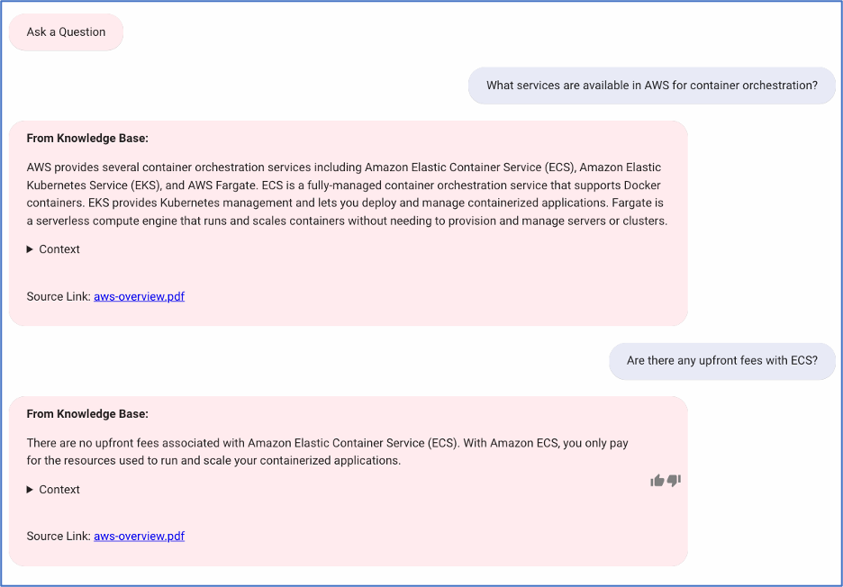
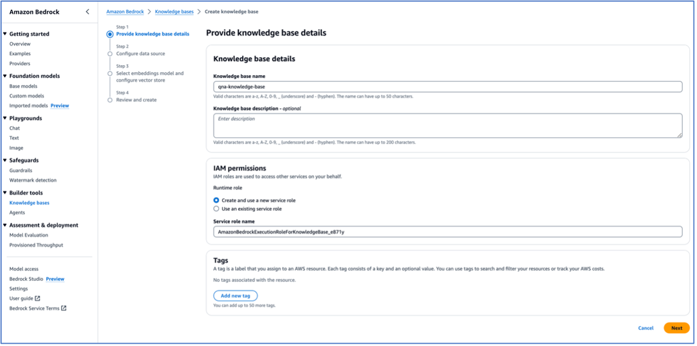
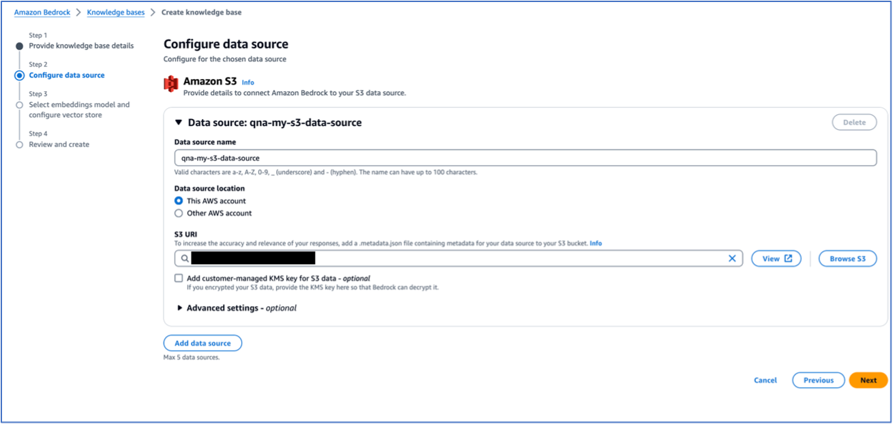
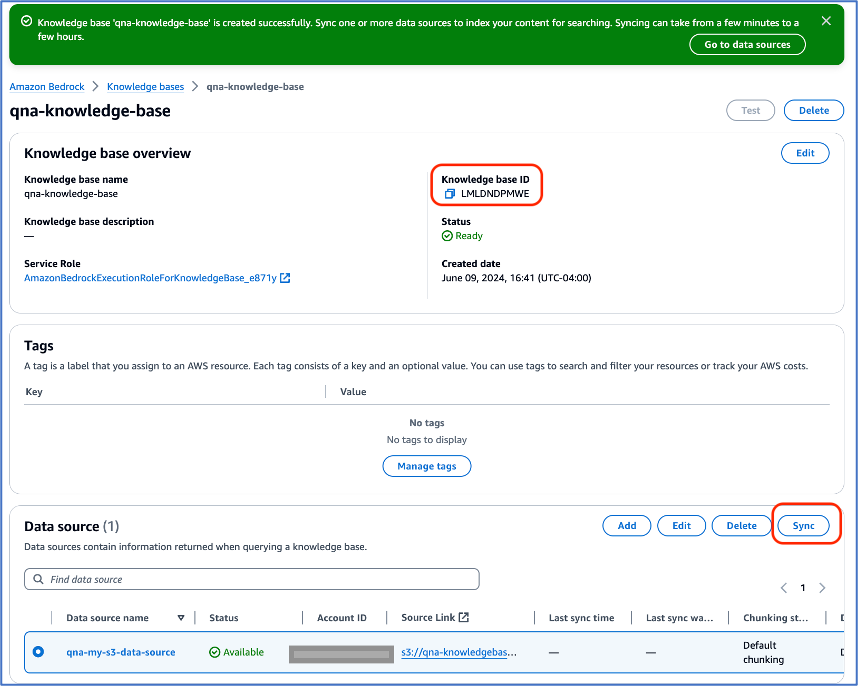
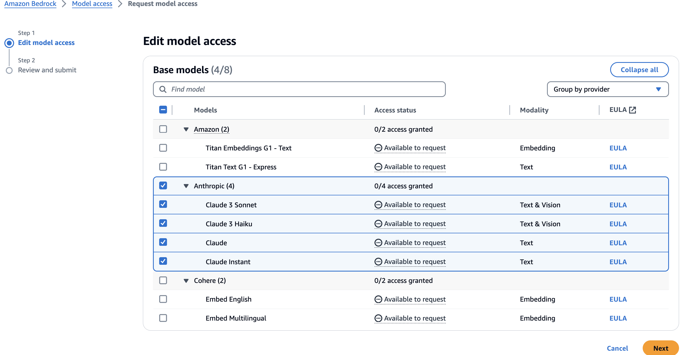

# Retrieval Augmentation Generation (RAG) using Amazon Bedrock Knowledge Base:

By integrating with the [Amazon Bedrock Knowledge Base](https://aws.amazon.com/bedrock/knowledge-bases/), QnABot on AWS can generate concise answers to user’s questions from configured data source(s). This prevents the need for users to sift through larger text passages to find the answer. You can also create your own knowledge base from files stored in an Amazon S3 bucket. Amazon Bedrock knowledge bases with QnaBot do not require EmbeddingsApi and LLMApi since the embeddings and generative response are already provided by the knowledge base. To enable this option, create an Amazon Bedrock knowledge base and copy your knowledge base ID into the CloudFormation parameter BedrockKnowledgeBaseId. 

In addition to answers generated, QnABot also provides context and signed S3 URLs to documents stored in S3 buckets that knowledge base returns in it's response. The security of the S3 bucket governs whether this link is usable.

With this integration, QnABot on AWS can answer question and it's follow-up from pdf files such as [AWS Whitepaper](https://docs.aws.amazon.com/pdfs/whitepapers/latest/aws-overview/aws-overview.pdf):

•	What services are available in AWS for container orchestration?

•	Are there any upfront fees with ECS?

## Amazon Bedrock Knowledge Base Models:

- [Anthropic Claude Instant 1.2](https://us-east-1.console.aws.amazon.com/bedrock/home?region=us-east-1#/providers?model=anthropic.claude-instant-v1)
- [Anthropic Claude 2.1](https://us-east-1.console.aws.amazon.com/bedrock/home?region=us-east-1#/providers?model=anthropic.claude-v2:1)
- [Anthropic Claude 3 Sonnet](https://us-east-1.console.aws.amazon.com/bedrock/home?region=us-east-1#/providers?model=anthropic.claude-3-sonnet-20240229-v1:0)
- [Anthropic Claude 3 Haiku](https://us-east-1.console.aws.amazon.com/bedrock/home?region=us-east-1#/providers?model=anthropic.claude-3-haiku-20240307-v1:0)

## Amazon Bedrock Knowledge Base Quick Setup:
> **_NOTE:_** 
Before getting started, please verify [supported regions and models for Knowledge bases for Amazon Bedrock](https://docs.aws.amazon.com/bedrock/latest/userguide/knowledge-base-supported.html). To configure QnABot to use Bedrock Knowledge Base, you will first need to [create a knowledge base](https://docs.aws.amazon.com/bedrock/latest/userguide/knowledge-base-create.html). Below is a quick setup guide to get started:

- Provide Knowledge Base details

    

- Configure your data source based on available options. Here we will configure data source for S3. 
    > **_NOTE:_** If you want to enable S3 presigned URLs, S3 bucket names must start with `qna` (e.g. qnabot-mydocs), otherwise make sure IAM Role *...FulfillmentLambdaRole...* has been granted S3:GetObject access to the Bedrock Knowledge Base bucket (otherwise the signed URLS will not have access). In addition, you can encrypt the transient messages using your own KMS key; ensure that when creating the KMS key that the IAM Role *...FulfillmentLambdaRole...* is a key user.
    
    

- Upload your documents in S3. Here we uploaded [aws-overview.pdf](https://docs.aws.amazon.com/pdfs/whitepapers/latest/aws-overview/aws-overview.pdf) whitepaper to test integration

- Sync Data source and Copy your Knowledge base ID into the CloudFormation parameter BedrockKnowledgeBaseId

    

## Configure Knowledge Base using the following Cloudformation parameter

### BedrockKnowledgeBaseId

**Optional** - ID of an existing Bedrock knowledge base. This setting enables the use of Bedrock knowledge bases as a fallback mechanism when a match is not found in OpenSearch.
For example:

### BedrockKnowledgeBaseModel

**Optional** -  Required if BedrockKnowledgeBaseId is not empty. Sets the preferred LLM model to use with the Bedrock knowledge base. Please ensure you have [requested model access](https://docs.aws.amazon.com/bedrock/latest/userguide/model-access.html) in Bedrock console, before deploying.

## Configure settings for RAG with Amazon Bedrock Knowledge Base in Content Designer:

- **KNOWLEDGE_BASE_PREFIX_MESSAGE:** Message to append in the chat client when the knowledge base generates a response.
- **KNOWLEDGE_BASE_SHOW_REFERENCES:** Enables or disables inclusion of the passages used as context for Bedrock Knowledge Base generated answers.
- **KNOWLEDGE_BASE_S3_SIGNED_URLS:** Enables or disables S3 presigned URL signing for Bedrock Knowledge Base answers.
- **KNOWLEDGE_BASE_S3_SIGNED_URL_EXPIRE_SECS:** Determines length of time in seconds for the validity of signed S3 Urls for Bedrock Knowledge Base answers.