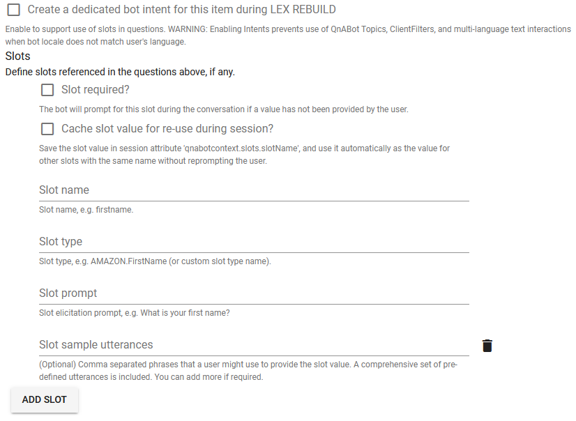

# Intent and Slot matching -- an early implementation
QnABot supports different types of question and answer workflows. For example:
- you can create a question and answer experience to help answer frequently asked questions. In this model, the user asks a question and QnABot responds with the most relevant answer to the question (from the list of created Item IDs). For more information: https://docs.aws.amazon.com/solutions/latest/qnabot-on-aws/create-chatbot-content-and-load-sample-qanda-data.html
- build a diagnostic or questionnaire based workflow, where a question from a user can result with QnABot asking follow-up question(s). If you are creating a survey or building a diagnostic workflow where you may require inputs to different questions, you can use ResponseBots and Document Chaining capabilities of QnABot. For more information: https://docs.aws.amazon.com/solutions/latest/qnabot-on-aws/configuring-the-chatbot-to-ask-the-questions-and-use-response-bots.html

Both of these options provide flexibility in creating a interactive chat experience. However, there are cases such as: accepting dynamic user input in a question, ability to automatically ask a question for a given input - without needing to setup document chaining, validating user input against an available list of options, provide a richer conversational experience. 
With this early implementation of Intent and Slot matching capability in QnABot, you can now build a richer conversational experience. For example, you might create an intent that makes a car reservation, or assists an agent during a live chat or call (via Amazon Connect). 
You can use intent and slot matching also for cases where you may want better intent matching via Amazon Lex Natural Language Understanding (NLU) engine, as an alternative to QnABot default ElasticSearch queries.

The {Item ID} setup is made of the following attributes: 

- **Intent** – an intent represents an action that the user wants to perform. For each intent, you provide the following required information:
  - Intent name – descriptive name for the intent by providing a Item ID. For example: `IntentSlotMatching.Example.Q1`
  - Sample utterances – how a user might convey the intent. For example, a user might say "*book a car*" or "*make a car reservation*"
- **Slot** – an intent can require zero or more slots, or parameters. You add slots as part of the Item ID configuration. At runtime, Amazon Lex V2 prompts the user for specific slot values. The user must provide values for all required slots before Amazon Lex V2 can fulfill the intent.
- **Slot type** – each slot has a type. Slot types define the values that users can supply for your intent slot(s). You can create your own slot type, or you can use [built-in slot types](https://docs.aws.amazon.com/lexv2/latest/dg/howitworks-builtins-slots.html).


## Creating Custom Intent with Slot(s) and Slot Type(s)
- To get started, create a QnABot question as you would normally do by providing a `Item ID` and `Questions/Utterances`. 
- Expand the `Advanced` option
- Check the option for `Create a dedicated bot intent for this item during LEX REBUILD`. 
- Slot(s) can be configured to be either required or optional. Should a conversation flow require user input, then check the `Slot Required` option. 
- For each slot, you provide the Slot Type and one or more prompts that Amazon Lex V2 sends to the client to elicit values from the user. A user can reply with a slot value when input may be needed. You can create your own custom slot type, or you can use [built-in slot types](https://docs.aws.amazon.com/lexv2/latest/dg/howitworks-builtins-slots.html).



  - A slot can also include optional sample utterances. These are phrases that a user might use to provide the slot value. A comprehensive set of pre-defined utterances is included (via built-in slot type or a custom slot type). You can add more if required. In most cases, Amazon Lex can understand user utterances. If you know a specific pattern that users might respond to an Amazon Lex request for a slot value, you can provide those utterances to improve accuracy. In most cases, you won't need to provide any utterances.

  - Cache slot value for re-use during a session - slot value can be stored in session variables and accessed via `qnabotcontext.slots.slotName`. When a slot value is stored in a session attribute, it is used automatically as the value for other slots with the same name without reprompting the user. This can be beneficial for use cases, where you are capturing a user's profile information in order to support different conversational workflows, and don't want to ask the same profile informaton again from the user. 


## Creating Custom Slot Type(s)
In addition to using built-in slot types, you can also create custom slot types. If a intent requires a custom slot type, you can create a custom slot type, by creating a new Item and choosing the type `slottype`. Similar to built-in slottypes, a custom slot type can be used across more than one intent. 

- Slot type values – the values for the slot. If you chose Restrict to slot values, you can add synonyms for the value. For example, for the value "football" you can add the synonym "soccer." If the user enters "soccer" in a conversation with your bot, the actual value of the slot is "football."

- Slot value resolution – determines how slot values are resolved. If you choose not to Restrict to slot values, Amazon Lex V2 uses the values as representative values for training. If you choose to Restrict to slot values, the allowed values for the slot are restricted to the ones that you provide.


## Accessing Slot Values
To support a conversational experience, you may want to display what the user provided as slot values (such as: workflows requiring confirming user input) and/or use the slot value(es) to support conditional branching (via document chaining), or just display a summary (such as: for order summary). There are few ways you can access slot values within a Item ID and/or Lambda hook. 

Using Handlebars you can access slot value(es) in the below ways: 

- using `getSlot` - a new helper function that returns named slot value if it is defined, or default value. For example: `{{getSlot '_slotName_' '_default_'}}`
- using session attribute `{{qnabotcontext.slots._slotName_}}` -- where `_slotName_` is the name of the slot defined in a Item ID. If the slot value is cached for re-use, the value is available in a session attribute, and can be used across Item IDs. 

- alternatively, you can also use `{{Slots._slotName_}}` - where `_slotName_` is the name of the slot defined in a Item ID. 


## Import Sample Intent and Slot Types
In the QnABot Designer, click on the `Tools` menu link on the top left and select `Import`. From the `Examples/Extensions` section, click `Load` for `IntentSlotMatching` to load sample Intent and Slot Types.
This example will import:
- `IntentSlotMatching.Example.Q1` -- a Item ID of type `qna` with custom intent and slot
- `IntentSlotMatching_Example_slottype_CarType` and `IntentSlotMatching_Example_slottype_Confirmation` Item ID of type `slottype` with sample slot values


## Lex Rebuild
Once you have loaded the questions, click the `Edit` option from the `Tools` menu and choose `LEX REBUILD` from the top right edit card menu (`⋮`). This will re-train Amazon Lex using the newly added questions as training data.


## Testing the Experience
Click the `Tools` menu and choose `QnABot Client` from the options.

Try the below conversation flow: 

````
User: Book a Car

Bot: In what city do you need to rent a car?
User: Seattle

Bot: What day do you want to start your rental?
User: Today

Bot: What day do you want to return this car?
User: next sunday

Bot: What type of car would you like to rent? Our most popular options are economy, midsize, and luxury.
User: economy

Bot: Okay, should I go ahead and book the reservation?
User: yes

Bot: Okay, I have confirmed your reservation. The reservation details are below:
    Car Type: economy
    Pick up City: Seattle
    Pick up Date: 2022-05-30
    Return Date: 2022-06-12
````

Try the above conversation flow, but this time include a slot value for {PickUpDate} in the utterance.
for example: 
````
In this sample user utterance, the slot value for {PickUpDate} is provided with the value {tomorrow}

User: Book a Car for tomorrow
````
Notice that the user is not prompted with the question `What day do you want to start your rental?`, because the slot value was already provided by the user in the utterance. 


## Notes and Considerations
- Utterances must be unique across intents. Duplicate utterances across intents will cause the Lex build to fail. Suppose you have two intents (`OrderPizza` and `OrderDrink`) in your bot and both are configured with an `I want to order` utterance. This utterance does not map to a specific intent that Amazon Lex V2 can learn from while building the language model for the bot at build time. As a result, when a user inputs this utterance at runtime, Amazon Lex V2 can't pick an intent with a high degree of confidence. 
- Topics, and ClientFilters are not supported when a Item ID is enabled with custom Intent. 
- Bot locale must be set to user's locale for QnABot multi-language text interactions. 
- Always initiate a LEX REBUILD when enabling Item IDs with custom intent and slots. This will create the custom intent(s), slot(s), and slot type(s) in Amazon Lex V2, and will also train Amazon Lex using the added/updated Item IDs as training data. 
- To take advantage of the additional features supported by Lex (such as: confirmation prompts, regular expression to validate the value of a slot etc.), you can also create the Lex Intents and Slottypes in the QnABot lex bot using the Amazon Lex console. 
More information: https://docs.aws.amazon.com/lexv2/latest/dg/build-intents.html 
- Even if the Lex Intents and Slottypes are created in the Amazon Lex console (i.e.: created outside of the QnABot designer), you can reference any SlotType defined in the bot in a QnABot Item ID, and also map a QID to a manually created Lex intent in QnABot. 
- The `Test All` or `Test` option will not work correctly for Item IDs with custom intent. 
- As you are building your knowledge bank of questions, you may have a combination of FAQ based questions, Intent based questions. There may be instances where a wrong intent gets matched, or a FAQ question is matched instead. To troubleshoot this, below are couple of options that can help: 
  - Enable the `ENABLE_DEBUG_RESPONSES` setting in QnABot. This setting provides debug information to help understand what is processing the request (such as: Intent, ElasticSearch, Kendra)


## Additional Example Implementation
Also take a look at an example implementation showcasing the use of Intent and Slot matching. 
- [Integration with Canvas LMS](../canvaslms_integration/README.md)

__**NOTICE: Canvas LMS integration with QnABot on AWS is deprecated in this release and no longer be supported. Customers may fork the code needed for their specific use case from previous versions. The integration code will be removed in the next release.**__


----
