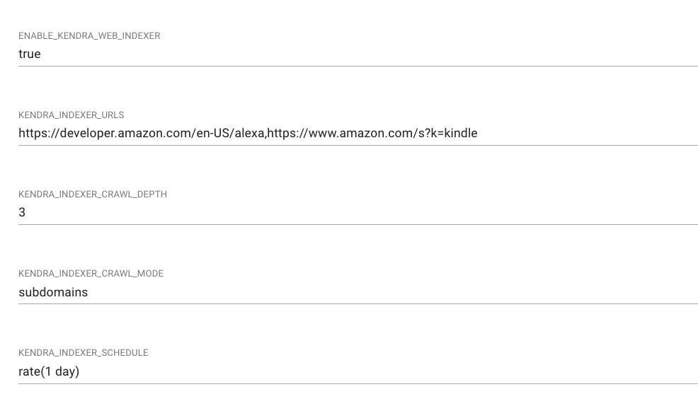
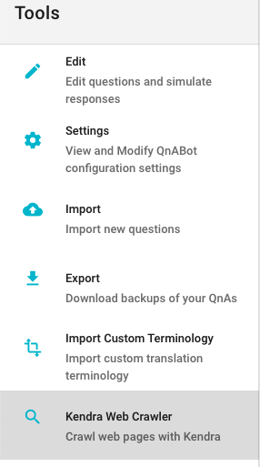

# Amazon Kendra Web Crawler Integration

Please read the [Amazon Kendra Integration](../../workshops/kendra/README.md) for instructions about configuring Kendra

QnABot can crawl your website with Kendra and answer questions based on what it has found.

When deploying the CloudFormation stack for the first time, set the KendraWebPageIndexId parameter to specify the desired Kendra Index ID for web crawling. 
For existing CloudFormation stacks, this parameter can also be updated after deployment to enable web crawling.

Go to the Settings option in the Tools menu

The built in "Web Page Indexer" has been replaced with Kendra's native web crawler data source.
The settings names have been maintained for compatibility.

| Setting | Valid Values | Description |
|---------|--------------|-------------|
| ENABLE_KENDRA_WEB_INDEXER | true or false | Enables the web crawler
| KENDRA_INDEXER_URLS | comma separated list | List of web addresses QnABot should crawl and index with Kendra
| KENDRA_INDEXER_SCHEDULE | [CloudWatch Rate Syntax](https://docs.aws.amazon.com/AmazonCloudWatch/latest/events/ScheduledEvents.html) | Interval Indexer should crawl
| KENDRA_INDEXER_CRAWL_DEPTH | number | Sets the depth to the number of levels in a website from the seed level that you want to crawl
| KENDRA_INDEXER_CRAWL_MODE | HOST_ONLY \| SUBDOMAINS \| EVERYTHING | Determines which addresses should be crawled 

After you save your settings, go back to the Tools Menu and then choose **Kendra Web Page Crawler**

If your settings are correct, the first time you choose the option, you should see the following dialog.

Just press **Start Crawling** to index your web pages to Amazon Kendra.  

The Content Designer will show you a history of your indexing.

If you are logged into your AWS Account, you can click on "View Web Crawling Errors in CloudWatch" to get the details of
any pages that Amazon Kendra couldn't crawl.

