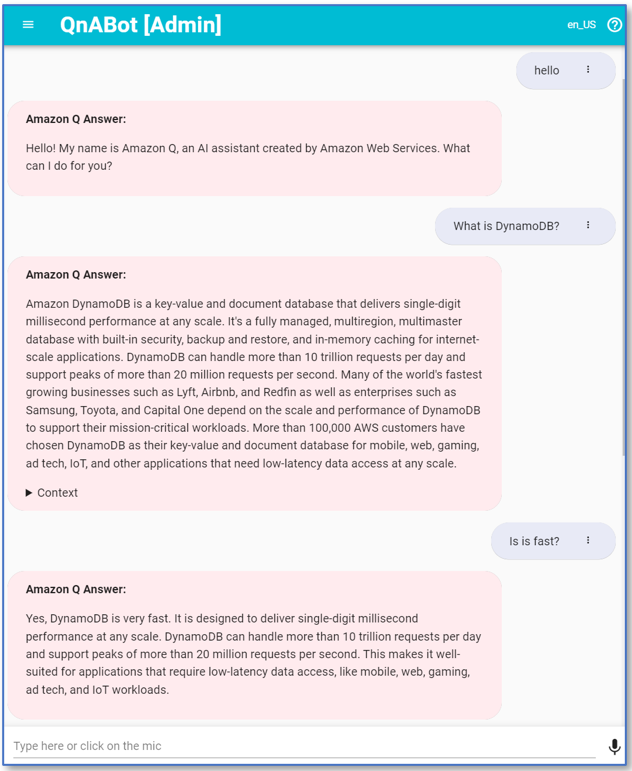
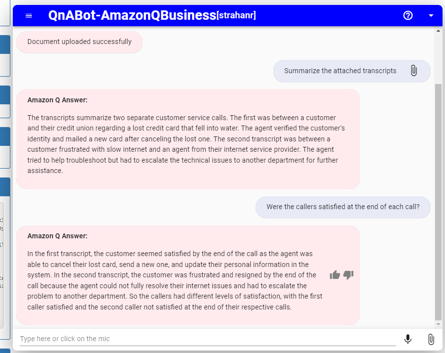

# QnABot LambdaHook for Amazon Q Business (preview)

| :zap:        The QnAbot LambdaHook for Amazon Q Business has been updated to accomodate migration to IAM Identity Center. Please note some manual configuration steps are required and outlined below as part of the deployment process. |
|-----------------------------------------|

Amazon Q is a new generative AI-powered application that helps users get work done. Amazon Q can become your tailored business expert and let you discover content, brainstorm ideas, or create summaries using your company’s data safely and securely. For more information see: [Introducing Amazon Q, a new generative AI-powered assistant (preview)](https://aws.amazon.com/blogs/aws/introducing-amazon-q-a-new-generative-ai-powered-assistant-preview)

In this repo we share a project which lets you use Amazon Q's generative AI to enable QnABot users to access your organization's data and knowledge sources via conversational question-answering. You can connect to your organization data via data source connectors and integrate it with the QnABot LambdaHook plugin for Amazon Q to enable access to your QnABot users. It allows your users to converse with Amazon Q using QnABot to ask questions and get answers based on company data, get help creating new content such as emails, and performing tasks. 

NEW! This plugin now supports attachments! Use the newest version of the [Lex Web UI](http://amazon.com/chatbotui) - version 0.20.4 or later - to add local file attachments to your conversation. There's more information on this feature in the Lex Web UI [File Upload README](https://github.com/aws-samples/aws-lex-web-ui/blob/master/README-file-upload.md). 

It's easy to deploy in your own AWS Account, and add to your own QnABot. We show you how below.

## Deploy Amazon Q (your business expert) as a fallback source of answers, using Lambda hooks with CustomNoMatches/no_hits

### Prerequisites 

1. An existing deployment of a Q Business application. Please reference the AWS docs for creating a new [Q Business application](https://docs.aws.amazon.com/amazonq/latest/qbusiness-ug/create-application.html)
2. A deployment of QnABot on AWS with `LLMApi` enabled in Cloudformation and `LLM_GENERATE_QUERY_ENABLE` set to `true` in Content Designer Settings.
3. Generate a QnABot `BootstrapBucket` to load the Q Business Lambda Hook assets. Follow [README.md](https://github.com/aws-solutions/qnabot-on-aws?tab=readme-ov-file#custom-deployment-of-qnabot-on-aws) and stop after you run `npm run bootstrap`.
4. A deployment of the Lex Web UI with login enabled is required for this stack. To learn more about deploying the Web UI see the [Github repo for the solution](https://github.com/aws-samples/aws-lex-web-ui). This Cognito should be integrated with the same identity provider as your Identity Center (in the below example we will use IAM Identity Center as the IDP).
5. The Cognito user pool created by the Web UI will need to be added as **Trusted token issuer** to Identity Center by doing the following steps
    1. Go to Identity Center and click on `Settings`>> `Authentication` >> `Trusted token issuer` >> click `Create trusted token issuer`
    2. The issuer URL will be `https://cognito-idp.[region].amazonaws.com/[cognito-pool-id]` and you will need to provide which attributes should map between the two.
        
6. A custom application will need to be created in Identity Center to handle the connection between your Q Business application and your Cognito pool. Follow these steps to create the application.
    1. Go to Identity Center and click on `Applications` then `Add application`
    2. Select `I have an application I want to set up` and `OAuth 2.0` on the next page for Selecting Application type, then hit `Next`. 
    3. Add a `Display Name` and select `Do not require Assignments`. For `Application URL`, provide the **Web experience URL** of your Q Business application (if you have a custom domain for your Q Business application, you would use the URL of that domain). You can either opt to assign specific users/groups to this application or allow any Identity Center users/groups to access the application. Your Q Business subscriptions will still apply however so only users with a subscription can successfully chat with the application. Then hit `Next`
    4. Select the Trusted token issuer that was created in Step 2 of this guide, you will now need an aud claim so that the token issuer can identify the application. This aud claim is created when you deploy the Lex Web UI and can be found within the Cognito User pool. To find this value go to your Cognito user pool and select the `App Clients`. The aud claim is the **Client ID** value found under the App client list. Take this value and paste it into the aud claim field, then select `Next`
        
    5. You will need to wait until after you deploy the CloudFormation stack to provide the role on the Specify application credentials page. For now, provide any existing IAM role in your environment and hit `Next`.
7. (Optional) [Deploy a VPC](https://docs.aws.amazon.com/vpc/latest/userguide/create-vpc.html).

### Deploy a new Amazon Q (Business) Plugin stack

Use AWS CloudFormation to deploy one or more of the sample plugin Lambdas in your own AWS account (if you do not have an AWS account, please see [How do I create and activate a new Amazon Web Services account?](https://aws.amazon.com/premiumsupport/knowledge-center/create-and-activate-aws-account/)):

1. Log into the [AWS console](https://console.aws.amazon.com/) if you are not already.
2. Open AWS CloudFormation and select `Create stack` and `With new resources (standard)`. Under `Specify Template` select `Upload a template file` and upload [q-business-lambda-hook-template.yml](./q-business-lambda-hook-template.yml) and click `Next`
3. Enter the following parameters:
    1. `Stack Name`: Name your stack, e.g. QNABOTPLUGIN-QNA-BOT-QBUSINESS-LAMBDAHOOK.
    2. `AmazonQAppId`: Existing Amazon Q Application ID (copy from AWS console)
    3. `AmazonQRegion`: Amazon Q Region (us-east-1, or us-west-2)
    4. `BootstrapBucket`: Name of bootstrap bucket created in step 3 of the prerequisites.
    5. `DynamoDBTableName`: DynamoDB table that will be used to cache encrypted user credentials for question answering with QBusiness.
    6. `IDCApplicationARN`: ARN of the Identity Center customer managed application created for QBusiness (see prerequisites for steps to create)
5. Launch the stack.
6. When your QNABOTPLUGIN-QNA-BOT-QBUSINESS-LAMBDAHOOK Plugin CloudFormation stack status is CREATE_COMPLETE, choose the **Outputs** tab. Look for the output `QnAItemLambdaFunctionRoleArn` and modify your existing Identity Center application with this value by following these steps.
    1. Go to Identity Center and click on `Applications` and find the application created for the QBusiness plugin. Click on the application to view more details.
    2. Select `Actions->Edit configuration` to modify the settings of the application
    3. Expand the Application credentials and paste the ARN obtained from the Outputs section.
    4. Hit `Save changes`

## After your Amazon Q Plugin stack is deployed
Configure QnAbot to prompt Amazon Q directly by configuring the AmazonQ LambdaHook function `QnAItemLambdaHookFunctionName` as a Lambda Hook for the QnABot [CustomNoMatches](https://docs.aws.amazon.com/solutions/latest/qnabot-on-aws/using-keyword-filters-for.html) `no_hits` item. When QnABot cannot answer a question by any other means, it reverts to the `no_hits` item, which, when configured with this Lambda Hook function, will relay the question to Amazon Q.  

When your QNABOTPLUGIN-QNA-BOT-QBUSINESS-LAMBDAHOOK Plugin CloudFormation stack status is CREATE_COMPLETE, choose the **Outputs** tab. Look for the outputs `QnAItemLambdaHookFunctionName` and `QnAItemLambdaHookArgs`. Use these values in the LambdaHook section of your no_hits item. You can change the value of "Prefix', or use "None" if you don't want to prefix the LLM answer.

The default behavior is to relay the user's query to Amazon Q Business as the user input. If LLM_QUERY_GENERATION is enabled, the generated (disambiguated) query will be used, otherwise the user's utterance is used.  
Alternatively, you can supply an explicit `"Prompt"` key in the `QnAItemLambdaHookArgs` value. For example setting `QnAItemLambdaHookArgs` to `{"Prefix":"Amazon Q Answer:", "ShowContextText":true, "ShowSourceLinks":true, "Prompt":"Why is the sky blue?"}` will ignore the user's input and simply use the configured prompt instead. You may find this useful if you use the function as a Lambda Hook for QnA items that match explicit lists of utterances/questions, and you want to normalise these into a single static question to ask Amazon Q. Prompts supplied in this manner do not (yet) support variable substitution (eg to substitute user attributes, session attributes, etc. into the prompt). If you feel that would be a useful feature, please create a feature request issue in the repo, or, better yet, implement it, and submit a Pull Request!  

### Say hello
> Time to say Hi!

1. Go to QnAbot
2. Launch the Web client
4. Say *Hello*. And start asking questions!
5. Enjoy.

### Using file attachments

This plugin now supports attachments! Use the newest version of the [Lex Web UI](http://amazon.com/chatbotui) - version 0.20.4 or later - to add local file attachments to your conversation. There's more information on this feature in the Lex Web UI [File Upload README](https://github.com/aws-samples/aws-lex-web-ui/blob/master/README-file-upload.md). 
When deploying or updating your Lex Web UI, you can reuse QnABot's existing **ImportBucket** name as the **UploadBucket** parameter - it already has a CORS policy that will work, and the Q Business plugin lambda role already grants read access to uploads in this bucket. To find your QnaBot's ImportBucket, use the `Resources` tab in the QnABot stack to search for the bucket reasorce with the logical name **ImportBucket**.

Here's an example of what you can do with attachments:

