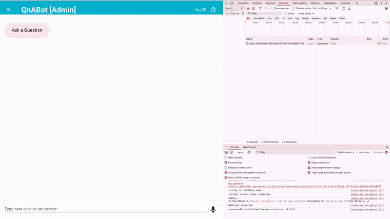
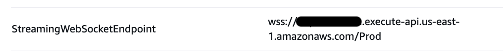
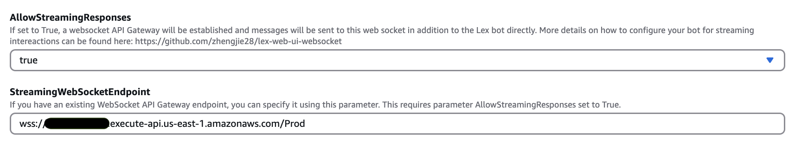

# Streaming Responses from QnABot  (7.0.0+)

The streaming responses feature enhances the responses from QnABot by returning real-time stream from Large Language Models (LLMs) to appear in the chat interface. Instead of waiting for the complete response to be generated, the chat users can see the answer being constructed in real-time, providing a more interactive and engaging experience. Currently, this feature leverages Amazon Bedrock [ConverseStream](https://docs.aws.amazon.com/bedrock/latest/APIReference/API_runtime_ConverseStream.html) and [RetrieveAndGenerateStream](https://docs.aws.amazon.com/bedrock/latest/APIReference/API_agent-runtime_RetrieveAndGenerateStream.html) APIs to establish a real-time connection between the LLM and the QnABot chat interface, ensuring efficient delivery of response as they're generated.

## Key Features
- Real-time streaming of LLM responses through Amazon Bedrock
- Progressive text generation visible in chat interface
- Seamless integration with custom Lambda hooks
- Optional deployment of streaming resources through nested stack with EnableStreaming flag

## Benefits
- Reduced perceived latency for RAG flows
- More natural conversation flow
- Quasi-immediate visibility of response generation
- Enhanced user engagement

## How It Works
- When a user submits a question, the chat client establishes connection to QnABot using websocket endpoint that QnABot creates.
- QnABot connects to the configured LLM through Amazon Bedrock
- As the LLM generates the response, each text chunk is immediately streamed to the chat client.
- The users see the response being built incrementally, similar to human typing. The streaming continues until the complete response is delivered

### Admin Setup
- The QnABot admin needs to enable streaming option in the cloudformation template using parameter `EnableStreaming`.
- When using an external chat client such as Lex Web UI, the admin will need to setup in Lex Web UI the `StreamingWebSocketEndpoint` output from QnABot stack.

### WebSocket Connection Flow
- User visits the chat client with streaming enabled
- The chat client establishes a WebSocket connection
- QnABot establishes connection with Websocket
- A bi-directional communication channel is created between the chat client and QnABot

### Message Flow
- User sends a question
- Backend (LLMs) begins generating the response
- Each text segment is immediately streamed to the client as it's generated
- The streaming continues until the LLM completes the response
- Fulfillment lambda returns the final complete response
- The streamed content is replaced with the final formatted response

### Sample Streaming Output

In below example, QnABot on AWS answers a question by streaming response from Bedrock Knowledge Base.

## Technical Details
- Uses API Gateway V2 for WebSocket connection to supports bi-directional real-time communication. 
   - Uses encrypted WebSocket protocol specification `wss://` (WebSocket Secure)
   - Secure access to WebSocket API controlled with [IAM authorization](https://docs.aws.amazon.com/apigateway/latest/developerguide/apigateway-websocket-control-access-iam.html) and signed requests
   - Default [API Gateway V2 quotas](https://docs.aws.amazon.com/apigateway/latest/developerguide/limits.html#apigateway-execution-service-websocket-limits-table) apply for configuring and running a WebSocket API. 
   - Configures ping route to support one-way pings. To prevent [Idle Connection Timeout of 10 min](https://docs.aws.amazon.com/apigateway/latest/developerguide/limits.html#apigateway-execution-service-websocket-limits-table) while user session is active, the chat client will send ping every 9 mins until 2 hours limit is reached.
   - Implements logging for API Gateway V2 and Streaming Lambda, which are accessible in Amazon CloudWatch.
- Uses [ConverseStream](https://docs.aws.amazon.com/bedrock/latest/APIReference/API_runtime_ConverseStream.html) API for streaming from Bedrock LLM
- Uses [RetrieveAndGenerateStream](https://docs.aws.amazon.com/bedrock/latest/APIReference/API_agent-runtime_RetrieveAndGenerateStream.html) API for streaming from Bedrock Knowledge Base

## Setup:

### Step A: Enable Streaming QnABot on AWS Stack 

To turn on streaming support for QnABot:
 - Set the `EnableStreaming` cloudformation parameter to `TRUE` and deploy the solution. This will create a nested which will deploy the following resources:
    - Amazon API Gateway V2
    - Amazon DynamoDB Table 
    - AWS Lambda
 - Once stack update is complete, go to Stack > `Outputs` and copy the value for `StreamingWebSocketEndpoint` output.

    

### Step B: Enable Streaming in Lex Web UI (0.26+) and provide WebSocket Endpoint from QnABot

To turn on streaming support for Lex Web UI:
 - Set the `AllowStreamingResponses` cloudformation parameter to `true` and deploy the solution.
 - Copy the `StreamingWebSocketEndpoint` value from the QnABot stack `Outputs` and enter it as the `StreamingWebSocketEndpoint` parameter when deploying the [AWS Lex Web UI](https://aws.amazon.com/blogs/machine-learning/deploy-a-web-ui-for-your-chatbot/) chat client CloudFormation template, as shown in the screenshot below.
 
