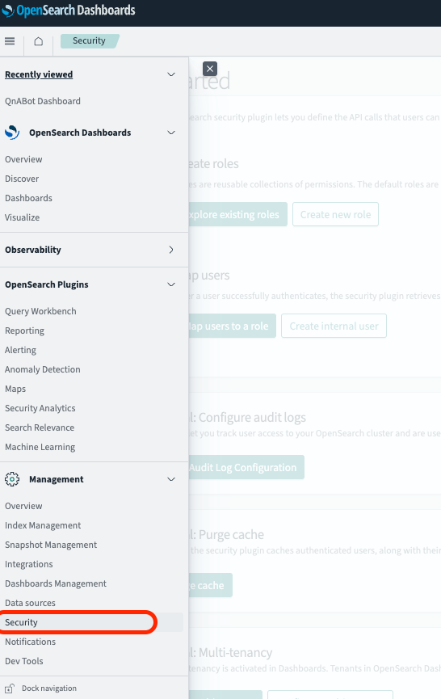
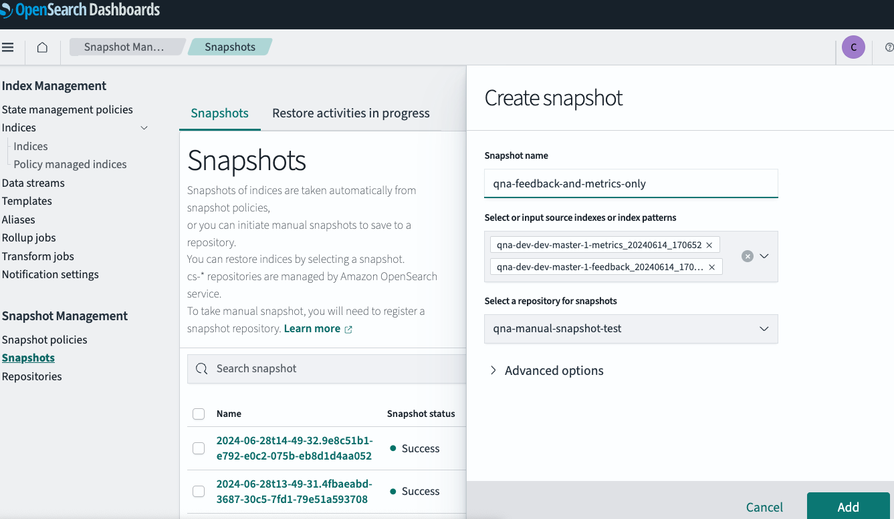
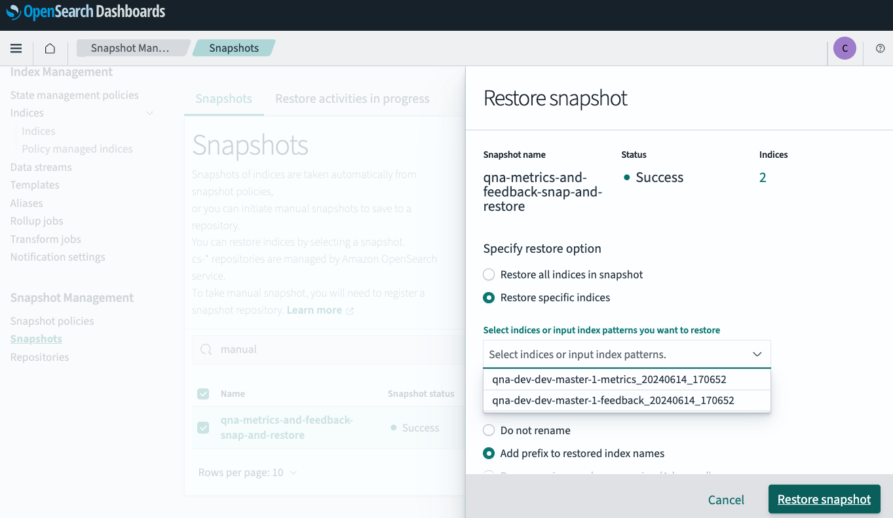
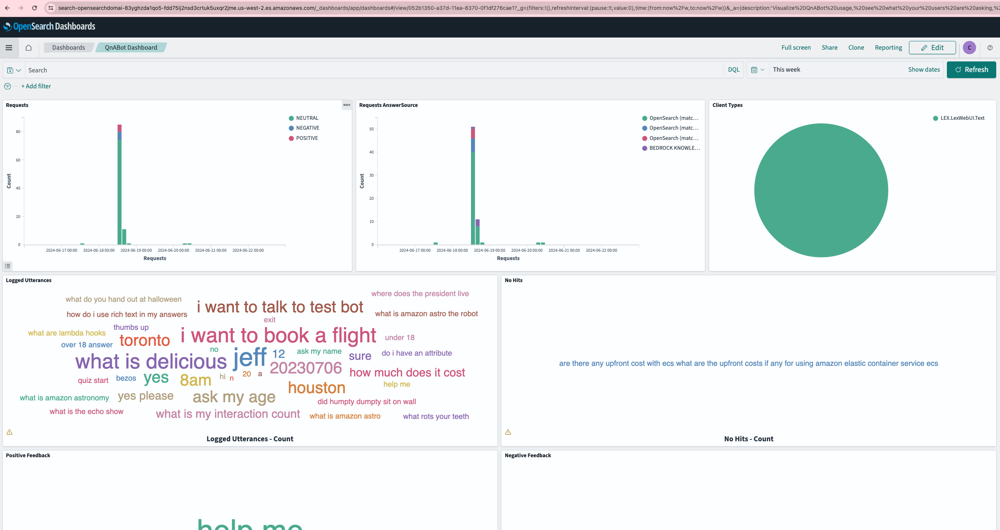
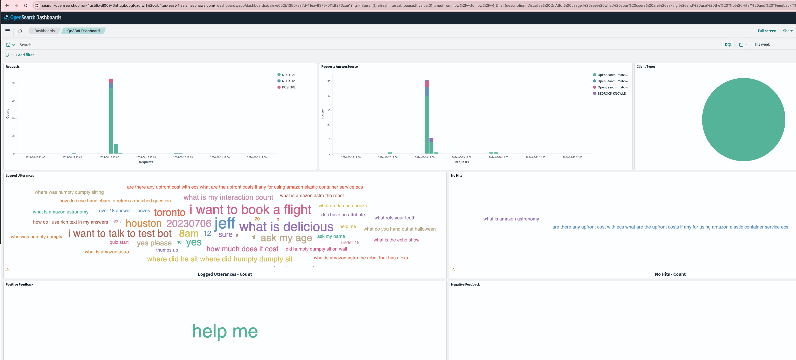

# In-place upgrade of QnABot

If you have previously deployed the solution and want to perform in-place upgrade, please refer to [Update the solution](https://docs.aws.amazon.com/solutions/latest/qnabot-on-aws/update-the-solution.html)

# Migrating QnABot Configurations and Data from Existing Cloudformation Stack to New Cloudformation Stack

If you have previously deployed the solution but do not want to perform in-place upgrade or encountered issues during in-place upgrade or in case of a breaking change which does not allow you to upgrade in place, you may try migrating the solution configuration and data using this procedure:

> **_NOTE:_**  
Before getting started, we highly recommend reading [QnABot on AWS Implementation Guide](https://docs.aws.amazon.com/solutions/latest/qnabot-on-aws/update-the-solution.html) to plan your deployment and refer to [revisions](https://docs.aws.amazon.com/solutions/latest/qnabot-on-aws/revisions.html) for any changes. 

A. Deploying Cloudformation Stack:
1. Sign in to the AWS CloudFormation console, select your existing QnABot on AWS CloudFormation stack > Parameters. Make a note of the parameters of your existing stack.
2. Deploy latest QnABot stack by enter the appropriate Amazon S3 URL. For more information on deploying solution, please see [QnABot on AWS Implementation Guide](https://docs.aws.amazon.com/solutions/latest/qnabot-on-aws/deploy-the-solution.html):

    -  If using the default main template: [launch here](https://solutions-reference.s3.amazonaws.com/qnabot-on-aws/latest/qnabot-on-aws-main.template)

    -  If using the VPC template: [launch here](https://solutions-reference.s3.amazonaws.com/qnabot-on-aws/latest/qnabot-on-aws-vpc.template)

3. Under Parameters, modify them as necessary per the notes made in Step 1.
4. Choose Next.
6. On the Configure stack options page, choose Next.
7. On the Review page, review and confirm the settings. Be sure to check the box acknowledging that the template might create AWS Identity and Access Management (IAM) resources.
8. Choose View change set and verify the changes. Click Submit to deploy the stack.
9. Wait and confirm that deployment is complete

B. Exporting and Import QnAs:

1. Export QnAs from previous stack:

    a. Sign in to the content designer of previous stack, choose the tools menu ( ☰ ), and then choose the Export.

    b. Click on Export. For more details, please refer to [Importing and exporting chatbot answers](https://docs.aws.amazon.com/solutions/latest/qnabot-on-aws/importing-and-exporting-chatbot-answers.html).

    > **_NOTE:_**  
    If for any event QnABot designer is not accessible, you may also find this data in S3 Export Bucket if it has been previously exported. If you do not find this data in export bucket, you may also find it OpenSearch indices. 
2. Importing QnAs to new stack:

   a. Sign in to the content designer of your newly deployed stack, choose the tools menu ( ☰ ), choose the Import, and then choose From File.

   b. Import the JSON file exported previously in Step B.1.b.


C. Verifying and copying settings in the designer:
1. Export settings from previous stack:

    a. Sign in to the content designer of previous stack, select the tools menu ( ☰ ), and then choose Settings.

    b. Click on Export Settings.
    

2. Import settings to new stack:

    a. Sign in to the content designer of your newly deployed stack, select the tools menu ( ☰ ), and then choose Settings.

    b. Click on Import Settings.

3. Please note there maybe new settings or enhancement with new releases. We recommend to review their description and modify them as required.
    > **_NOTE:_**  
    If for any reason, the QnABot designer of the previous stack is not accessible, you may also find these settings backed up in AWS Systems Manager Parameter Store of your previous stack. In that case, you will refer to those settings from the Parameter Store and update them manually in the settings page of the newly deployed stack.

D. Post-migration verification and cleaning:

  1. Verify questions, answers and text passages that were imported are successfully loaded in the designer.
  2. Verify settings were imported correctly or correct them as necessary.
  3. Once you have loaded the questions, choose Edit from the Tools menu, choose LEX REBUILD from the top right edit card menu (⋮) and make sure it's successful. This also re-trains Amazon Lex using the newly added questions as training data. For more information, please refer to [Lex rebuild](https://docs.aws.amazon.com/solutions/latest/qnabot-on-aws/configuring-intent-and-slot-matching.html#lex-rebuild).
  4. Using chat client provided through QnABot, please ensure that the questions are being answered corrently. You can also use the content designer to tune, test, and troubleshoot answers to fix problems. For more information, please refer to [Tuning, testing, and troubleshooting unexpected answers](https://docs.aws.amazon.com/solutions/latest/qnabot-on-aws/tuning-testing-and-troubleshooting-unexpected-answers.html).
      > **_NOTE:_**  
     If you have deployed [AWS Lex Web UI](https://github.com/aws-samples/aws-lex-web-ui/blob/master/README.md) (this is not maintained as part of QnABot on AWS) to integrate with QnABot on AWS, please verify you have updated required information (e.g LexV2BotId, LexV2BotAliasId etc) available under newly deployed QnABot on AWS CloudFormation stack > Outputs. For more details, please refer to [Deploy a Web UI for Your Chatbot](https://aws.amazon.com/blogs/machine-learning/deploy-a-web-ui-for-your-chatbot/).
  5. Deleting your previous QnABot stack:
  
        a. Before deleting the previous stack, please validate if you need to retain any AWS CloudWatch Logs and data in AWS S3 buckets created by QnaBot.
            
        b. After validating, you may proceed to delete your existing deployment by selecting your existing QnABot on AWS CloudFormation stack > Delete.

 ### Migrating Feedback and Metrics Indices from OpenSearch (Optional):

Migrating indices is not required. QnABot has export and import functionalities that will assist you in exporting and importing QnAs, as mentioned in `D. Exporting and Import QnAs`.However, if you would like to keep feedback and metrics in the OpenSearch Dashboards > QnABot Dashboard of your new deployment, you will need to migrate data from the feedback and metrics indices from your old OpenSearch domain to the new one by utilizing the [snapshot backups stored in Amazon S3](https://docs.aws.amazon.com/opensearch-service/latest/developerguide/managedomains-snapshots.html#managedomains-snapshot-prerequisites) using this procedure:


 - A. Getting access to Security plugin in OpenSearch Dashboards:

    Since QnABot by default is configured with [Fine Grain Access Control](https://docs.aws.amazon.com/opensearch-service/latest/developerguide/fgac.html), you won't have default access to security plugin. This will provide you access OpenSearch Dashboard > Management > Security to map roles with OpenSearch. 

    
    
    To do this:

    1. In Content Designer > select the tools menu ( ☰ ) > click on OpenSearch Dashboard. 
    2. In OpenSearch Dashboards, click on top right icon of your login > View roles and Identities> Backend roles > Copy ARN of your OpenSearch Dashboard role. 
    2. Navigate to Amazon OpenSearch Service > Domains > New Deployment's Domain > Security Configuration > Edit > Fine-grained access control > Set IAM ARN as master user > Paste ARN of OpenSearchDashboards role copied in step 1.

- B. Setting up Amazon S3 Bucket and providing IAM permissions for backup:

    Here we will set up a S3 bucket which will be connected to both OpenSearch instances. The existing domain will write snapshot to this bucket while new deployment's domain will read snapshot from this bucket. To achieve this: 

    1. Create a S3 bucket listed in pre-requisiste table [here](https://docs.aws.amazon.com/opensearch-service/latest/developerguide/managedomains-snapshots.html#managedomains-snapshot-prerequisites)
    2.  Create a IAM role listed in pre-requisiste table [here](https://docs.aws.amazon.com/opensearch-service/latest/developerguide/managedomains-snapshots.html#managedomains-snapshot-prerequisites)
    3.  Create a IAM role listed in pre-requisiste table [here](https://docs.aws.amazon.com/opensearch-service/latest/developerguide/managedomains-snapshots.html#managedomains-snapshot-prerequisites). Note that you will provide you will put permission for existing domain only since we are adding snapshot to this bucket from existing domain. Thus, you will input its ARN accordingly.

- C. Registering a manual snapshot repository:

    To take manual snapshots, you will need to register a repository. To do this:
    
    1. You will map the snapshot role using OpenSearch Dashboards as mentioned in [Step 1: Map the snapshot role in OpenSearch Dashboards (if using fine-grained access control) ](https://docs.aws.amazon.com/opensearch-service/latest/developerguide/managedomains-snapshots.html#managedomains-snapshot-registerdirectory)
    2. You will need run a part of Python script "Register repository" as mentioned in [Step 2: Register a repository](https://docs.aws.amazon.com/opensearch-service/latest/developerguide/managedomains-snapshots.html#managedomains-snapshot-registerdirectory) > Domain Migration. 
    3. When running this script, please carefully note the payload in the script. To register repository for existing deployment and new deployment, you can run this script for both domains by filling necessary values such region, endpoint (obtained in Amazon OpenSearch Service > Domains > Click on the Domain) but keep repository name same in both. Also, for new deployment domain, also make sure to add "readonly": "true" to the "settings" object in the payload.

- D. Taking manual snapshots
    1. Once you have created a repository for manual snapshots, you can take a snapshot in existing deplyoment by navigating to OpenSearch Dashboards > click menu ( ☰ ) > Management > Snapshot Management (available in QnA 6.0.0 and above versions only) > Snapshots > Take a Snasphot (see screenshot) > Provide Name and Indices > Add. 

        

    2. Once the snapshot is completed, please verify if it is available in new QnA deployment > OpenSearch Dashboards click menu ( ☰ ) > Management > Snapshot Management, please verify if snapshot is available in another deployment as well. If it is not available then check if you have missed any previous steps such as the repository in new deployment as well.


- E. Restoring Snapshot and Indices

    1. Once you have the snapshot available in new deployment, you will need to restore these snapshots using OpenSearch Dashboards click menu ( ☰ ) > Management > Snapshot Management > Snapshots > Restore. In this step, you can restore all indices or specific indices as per your needs (see below).

        

    2. Once you have restored snapshot, you will navigate to  OpenSearch Dashboards click menu ( ☰ ) > Management > Dev Tools. Here you will reindex all the documents from new deployment's index (destination) with index you restored from snapshot (source)

    ```
        POST _reindex

        {
        "source":{
            "index":"source"
            },
        "dest":{
            "index":"destination"
            },
        }
    ```

- F. Verify the data is available

    Once you have reindex Opensearch feedback and metrics indices using either of methods, you can validate it under OpenSearch Dashboards click menu ( ☰ ) > Dashboards > QnABot Dashboard. You can also compare both of these instances to make sure the data is matched as show below.

    Existing Deployment           |  New Deployment
    :-------------------------:|:-------------------------:
      |  


 ### Frequently Asked Questions (FAQs):
- Do I need to back-up and migrate Amazon DynamoDb database table?
    - This is not required as it only contains user chat information to disambiguate follow-up questions from previous question and answer context. Once users start interacting with QnABot, the table rows will be populated and updated.


