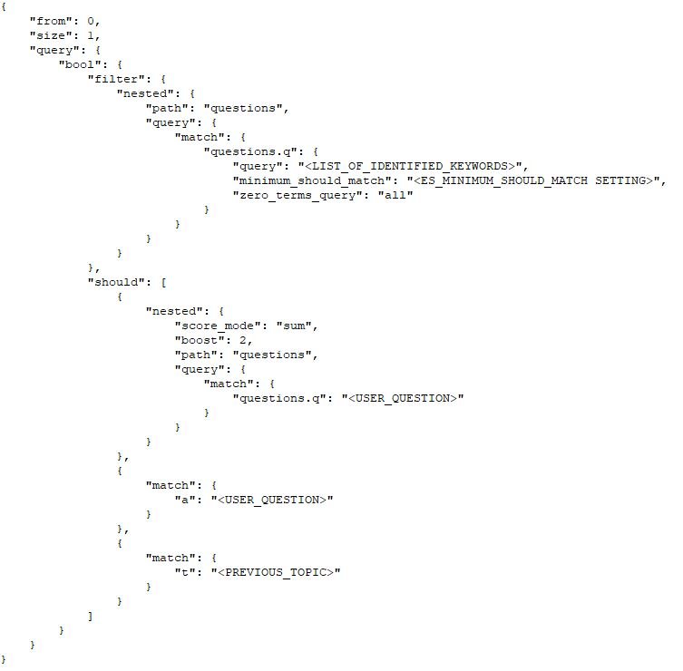
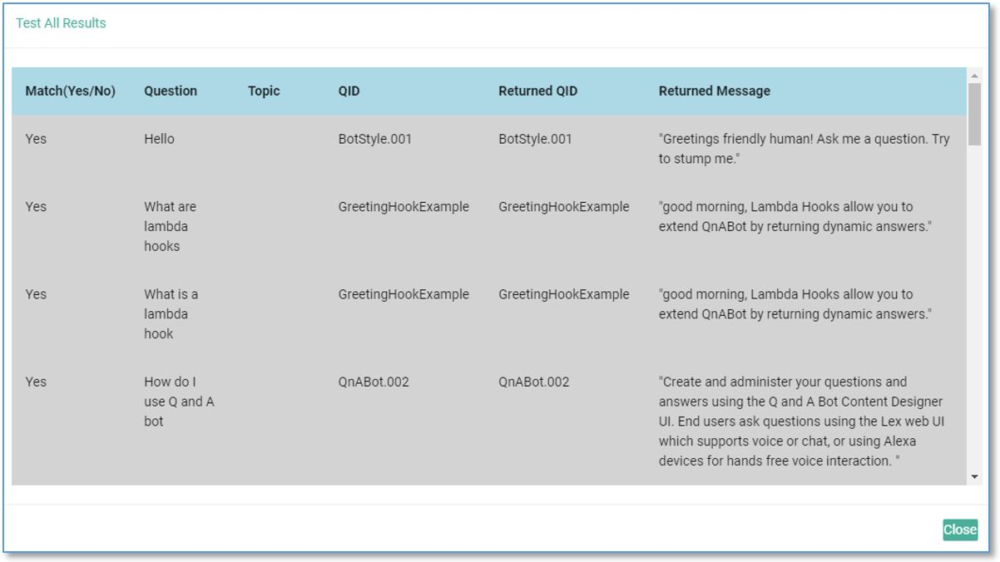

**Tuning Recognition Accuracy**
===============================

Overview
========

Chatbots are a great way to make information available for your users.
With the Amazon Web Services (AWS) QnABot solution you can deploy a
chatbot in just a few steps and have a fully functional chat experience
setup in under an hour.

The AWS QnABot solution is a AWS CloudFormation template that sets up
the infrastructure for the chat environment. A CloudFormation template
provides a common language to describe and provision all the
infrastructure resources in your AWS cloud environment. This AWS QnABot
CloudFormation template will setup resources such as Amazon Lex, Amazon
Elasticsearch Service, Amazon API Gateway, and AWS Lambda. Additionally,
this solution is also available in GitHub
(<https://github.com/aws-samples/aws-ai-qna-bot>).

Once the solution is deployed, you have a QnABot designer console where
you can build and manage your question and answer bank. The question and
answer bank become your knowledge base and the main source of
information for the chatbot to interact with to provide users' with
relevant answers. The term Q&A chatbot refers to the Q&A based chatbot
experience you will build with the solution.

As you continue to augment your knowledge base, there are going to be
instances where the questions asked by users are not providing the
desired results. In this guide, we will take a look at how the solution
works in identifying user questions and providing the relevant answers.
Learn how you can improve the recognition accuracy and further augment
the chatbot to get better over time.

Solution architecture and how It works
======================================

When the QnABot solution is deployed, resources such as Amazon Lex,
Amazon Elasticsearch Service (Amazon ES), Amazon API Gateway, and AWS
Lambda are provisioned and setup in your AWS account.

Two key AWS services are at the core of the solution:

-   **Amazon Lex** is a service for building conversational interfaces
    into any application using voice and text. Amazon Lex provides the
    advanced deep learning functionalities of automatic speech
    recognition (ASR) for converting speech to text, and natural
    language understanding (NLU) to recognize the intent of the text to
    enable you to build applications with highly engaging user
    experiences and lifelike conversational interactions.

-   **Amazon ES** is an open-source search and analytics engine for use
    cases such as log analytics, real-time application monitoring, and
    clickstream analysis. Amazon ES is a managed service that makes it
    simple to deploy, operate, and scale Elasticsearch clusters in the
    AWS Cloud. The service offers open-source Amazon ES APIs, managed
    Kibana, and integrations with Logstash and other AWS services,
    enabling you to securely ingest data from any source and search,
    analyze, and visualize it in real time.

Let's take a closer look at these two services and how they help power
the AWS QnABot solution.

*Figure 1.0 -- Solution architecture and data flow*

When you ask QnABot a question, a few things happen:

1. The question gets processed and transcribed by Amazon Lex using a
    Natural Language Understanding (NLU) and Processing (NLP) engine.

    -   QnABot initially trains the NLP to match a wide variety of possible
    questions and statements, so that the Amazon Lex bot can accept just
    about any question a user might ask. The Amazon Lex interaction
    model is setup with:

      -   **Intents**: An intent represents an action that fulfills a
        user\'s spoken request. Intents can optionally have arguments
        called **slots**. The QnABot uses **slots** to capture user
        input and fulfils the Intent via Lambda function.

      -   **Sample utterances**: A set of likely spoken phrases mapped to
        the intents. This should include as many representative phrases
        as possible. The sample utterances specify the words and phrases
        users can say to invoke your intents. QnABot updates the **Sample utterances** with the various questions to train the
        chatbot to understand different user input

2.  This request is then sent to Amazon ES. QnABot attempts to match a
    user's question to the list of questions and answers (created in the
    QnABot content designer) stored in Amazon ES.

    -   The QnABot uses full text search to find the most relevant ranked
    document from the searchable index. Relevancy ranking is based on a
    few properties:

      -   Count: How many search terms appear in a document

      -   Frequency: How often the specified keywords occur in a given
        document

      -   Importance: How rare or new the specified keywords are and how
        closely the keywords occur together in a phrase

    -   The closer the alignment between a question associated with an item
    and a question asked by the user, the greater the probability that
    the QnABot will choose that item as the most relevant answer. Noise
    words such as article, preposition in sentence constructs have lower
    weighting than unique keywords.

    -   The QnABot fulfillment Lambda function generates an Amazon ES query
    containing the transcribed question. The query attempts to find the
    best match from all the questions and answers you have previously
    provided, filtering items to apply the keyword filters and using
    Amazon ES relevance scoring to rank the results. Matches found in
    the text of stored questions (nested field: {questions.q}) are
    summed and given greater weight than matches found in the text of
    the stored answers (field: {a}). The topic value assigned to the
    previous answer (if any) will increase the overall relevance score
    for matches on topic value (field {t}). The following example shows
    the query:

      
      *Figure 2.0 -- Example Elasticsearch query*

      

      *Figure 3.0 -- Elasticsearch index mapping*

      -   By including matches found in the answer field, QnABot gives greater
    relevance to items where the answer contains multiple references to
    the terms used in the user's question. This is not always desirable,
    however, since term matches contained in the answer {a} field can
    make it harder to predict and control the items, you want to score
    highest for any question. You can now configure the QnABot to score
    matches only using the question {questions.q} and topic {t} fields:

          a.  Log in to the content designer, choose the tools menu ( ☰ ) and
    choose Settings.

          b.  Change the value of the setting ES\_SCORE\_ANSWER\_FIELD from true
    to false.

          c.  Scroll to the bottom and choose Save.

      -   The QnABot fulfillment Lambda function uses the answer field {a} (or
    the alternate Markdown or SSML fields if they have been populated)
    from the item with the highest score to create a response to send
    back to Amazon Lex.

Tuning recognition accuracy and monitoring
==========================================

Now, we have a background on how the QnABot solution works to provide
answers to users' questions. We will now take a look at how you can
improve the recognition accuracy and further augment the chatbot to get
better over time.

As you continue to build your knowledge base using the QnABot designer,
you may find occurrences where some questions may not be providing the
desired answers. This can be possible if the questions are not trained
with different variations of asking the same question and/or have a
conflict with another question with similar keywords.

You can solve this in a couple of ways:

1.  The QnABot solution has a built-in tool that can help you quickly
    test all your questions and see how well they perform. Based on the
    results, you can then review any incorrect matches and update the
    needed questions. The following steps below show how you can enable
    testing:

    -   Log in to the QnABot designer and choose TEST ALL.

    -   Use the default Filename, or enter your own.

    -   If you want to test only a subset of questions, you can optionally
    filter by {qid} prefix. Leave this field blank to test all the
    questions.

    -   Choose the TEST ALL button and wait for the tests to complete.

      

    -   Choose the view results icon
    () on the far right to view the test
    results.

      

      Behind the scenes, a test function sends every question for every item to the QnABot via Amazon Lex and checks that the QnABot matched the question to the expected item. Any incorrect matches are highlighted in red. Test results can be viewed in the browser or downloaded as a CSV file.

2.  The QnABot solution also includes a visualization tool (using
    Kibana) to analyze chatbot usage. Kibana is an open-source data
    visualization and exploration tool used for log and time-series
    analytics, application monitoring, and operational intelligence use
    cases. It offers powerful and easy-to-use features such as
    histograms, line graphs, pie charts, heat maps, and built-in
    geospatial support. Also, it provides tight integration with
    Elasticsearch, which makes Kibana the default choice for visualizing
    data stored in Elasticsearch.

    This visualization tool is available from the QnABot designer console.

    

    The Kibana dashboard can be used to view usage history, logged
utterances, no hits utterances, positive user feedback, and negative
user feedback and also provides the ability to create custom reports.

    To review if the chatbot is answering all user questions, the "No Hits"
report can be helpful to see what questions are getting unanswered. This
could also help conclude that the questions in the knowledge base are
not getting answered or there are questions users are asking for which
no question and answer exists in the knowledge base. This can be another
way to see how well the chatbot is performing. You can then augment the
knowledge base where needed.

*Figure 4.0 -- Kibana dashboard showing* No Hits *report*

    Any questions not in the knowledge base can be easily added by using the QnABot designer console.

    Additionally, for questions that are going unanswered (even though the
knowledge base contains the questions and answers), you can re-visit
those questions in the QnABot designer and add different variations of
the same questions (as noticed in the Kibana "No Hits" report).

    For example: For the question "*How do I use Q&A chatbot?*" you can use
the QnABot designer to add multiple variations of how one can ask the
question. In the below example, you can see there are many variations of
the same question that can be included to further train the bot to
understand user input.

*Figure 5.0 -- Example question that can provide undesired and skewed results*

    In the above example, you can see that the question uses repeated "*how
do I use*" phrase in the question. This could skew other questions like
"*How do I use* Alexa?" or \"*How do I use* Kibana?\" to this answer. If
you had another item, with just one question "*How do I use* Alexa?" It
might not get the highest score because the cumulative score for the
repeated "*how do I use*" from the three questions in the above example
could add up to more than the score for the match on "*How do I use*
Alexa?" or \"*How do I use* Kibana?\"

    It is a better practice to avoid repeating phrases in multiple
questions. Instead, you can actually put all the alternatives into a
single question, such as below:

    "How do I use Q&A / q and a chatbot?"

    These options can further help tune the chatbot to better understand
user input and be able to support different ways of asking the same
question.

Conclusion
==========

There are of course many ways we can improve the search experience, such
as adding support for synonyms, lexicons, taxonomies. We are continuing
to explore and see how that we could best integrate that in the
solution. As we look to further improving and extending the AWS QnABot
solution with more functionalities and features, we welcome you to share
your feedback. We would love to hear more on how you are using the AWS
QnABot solution to solve your business needs and what features and
improvements you would like to see implemented.

Thank you for using the AWS QnABot solution.
