# Solar Association: Deploying and Customizing a ready made Question and Answer Bot

## Overview:

Welcome to the Solar Association team.

The Solar Association is an association that specializes in providing data about the Sun to universities and research 
institutions around the globe. Recent acquisitions from NASA and the European Space agency have added a wealth of
information to Solar's vast database of Sun facts. The marketing team at Solar Universal has launched a new 
campaign to raise awareness of their information. Recent extreme Sun activity has peaked public curiosity. The 
current call center is overwhelmed and needs an immediate solution to provide quick answers and information about
the Sun.

The team researched the best mechanism to handle this load and have decided on a chatbot embedded in their
existing website. They don't know anything about implementing a chatbot but need to get something running quickly in 
2 hours. 

Your job is to implement Sun facts on your website. 

### Requirements:

* AWS account - if you don't have one, it's easy and free to [create one](https://aws.amazon.com/).
* Amazon developer account - if you don't have one its easy and free to [create one](https://developer.amazon.com).
* AWS IAM account with elevated privileges allowing you to interact with CloudFormation, IAM, S3, Elasticsearch, CloudWatch, Cloud9. [Learn how](https://docs.aws.amazon.com/IAM/latest/UserGuide/id_users_create.html).
* Familiarity with [NodeJS](https://www.nodejs.org) and [AWS](httpts://aws.amazon.com) - *not required but a bonus*.
* If you want to test out the voice capabilities of the Bot, have a headset with mic available to test with.

### Running the workshop

These steps are designed to be completed in sequence, and the full set of instructions are documented below.  Read and follow along to complete the steps.  
During the workshop, AWS staff will give you a high-level overview of the labs and help answer any questions.  Don't worry if you get stuck, we provide hints along the way.

* **Step 1:** [Deploying your very own QnABot](#step-1---lets-begin-and-deploy-a-working-qnabot)
* **Step 2:** [Manage questions, answers, test the simple bot](#step-2---manage-questions-answers-and-test-using-the-client-ui)
* **Step 3:** [Integrate on your WebSite](#step-3---integrate-qnabot-into-your-website)
* **Step 4:** [Integrate QnABot into an Amazon Connect Call Center](#step-4---integrate-qnabot-into-an-amazon-connect-call-center)
* **Step 5:** [Integrate Alexa](#step-5---integrate-alexa)
* **Step 6:** [Monitor Usage in Kibana](#step-6---monitor-usage-with-kibana)
* **Step 7:** [Customize with Lambda](#step-7---customize-with-lambda)
* **Cleanup** [Put everything away nicely](#workshop-cleanup)

### Conventions:

Throughout this workshop, we will provide commands for you to run.  These commands will look like this:

<pre>
$ aws es list-domain-names
$ aws es describe-elasticsearch-domain --domain-name <b><i>DOMAIN-NAME</i></b>
$ aws lex-models get-bots</b>
</pre>

The command starts after the `$`.  Text that is ***UPPER_ITALIC_BOLD*** indicates a value that is unique to your environment.  
For example, ***DOMAIN-NAME*** refers to the name of an Elasticsearch domain created in your account.  You can find these unique 
values either in the CloudFormation outputs or by navigating to the specific service dashboard in the [AWS management console](https://console.aws.amazon.com).

Tasks or actions that you need to complete will always start with a number 

1) For example, this is an action you should take

### IMPORTANT: Workshop Cleanup

You will be deploying infrastructure on AWS which will have an associated cost. If you're attending an AWS event, credits will be provided.  When you're done with the workshop, [follow the steps at the very end of the instructions](#workshop-cleanup) to make sure everything is cleaned up and avoid unnecessary charges.

* * *

## Step 1 - Let's begin and deploy a working QnABot

### Workshop Setup:

You've found the QnABot open source package and want to give this a spin as a possible mechanism to implement your chatbot.

1) Log into the AWS Management Console using Chrome or Firefox and select **US East (N.Virginia)** for your [AWS region](http://docs.aws.amazon.com/AWSEC2/latest/UserGuide/using-regions-availability-zones.html).

    The region dropdown is in the upper right hand corner of the console to the left of the Support dropdown menu.  For this workshop, you will use **N.Virginia**.

2) In a new tab or browser window and navigate to the [QnABot blog post](https://www.amazon.com/qnabot) and navigate down until you see the Launch Stack button. 

    Note: The blog posts for QnABot provide the most up-to-date version and information regarding this toolset.

    You can also click (copy link / paste link in new tab) on the link directly on this page to launch the [CloudFormation template](https://console.aws.amazon.com/cloudformation/home?region=us-east-1#/stacks/new?stackName=QnABot&templateURL=http://s3.amazonaws.com/aws-bigdata-blog/artifacts/aws-ai-qna-bot/templates/public.json). 

3) Launch the CloudFormation template for your selected region to stand up the QnaBot infrastructure. You can find out more information about CloudFormation using this [link](http://docs.aws.amazon.com/AWSCloudFormation/latest/UserGuide/Welcome.html).

    Once the template is launched it will automatically bring you to the CloudFormation Dashboard and start the stack creation process in the specified region. Do not change anything on the first screen. Click **Next** to continue.

4) On the Specify Details step of the Create Stack process, enter values for the following fields:

    * **Stack Name** - the stack name is an identifier that helps you find a particular stack from a list of stacks, e.g. QnABotWorkshop
    * **Email** - Specify a valid email address you can reach during the workshop. This field is to used to send an email registering you for access to the QnABot Content Designer. 
        * Note: Without obtaining this email it becomes difficult to access the Content Designer
    * **Username** - The default is "Admin". You can change this name but be sure to remember the username specified. You'll need this to access the Content Designer. 

5) Click **Next** to continue.

6) No changes or inputs are required on the Options page.  Click **Next** to move on to the Review page.

7) Acknowledge that CloudFormation will create IAM resources and create the stack.

8) On the Review page, scroll down to the **Capabilities** section and click on the checkbox next to *"I acknowledge that AWS CloudFormation might create IAM resources with custom names."*.  If you do not check this box, the stack creation will fail.

    

9) Click **Create** to launch the CloudFormation stack.

The CloudFormation template will launch the following:

* Elasticsearch Service cluster
* API Gateway
* Amazon Cognito UserPool and related settings
* S3 Buckets to hold the Content Designer web app, Lex-Web-Ui web app, and QnAbot metrics
* An Amazon Lex Bot to handle questions and answers
* Lambda functions support the Content Designer and Lex Fulfillment
* Kibana Dashboard to display usage metrics  
* Kinesis Firehouse used as an alternate mechanism to store metrics in S3
* IAM Roles and Policies to support access to the resources


### Checkpoint:
The CloudFormation stack will take 15 to 25 minutes to launch.  Periodically check on the stack creation process in the CloudFormation Dashboard. If no stack shows up immediately, click the refresh button at the top right hand corner of your screen.  Your stack should show status **CREATE\_COMPLETE** in roughly 15 minutes.  If you select the box next to your stack and click on the **Events** tab, you can see what step it's on. 

If there was an [error](http://docs.aws.amazon.com/AWSCloudFormation/latest/UserGuide/troubleshooting.html#troubleshooting-errors) during the stack creation process, CloudFormation will rollback and terminate.  You can investigate and troubleshoot by looking in the Events tab.  Any errors encountered during stack creation will appear in the event stream as a failure.

Go ahead and start reading the next section while your stack creates. Once the stack has been created you can 
explore resources using the AWS console for ElasticSearch, Lex, Lambda, Cognito. 

You can also login to your new Cloud9 environment and use the AWS CLI commands to explore. 

If you have cli access to your AWS account you can also use the following commands to explore the resources 
being created. Later in Step 3 you'll setup an AWS Cloud9 IDE which you can also use to run these commands.

#### Elasticsearch Service
<pre>
$ aws es list-domain-names
$ aws es describe-elasticsearch-domain --domain-name <b><i>DOMAIN-NAME</i></b>
</pre>

* Note: Use the domain name output from the first command to use as the DOMAIN-NAME in the second command.

#### AWS Lex Bot
<pre>
$ aws lex-models get-bots</b>
</pre>

The prior command will show the Lex Bot that has been created for you.

#### AWS Cognito UserPool
<pre>
$ aws cognito-idp list-user-pools --max-results 5
</pre>

* Note: The --max-results argument could need to be increased based on the number of existing cognito user pools in your account

#### AWS CloudFormation stack outputs
<pre>
$ aws cloudformation list-stacks
$ aws cloudformation describe-stacks --stack-name <b><i>YOURSTACKNAME</i></b>
</pre>

You should also look to see the Outputs from your stack displayed in the Cloud Formation console. 
Notice a number of urls. There are two very important URLs:
* ContentDesignerURL
* ClientURL
* BotName
* DashboardURL


[*^ back to top*](#solar-association-deploying-and-customizing-a-ready-made-question-and-answer-bot)
* * *

## Step 2 - Manage questions, answers, and test using the client ui

### In this step you're going to set your Designer UI admin password, login to the Designer UI, and add some questions and answers

***NOTE: QnABot Stack complete in ~25 minutes after launch.*** Before proceeding make sure the stack is complete.

1) You need to update the Admin password for the content designer using the email that the CloudFormation stack sent to you. Remember 
the password you set.  You'll need this to log into the designer over time. 

    * Note: the initial password must be reset during the first login. A temporary password is provided in the email. 

2) Once logged in, click on "Add" to input a new question. Use a question id of "sun.1".

3) The first question we want the Bot to respond to is "Tell me about our Sun". This represents our most frequently asked question. 

4) The bot needs to answer with "Our sun is 4.6 billion years old. Its considered a yellow dwarf with a diameter of 1,392,684 
kilometers and a circumference of 4,370,005 kilometers. It has a mass that is equal to 333,060 earths and a surface 
temperature of 5,500 degrees celsius. Really Hot!"

5) Once you've added the first question and its answers, naturally you want to test it out. Using the Content Designer UI, 
click on the menu item in the upper left hand corner and select the "QnABot client". 

    A sample web based client will appear. In the chat area type in 'Tell me about the sun' and press enter. You'll see your 
question answered. If you have headsets available, plug these in and click on the mic button. Then speak to the bot
saying 'Tell me about the sun'. The Bot should respond with audio as well. 

6) Lets add three more questions 
    1) one
        * Item id: sun.2
        * Q: How old is the Sun?
        * A: Our sun is 4.6 billion years old

    2) two
        * Item id: sun.3
        * Q: How hot is it at the center of the Sun?
        * A: At its centre the Sun reaches temperatures of 15 million degrees Celsius.

    3) three
        * Item id: sun.4
        * Q: Will the Sun ever consume the earth?
        * A: When all the Hydrogen has been burned, the Sun will continue for about 130 million more years, burning Helium, 
during which time it will expand to the point that it will engulf Mercury and Venus and the Earth. 
At this stage it will have become a red giant.

7) Once these are added test them out.  

    So how does QnaBot select an answer to a question it is given?

8) Click on Test to bring up the Test dialog in the Designer UI.

9) Enter a question 

10) Click on search

Look at the results. Notice the score column. The answer selected by the QnABot via Lex will be the answer with highest matching score.

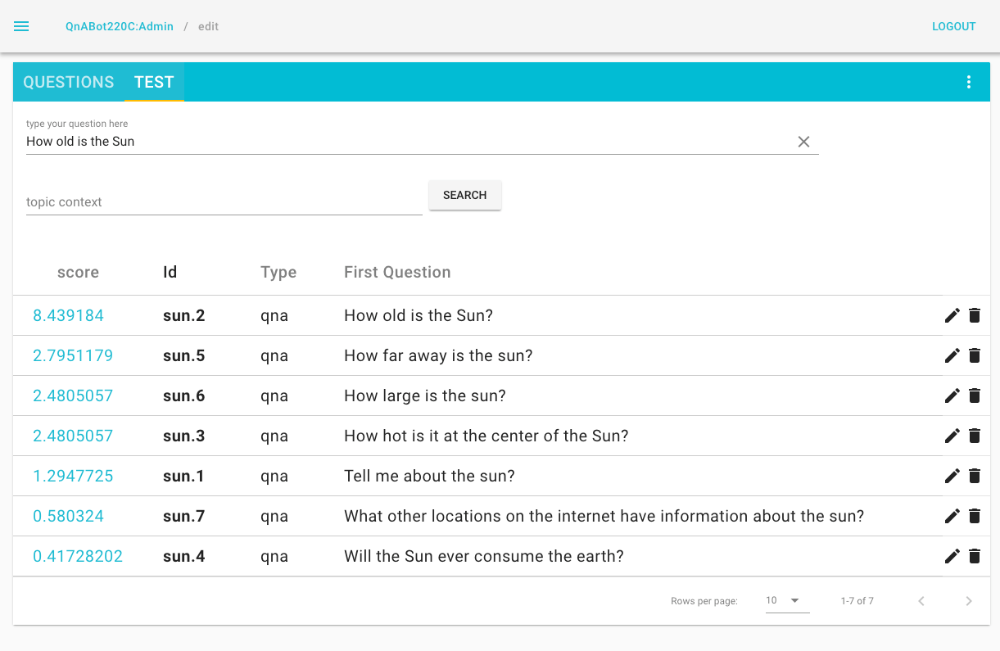


### Checkpoint:

You've now been able to add questions that your bot can respond to. Your bot's configuration can be 
exported using the Designer UI to a json file and downloaded to your system. You can also import a json file
containing QnABot configuration using the Designer.

1) Use 'Download' in the Designer UI menu to download your current configuration to your local system.

2) Use 'Import' to the import a configuration file from the following url:

    <pre>
    https://raw.githubusercontent.com/aws-samples/aws-ai-qna-bot/develop/workshops/reinvent2018/samples/sun-questions-qna-step-2.json
    </pre>
 
This file contains the questions preconfigured for the step. 

* Note: An import will overwrite existing questions with the same Question ID. 

[*^ back to top*](#solar-association-deploying-and-customizing-a-ready-made-question-and-answer-bot)

* * *

## Step 3 - Integrate QnABot into your website:

### Here's what you're going to work on in step 3: Deploy the Lex-Web-Ui and integrate a snippet of URL into your main html page.

Solar Association does not yet have a website and you've been tasked to create one. Lets deploy a simple 
website with just two files using Amazon S3 to host the website. The two files will be index.html and solar.png. 

We are going to use the [AWS Cloud9 IDE](https://aws.amazon.com/cloud9/ "Cloud9") to assist us. Perform the 
following to setup a new AWS Cloud9 Environment

#### Cloud9 Setup
   
1) Log into the AWS Console using your AWS Account

2) Set your region to N. Virginia (us-east-1)

2) Navigate to the Cloud9 Service

3) Click on create environment

4) Give this a name and description of QnABotWorkshop

5) Click Next step

6) Use the default of Create a new instance for environment (EC2)

7) Use the default of t2.micro

8) Use the default of Cost-saving setting - After 30 minutes (default)

9) Click Next step

10) Click Create environment
   
Your AWS Cloud9 environment will begin to be setup. Once its ready continue with the following.

#### Setup the Web Site

1) From the AWS Cloud9 console open the QnABotWorkshop environment
    * Under getting started select Clone Git Repository
    * In the terminal window that pops up complete the clone command to be
    <pre>
    git clone https://github.com/aws-samples/aws-ai-qna-bot.git
    </pre>

2) Run a script in your Cloud9 IDE that runs CloudFormation to setup an S3 bucket to host the website and uploads the two files

    <pre>
    cd aws-ai-qna-bot/workshops/reinvent2018/bin
    ./setupwebsite.sh
    </pre>

    You'll see output similar to
    
    <pre>
    
    Waiting for changeset to be created..
    
    No changes to deploy. Stack qnabotworkshop-website is up to date
    
    S3 Bucket: 
    qnabotworkshop-website-s3bucket-47l091varlix
    
    Website Url:
    http://qnabotworkshop-website-s3bucket-47l091varlix.s3-website-us-east-1.amazonaws.com/index.html
    
    upload: ../web/index.html to s3://qnabotworkshop-website-s3bucket-47l091varlix/index.html
    upload: ../web/solar.png to s3://qnabotworkshop-website-s3bucket-47l091varlix/solar.png
    </pre>

    * Note the Website Url. You can open this by clicking on the link from the IDE. Great. You should now see a fireball 
that is our Sun. 

3) Record the path to your website reported above. For example:
    
    ```
    http://qnabotworkshop-website-s3bucket-47l091varlix.s3-website-us-east-1.amazonaws.com
    ```

    This value will be used for ***WebAppParentOrigin*** when configuring the Lex-Web-Ui. 

4) Record the name of the Lex bot created in Workshop Step 1 to use as input to the next
    CloudFormation template. In your Cloud9 IDE run
    <pre>
    aws lex-models get-bots
    </pre>
    
    Look for a name similar to the stack name you used to create the QnABot. You can always find 
    the name of the Bot using CloudFormation in the outputs section for the stack you created in Step 1.

5) Deploy the lex-web-ui

    1) Open a new browser tab and navigate to https://www.amazon.com/chatbotui.  
    2) Scroll down until you see the yellow Launch Stack button and click it
    3) On Select Template, click Next
    4) On the parameters screen 
        * Set the stack name to be 'lex-web-ui-qnabot-workshop'
        * Set the CodeBuildName to be 'lex-web-ui-qnaabot-workshop'
        * Set the BotName to that returned in the step above for example 'QnABottwotwozero_Botup'
        * Set the WebAppParentOrigin to be the **URI** of the website you created
            * Note: The **URI** ends with .com and does not include the path /index.html
        * Set the WebAppConfBotInitialText to be 'You can ask me for information on the Sun. Just type questions for me or click on the mic and ask me.'
        * Set the WebAppConfBotInitialSpeech to be 'Ask me Sun questions.' to get started'
        * Set the WebAppConfToolbarTitle to be 'Sun Info'
        * Leave all the other parameters as is
    5) Click Next twice
    6) Check I acknowledge that AWS CloudFormation might create IAM resources with custom names.
    7) Click Create

    A new stack will launch which you can see in the CloudFormation console. This will take about fourt minutes to 
    finish. When its done, use the AWS Console to take a look at the stack Outputs
    
    * WebAppUrl
    * SnippetUrl
    
    These outputs provide links to web pages that provide access to the chat bot using different techniques.
    
    ***WebAppUrl*** provides a sample fullpage view of the chat bot. Click on this link and try 
    out chatting as well. 
    
    ***SnippetUrl*** provides the crucial code that we'll put into our simple website. 
    
6) Click on the SnippetUrl. You should see a snippet area that looks like the following.
    ```
        <script src="[YOUR-HOSTNAME]/lex-web-ui-loader.min.js"></script>
        <script>
          var loaderOpts = {
            baseUrl: 'https://lex-web-ui-qna-workshop-codebuilddep-webappbucket-6x7u4dwjv673.s3.amazonaws.com/'
          };
          var loader = new ChatBotUiLoader.IframeLoader(loaderOpts);
          loader.load()
            .catch(function (error) { console.error(error); });
        </script>
    ```
    * Note, ignore the Cloud9 IDE warning 'ChatBotUiLoader is not defined'. It is defined in the refereneced javascript.
    
7) Copy the from your snippet url, open web/index.html in Cloud9, and paste into index.html just below the '\<body\>' tag.

8) From the terminal window in Cloud9 make sure you are in the aws-ai-qna-bot/workshops/reinvent2018/bin folder. Then run

    <pre>
    ./setupwebsite.sh
    </pre>

    This will push the changes to index.html up to S3 hosting the website.
 
8) Open or Refresh the solar web page. You will now have embedded the open source lex-web-ui
on the Solar Association web site. Try chatting again and asking the bot questions.

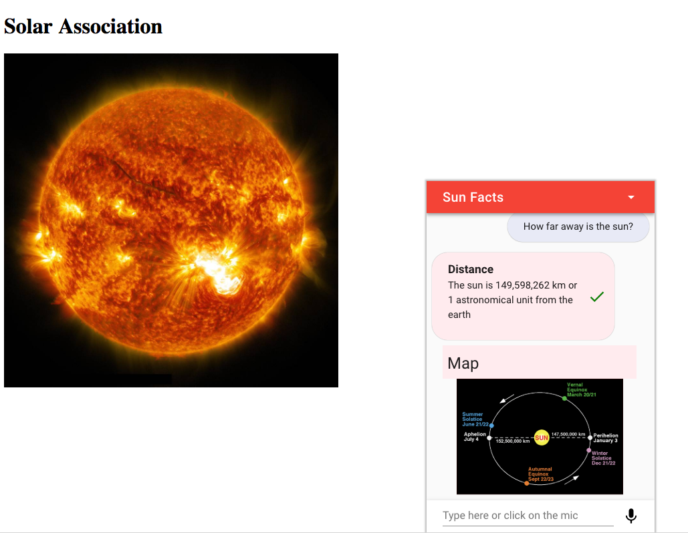

## CORS configuration

The configuration of the lex-web-ui took into account the parent page hosting the iframe
and performed the CORS configuration on the Lex Web UI S3 bucket for you. As long as the correct
parent page origin is configured into the Lex Web UI when the Cloud Formation template is
started, CORS will be automatically setup to allow the parent page and the newly minted 
Lex Web UI resources to work together. 

## Improving the look and feel of your bot

The QnABot in conjunction with the lex web ui support some advanced features that will help 
to improve look and feel as well as provide assisted navigation.  

### Markdown

1) Edit a question in your QnABot using the Designer. Select Advanced. Scroll down until you 
see Alternate Answers / Markdown. Add markdown to your answer

    \# For H1
    
    \#\# For H2
    
    \*Italic Characters\*

2) You can also generate simple tables to display. Try adding markdown to one of your questions and go 
back to the solar associations web page to try it out. 
    <pre>
    | Tables        | Are           | Cool  |
    | ------------- |:-------------:| -----:|
    | col 3 is      | right-aligned | $1600 |
    | col 2 is      | centered      |   $12 |
    | zebra stripes | are neat      |    $1 |
    </pre>

3) Add a link using Markdown ito the Alternate Answers
    <pre>
    [name](https://someurl) 
    </pre>
    
### Response Card and Buttons

Response cards are a great way to augment a response. You might want to display an
image to a user on an Echo Show or on the web site, or perhaps you'd like to display buttons 
to help the user navigate easily.

1) Edit a question in the Designer, click on Advanced, and scroll down to Response Card. 

2) Provide a title. It is a required field. 

    <pre>
    Suggestions
    </pre>
    * Note: the Lex Web UI can be configured to always hide the title. This is a parameter
    available in the Cloud Formation template. Sometimes hiding the title improves
    the appearance. If you do hide titles, use the Response Card subtitle to take 
    the place of the title. It will always be rendered. 

3) Add an image link
    <pre>
    https://3c1703fe8d.site.internapcdn.net/newman/gfx/news/hires/2018/imagethesunt.jpg
    </pre>

4) Add a button for the response card

    * Buttons are a great way to help the user navigate the chatbot. You can provide the user 
    with the next response they might want to give. For directional flows you can also 
    provide a number of different items they want to select next. 

    * Each button can be configured with the text to display in the button and the value that
    will be sent back to Lex if the button is clicked. 
    
5) Once you are happy with the additions you've made for markdown or response cards, 
click on update and then close once the update is successful.

6) Go back to the solar web page and type in the question you have been editing to see the 
photo response.

### Load in pre-configured questions for the end of Step 3
Use 'Import' to the import a configuration file from the following url:

    <pre>
    https://raw.githubusercontent.com/aws-samples/aws-ai-qna-bot/develop/workshops/reinvent2018/samples/sun-questions-qna-step-3.json
    </pre>
 
This file contains the questions preconfigured for the step. 

* Note: An import will overwrite existing questions with the same Question ID. 

### Quiz

On your own you can implement simple multiple choice quiz using the quiz functionality. See the 
[Questionnaire Blog Post.](https://aws.amazon.com/blogs/machine-learning/create-a-questionnaire-bot-with-amazon-lex-and-amazon-alexa/ "Quiz")

### Guided navigation

On your own can implement a tour / guided navigation. See the 
[Guided navigation Blog Post.](https://aws.amazon.com/blogs/machine-learning/creating-virtual-guided-navigation-using-a-question-and-answer-bot-with-amazon-lex-and-amazon-alexa/ "Guided")

### Checkpoint:

At this point you should be comfortable with embedding the qnabot on your website using
the lex-web-ui. You should also be comfortable improving the experience of the bot
using the advanced configuration features such as markdown, response cards with images,
and buttons. 

[*^ back to top*](#solar-association-deploying-and-customizing-a-ready-made-question-and-answer-bot)
* * *

## Step 4 - Integrate QnABot into an Amazon Connect call center

### Here's what you're going to work on in step 4: Create an Amazon Connect call center and wire in the QnABot bot.  
  
1) Open Connect [console:](https://console.aws.amazon.com/connect)  

    

2) Add an instance - I used 'qnabot' as the name, but you will have to use a globally unique name, e.g.: qnabot-<yourname>:  

    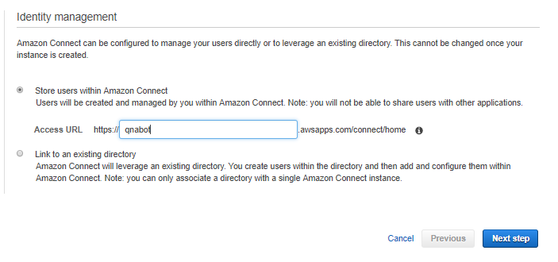

3) Skip the 'create new administrator' step - we can always get to administrative functions from AWS console.  
  
    
  
4) Choose to handle incoming calls with Amazon Connect  
  
    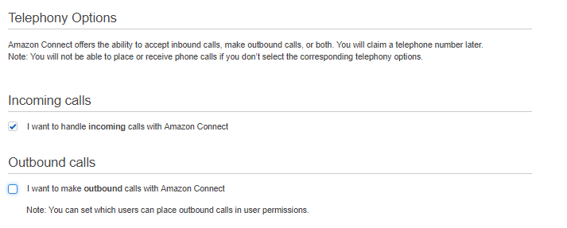  
  
5) Accept defaults for Data Storage, and choose 'Create Instance' on the Review and Create page:  
  
    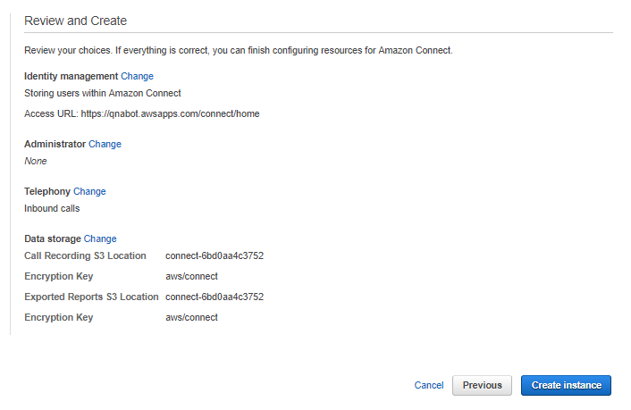
  
6) When the Success screen comes up, choose "Get Started"  
  
      
  
7) And "Let's Go!"  
  
    
  
8) Claim a phone number.. Choose 'United States', 'Direct Dial' or 'Toll Free', and select a number from the list offered. Then 'Next':  
  
    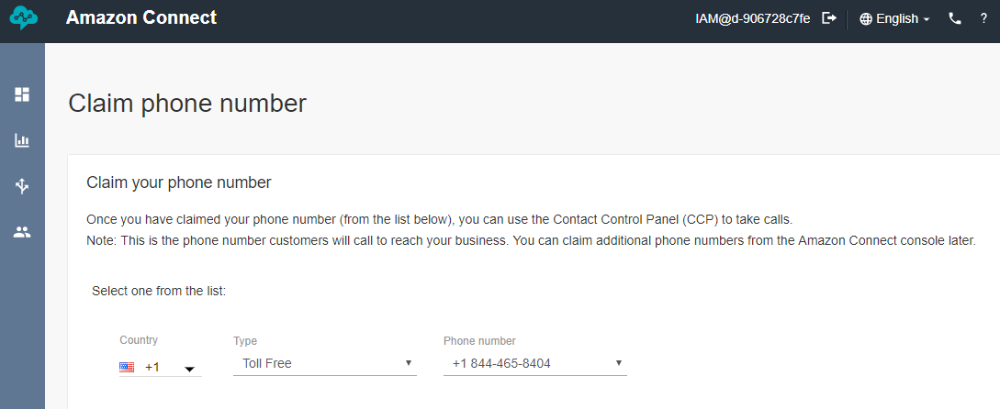
  
9) Play with the default call center as suggested. Or just choose 'Continue' to get on with integrating QnABot.  
  
    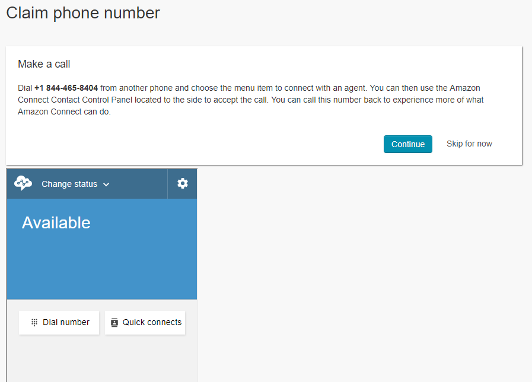
  

10) Now we must make the QnABot accessible to our new call center. Open the Amazon Connect console in a new tab (https://console.aws.amazon.com/connect), select our new call center, choose "Contact Flows" and add the QnABot Lex bot.

    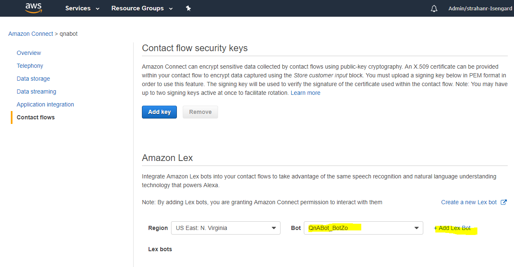
  
11) Go back to the call center admin page. From the Dashboard view, select 'Contact flows':  
  
    
  
12) then 'Create contact flow'  
  
    
  
13) Enter contact flow name, eg: "QnaBot"  
  
    
  
14) Open the 'Interact' folder, and drag 'Get customer input' widget to the canvas:  
  
    
  
15) Click on the 'Get customer input' widget to open its property pane. Enter a 'text to speech' prompt, eg "Hi, I'm Q and A bot. Ask me a question."  
  
    
  
16) Scroll down a bit, and enter the name of the QnABot Lex bot (Hint - go to the AWS CloudFormation Outputs tab to find the `BotName` value, and copy/paste to here.  Enter `$LATEST` as the Alias.  
  
    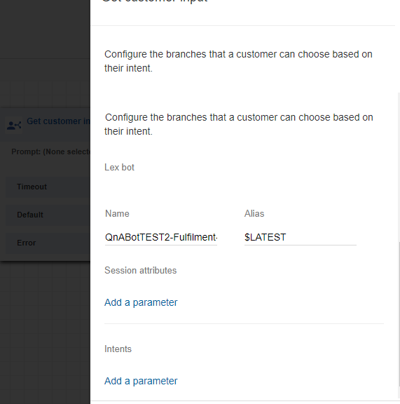
  
17) Add a "Disconnect / hang up" widget and connect the widgets as shown. Select 'Save and Publish"  
  
    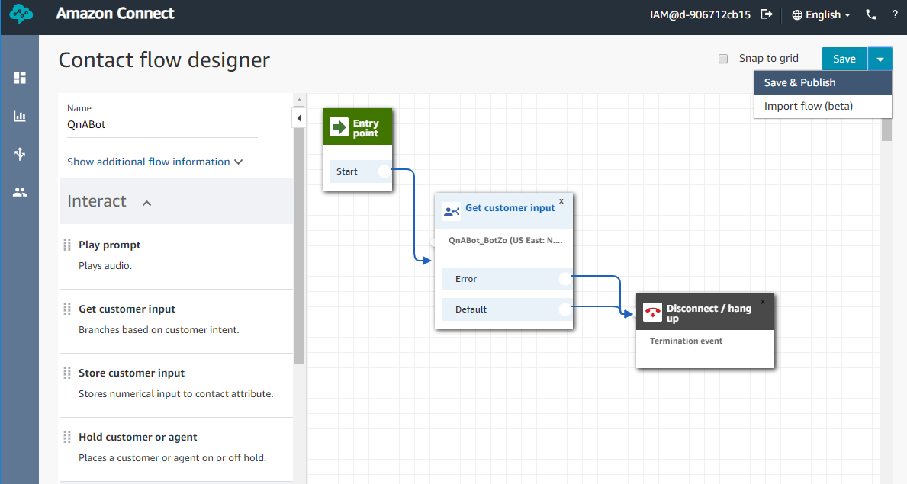
  
18) Go to "Routing"→"Phone numbers":  
  
    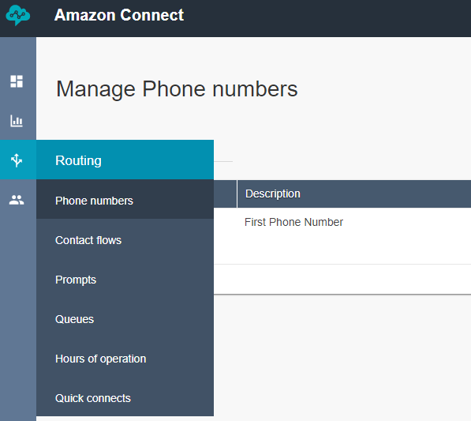
  
19) Choose the phone number to open the Edit Phone number form. Select the "QnABot" contact flow that we just created, and choose 'Save".  
  
    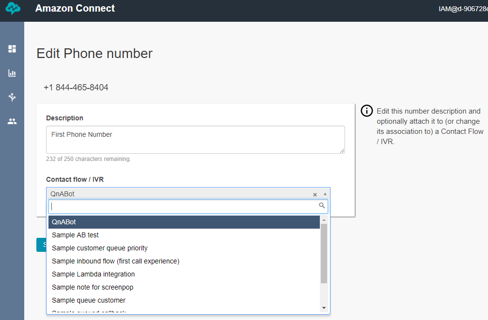
  
  
20) Try it now... Call the phone number for your new call center, and ask QnABot a question (ideally a question that you already entered into the Designer!)  
  
### Checkpoint:

Solar Association now has a phone number that can be used to answer questions configured
into the bot. Yay. Cross that off the list. 
  
[*^ back to top*](#solar-association-deploying-and-customizing-a-ready-made-question-and-answer-bot)
* * *
  
## Step 5 - Integrate Alexa

### Here's what you're going to work on in step 5: Implement your new QnA bot as an Alexa skill.  
  
QnABot also works with Alexa, allowing your users to get answers from your content via any Alexa enabled device, including Amazon FireTV, Amazon Dash Wand, and any of the Amazon Echo family of devices.
  
1) To enable Alexa, first create an Alexa skill for QnABot using the Amazon Developer Console. QnABot can’t automatically create the Alexa skill at this time, so we’ve provided instructions. Log in to the QnABot Content Designer (as explained earlier), and choose Alexa from the tools menu ( ☰ ):  

    
  

### Checkpoint:

Cool. Now you can ask Sun questions using your Alexa Skill and keep these easily updated.

[*^ back to top*](#solar-association-deploying-and-customizing-a-ready-made-question-and-answer-bot)

* * *
  
## Step 6 - Monitor Usage with Kibana:

### Here's what you're going to work on in step 6: 
To find out what your users up to with respect to your chat bot use a preconfigured Kibana deployment.

### Launching Kibana
1) Log into the Designer UI
2) From the menu pull down select Kibana Dashboard
3) Once Kibana appears for the first time select Dashboard on the left
4) Next click on Open
5) Select the 'Default'

    

### Standard Dashboard
1) Requests
2) Client types
3) Frequent utterances (tag cloud)
4)  answers with positive or negative feedback (requires enablement in designer)

### Build a query that finds all utterances that did not resolve to a question

1) See if you can build a query in Kibana that finds utterances a user made that did not
match any question?

    * In Kibana, click on Discover
    * Switch to the metrics index
    * In the query area enter 
    <pre>
    !(_exists_:"qid")
    </pre>
    Add utterance as a selected field

    * Note: Any document in the metrics index that does not have a qid did not match a question in
elastic search. 

    * Note: Sometimes Lex does not always pass utterances to the bot. 

        The message __Sorry, I did not understand that__ is due to Lex not matching an 
        intent to send this to. In qnabot there is one intent. Hence this message means that Lex
        did not understand enough about the request to the qnabot. 

        The message __You stumped me! Sadly I don't know how to answer your question.__ comes from qnabot. 
        You should find the utterances of this sort captured in the Kibana query above. 

### Rebuilding the Lex bot

If you experience many of the Lex matching errors, you can rebuild the Lex bot using the
Designer UI. 

1) Use the menu on the right hand side of the designer
2) Find the "three vertical dots"
3) Select Lex Rebuild. This will take the questions and add these to the Lex intent and then
rebuild the bot. **This is one way of reducing** the number of messages that Lex will
not forward to the Intent. 

### Experiment with other queries

Try implementing other Kibana queries using the fields available in the metrics index. 


### Checkpoint:

You learned using Kibana to see how users are exercising your bot and how to look for utterances 
that the system is not matching against. 

[*^ back to top*](#solar-association-deploying-and-customizing-a-ready-made-question-and-answer-bot)

* * *

## Step 7 - Customize with Lambda:

### Here's what you're going to work on in step 7:

Solar Association wants to provide quick access to Solar Flare information. In particular
the Association wants to let users know when the last solar flare events were detected. For this workshop,
implement two adjustments to your questions. 

1) Add to any answer if a Solar flare has detected in the last 30 days. 

2) Augment our QnA with the question, when were the last solar flares detected? 

To do this we are going to use a NASA API to create a lambda hook.

The [NASA API](https://api.nasa.gov/api.html#DONKI "NASA API") is at

[NASA API Example](https://api.nasa.gov/DONKI/SEP?startDate=2017-01-01&endDate=2018-12-30&api_key=DEMO_KEY "Example call")

The API takes two parameters, startDate and endDate. endDate defaults to current UTC Time 
so we can leave this empty unless we want to provide a question and answer for a specific
time range.  

* Note: This API uses a DEMO_KEY and limits the caller to 30 requests per hour for a given IP Address.

The challenge is to write a NodeJS based (or python or your favorite Lambda supported language)
that calls this api and augments an answer with whether a solar flare has occurred in the past
30 days. 

The Lambda hook should also generate a response that lists the time the last several
solar flares were detected using a markdown table format.  

### Lambda Hook Setup

1) On your Cloud9 IDE make sure that you have the latest sam-cli. If on 0.2.11 follow 
the following steps:

    ```$xslt
    sam --version
    
    A newer version of the AWS SAM CLI is available!
    Your version:   0.2.11
    Latest version: 0.6.1
    See https://github.com/awslabs/aws-sam-local for upgrade instructions
    
    sam version 0.2.11
    
    ```
    
    1) Use the following to install latest sam cli and latest aws cli packages
    ```$xslt
    npm uninstall -g aws-sam-local
    pip install --user aws-sam-cli
    pip install awscli --upgrade --user
    ```

    Add the following to .bash_profile and source this profile
    ```$xslt
    USER_BASE_PATH=$(python -m site --user-base)
    export PATH=$USER_BASE_PATH/bin:$PATH
    ```

    sam --version should now return a current version

2) Setup the lambda function by deploying a preconfigured CloudFormation template using sam

    ```$xslt
    cd aws-ai-qna-bot/workshops/reinvent2018/code/solarflare
    npm install
    cd ../../bin
    ./solarflare-setup.sh
    ./solarflare-pkg.sh
    ./solarflare-deploy.sh
    ```
    * Note: This function is defined in templates/solarflare-master.yaml. The solarflare-pkg.sh and solarflare-deploy.sh
    builds and uploads code for a Lambda function that will start with 'qna-'. The QnABot fulfillment lambda function is 
    given permissions to call other functions that start with 'qna'. 
    
### Lambda Hook Inputs and Return structure

The event object passed to the Lambda has two properties:

* event.req the normalized request object
* event.res the normalized response object (edit this to change the response)

The Lambda handler must return the modified event object.

### Calling the NASA API

1) Call the API
    <pre>
        debug("Calling via axios");
        const finalUrl = baseurl + '?startDate=2017-01-01' + '&api_key=' + process.env.api_key;
        let res = await axios(finalUrl, axiosConfig);
        debug("RESPONSE RECEIVED: ", JSON.stringify(res.data, null, 2));
    </pre>

### Check for the existence of an argument 

For this use case lets use the first argument to indicate how many recent solar flare event times to return to the caller 

    <pre>
        // if lambdahook argument requests last solar flares, walk the returned flares up to
        // count provided adding to output using markdown
        let recentCount = 0;
        if (event.res.result.args &&
          event.res.result.args.length > 0 &&
          event.res.result.args[0] &&
          event.res.result.args[0].length > 0) {
          recentCount = parseInt(event.res.result.args[0]);
        }
    </pre>    

### Return markdown based on the API result and the existing of an argument

    <pre>
        if (recentCount > 0) {
          //walk the return data and provide dates for the requested number of solar flares
          let cnt = 0;
          if (res.data.length > 0) {
            let messageMarkDown = '';
            let obj = {};
            obj.messages = [];
            for (let i = res.data.length - 1; i >= 0 && cnt < recentCount; i--) {
              messageMarkDown += "\n* " + res.data[i].eventTime;
              cnt++;
            }
            obj.messages.push({type: "CustomPayload", value: messageMarkDown} );
            event.res.message = JSON.stringify(obj);
            debug('Sending message: ' + event.res.message);
          }
    
        } else {
    </pre>

### Else augment the message with an alert if the a solar flare has been detected in the last 30 days

    <pre>
          // check dates for recent solar flares.
          let recentFlares = false;
          let recentFlaresEventTime = '';
    
          let oneMonthAgo = moment().subtract(30, 'days');
          debug('computed month ago: ' + oneMonthAgo);
          res.data.forEach((o) => {
            debug(`reported event time: ${o.eventTime}`);
            let eventTime = moment(o.eventTime);
            debug('parsed eventTime: ' + eventTime);
            if (eventTime > oneMonthAgo) {
              recentFlares = true;
              recentFlaresEventTime = o.eventTime;
            }
          });
          if (recentFlares) {
            debug('recent flares detected');
            event.res.message += ' Alert. Recent Solar Flare has been reported on ' + recentFlaresEventTime;
          } else {
            debug('recent flares not reported in the last 30 days');
          }
        }
    </pre>
    
###  Test your code for valid syntax

1) Run tests to validate syntax

<pre>
cd aws-ai-qna-bot/workshops/reinvent2018/code/solarflare
npm test
</pre>

If the tests are successful, continue with the next section to redeploy your function. 

* Note: the full solution is available in app-solution.js. You can copy this over app.js if needed

### Redeploy the code changes you just made

1) Execute the following commands to redeploy the updated function.

<pre>
cd aws-ai-qna-bot/workshops/reinvent2018/code/solarflare
./solarflare-pkg.sh
./solarflare-deploy.sh
</pre>

* Note: Copy the Function ARN reported by solarflare-deploy.sh. You'll use this value to configure the Lambda hooks.

Once your package is redeployed the next step will be to add the Lambda hook to existing questions and adding a new
question.

### Adding the Lambda Hook to existing questions

1) Edit any question

2) Click on advanced and find the Lambda section

3) Paste the ARN of the function as the ARN of the Lambda hook

4) Save and update the question

4) Use the Lex-Web-Ui to ask the question you just modified.

5) Verify the function executed in CloudWatch logs


### Adding the Lambda Hook to the new question

1) Add a new question 'When did the last solar flare occur?'

2) Click on Advanced and scroll down to the Lambda section

3) Paste the ARN of the function you copied earlier as the ARN of the Lambda hook.

4) Fill the Argument with a value of 3

4) Use the Lex-Web-Ui to ask the question you just added

5) Verify the function executed in CloudWatch logs

6) Verify the output contains a table withe 3 rows in the markdown

### Checkpoint:

If you have succeeded with this step you now have a functioning lambda hook that can be added to existing questions.
Once added to a question, the function will execute each time the question is selected as the response to the 
user.

If no arguments are supplied, the function will check for flares that might have occurred in the last 30 days and 
report an incident.

If an argument (N) is supplied as an integer, the function will return N most recent solar flare dates. 


### If desired, load in pre-configured questions with Lambda support for the end of Step 7

Use 'Import' to the import a configuration file from the following url:

    <pre>
    https://raw.githubusercontent.com/aws-samples/aws-ai-qna-bot/develop/workshops/reinvent2018/samples/sun-questions-qna-step-7.json
    </pre>
 
This file contains the questions preconfigured for the step. 

* Note 1: An import will overwrite existing questions with the same Question ID. 

* Note 2: Two questions reference the lambda function. You need to update the ARN of these functions
after importing the sample file with the ARN of the function you have created in step 7. The question
ids to update are sun.8 and sun.2.

* * *


[*^ back to top*](#solar-association-deploying-and-customizing-a-ready-made-question-and-answer-bot)

* * *
## Finished! Please fill out evaluation cards!

Congratulations on completing the labs, or at least giving it a good go.  Thanks for helping Solar Universal publish a chatbot and reduce the load on its call center! 

* * *

## Workshop Cleanup

This is really important because if you leave stuff running in your account, it will continue to generate charges.  Certain things were created by CloudFormation and certain things were created manually throughout the workshop.  Follow the steps below to make sure you clean up properly.

Delete manually created resources throughout the laUbs:

* Use your AWS Cloud9 IDE's terminal to remove the sample web site
```$xslt
cd aws-ai-qna-bot/workshops/reinvent2018/bin
./removewebsite.sh
```
* Use the AWS Cloud9 Dashboard to Delete your development environment

* Use the Amazon Connect console to delete your call center instance

Finally, [delete the CloudFormation stacks](http://docs.aws.amazon.com/AWSCloudFormation/latest/UserGuide/cfn-console-delete-stack.html) launched at the beginning of the workshop to clean up the rest.  If the stack deletion process encountered errors, look at the Events tab in the CloudFormation dashboard, and you'll see what steps failed.  It might just be a case where you need to clean up a manually created asset that is tied to a resource goverened by CloudFormation.
* Use the AWS CloudFormation console to delete the QnABot stacks you launched
  * lex-web-ui
  * qnabotworkshop
  
[*^ back to the top*](#solar-association-deploying-and-customizing-a-ready-made-question-and-answer-bot)
