# Solar Association: Deploying and Customizing a ready made Question and Answer Bot

## Overview:

Welcome to the Solar Association team.

The Solar Association is an association that specializes in providing data about the Sun to universities and research 
institutions around the globe. Recent acquisitions from NASA and the European Space agency have added a wealth of
information to Solar's vast database of Sun facts. The marketing team at Solar Universal has launched a new 
campaign to raise awareness of their information. Recent extreme Sun activity has peaked public curiosity. The 
current call center is overwhelmed and needs an immediate solution to provide quick answers and information about
the Sun.

The team researched the best mechanism to handle this load and have decided on a chatbot embedded in their
existing website. They don't know anything about implementing a chatbot but need to get something running quickly in 
2 hours. 

Your job is to implement Sun facts on your website. 

### Requirements:

* AWS account - if you don't have one, it's easy and free to [create one](https://aws.amazon.com/). Note: If you are 
attending the workshop at re:Invent 2019, an AWS account will be provided to you for use during the workshop.
* Amazon developer account - if you don't have one its easy and free to [create one](https://developer.amazon.com).
* AWS IAM account with elevated privileges allowing you to interact with CloudFormation, IAM, S3, Elasticsearch, CloudWatch, Cloud9. [Learn how](https://docs.aws.amazon.com/IAM/latest/UserGuide/id_users_create.html).
* Familiarity with [NodeJS](https://www.nodejs.org) and [AWS](httpts://aws.amazon.com) - *not required but a bonus*.
* If you want to test out the voice capabilities of the Bot, have a headset with mic available to test with.

### Running the workshop

These steps are designed to be completed in sequence, and the full set of instructions are documented below.  Read and follow along to complete the steps.  
During the workshop, AWS staff will give you a high-level overview of the labs and help answer any questions.  Don't worry if you get stuck, we provide hints along the way.

* **Step 1:** [Deploying your very own QnABot](#step-1---lets-begin-and-deploy-a-working-qnabot)
* **Step 2:** [Manage questions, answers, test the simple bot](#step-2---manage-questions-answers-and-test-using-the-client-ui)
* **Step 3:** [Integrate on your WebSite](#step-3---integrate-qnabot-into-your-website)
* **Step 4:** [Integrate QnABot into an Amazon Connect Call Center](#step-4---integrate-qnabot-into-an-amazon-connect-call-center)
* **Step 5:** [Integrate Alexa](#step-5---integrate-alexa)
* **Step 6:** [Integrate SMS](#step-6---integrate-sms)
* **Step 7:** [Monitor Usage in Kibana](#step-7---monitor-usage-with-kibana-and-cloudwatch)
* **Step 8:** [Customize with Lambda](#step-8---customize-with-lambda)
* **Step 9:** [Kendra Fallback Search](#step-9---extending-qnabot-to-leverage-enterprise-search-with-kendra)
* **Step 10:** [Multiple Languages](#step-10---supporting-multiple-languages-in-qnabot)
* **Step 11:** [New QnABot features in 2.4.0](#step-9---new-features)
* **Cleanup** [Put everything away nicely](#workshop-cleanup)

### Conventions:

Throughout this workshop, we will provide commands for you to run.  These commands will look like this:

<pre>
$ aws es list-domain-names
$ aws es describe-elasticsearch-domain --domain-name <b><i>DOMAIN-NAME</i></b>
$ aws lex-models get-bots</b>
</pre>

The command starts after the `$`.  Text that is ***UPPER_ITALIC_BOLD*** indicates a value that is unique to your environment.  
For example, ***DOMAIN-NAME*** refers to the name of an Elasticsearch domain created in your account.  You can find these unique 
values either in the CloudFormation outputs or by navigating to the specific service dashboard in the [AWS management console](https://console.aws.amazon.com).

Tasks or actions that you need to complete will always start with a number 
1) For example, this is an action you should take

### IMPORTANT: Workshop Cleanup

You will be deploying infrastructure on AWS which will have an associated cost.
When you're done with the workshop, [follow the steps at the very end of the instructions](#workshop-cleanup) to make 
sure everything is cleaned up and avoid unnecessary charges.

* * *

## Step 1 - Let's begin and deploy a working QnABot

### You have an important choice to make at this point of the workshop

#### You are Not At reInvent (Most likely) or you wish to deploy QnABot in your own AWS account

- Follow the steps in step 1A below and then go on to Step 2 [Manage questions, answers, test the simple bot](#step-2---manage-questions-answers-and-test-using-the-client-ui) (Note this part of the setup will take ~25 minutes to complete)

#### You are attending at reInvent 2019

- Jump forward to Step 1B below and ***DO NOT run Step 1A***. 

## Step 1A

### Workshop Setup:

You've found the AWS QnABot open source project and want to test this as a possible vehicle to implement your chatbot.

1) Log into the AWS Management Console using Chrome or Firefox and select **US East (N.Virginia)** for your [AWS region](http://docs.aws.amazon.com/AWSEC2/latest/UserGuide/using-regions-availability-zones.html).

    The region dropdown is in the upper right hand corner of the console to the left of the Support dropdown menu.  For this workshop, you will use **N.Virginia**.

2) Launch the [CloudFormation template](https://console.aws.amazon.com/cloudformation/home?region=us-east-1#/stacks/new?stackName=QnABot&templateURL=http://s3.amazonaws.com/aws-bigdata-blog/artifacts/aws-ai-qna-bot/templates/public.json). 

3) On the Specify Details step of the Create Stack process, enter values for the following fields:

    * **Stack Name** <pre> QnABotWorkshop </pre>
    * **Email** <pre> ***[valid email address]*** </pre>
        * Note: Provide a valid email address you have access to. This field is to used to send an email registering you for 
        access to the QnABot Content Designer. You must have access to this email. Without this it becomes difficult to access the Content Designer
    * **Username** <pre> Admin </pre>

4) Launch the stack. Make sure to select both checkboxes in the Capabilities acknowledgements.  
    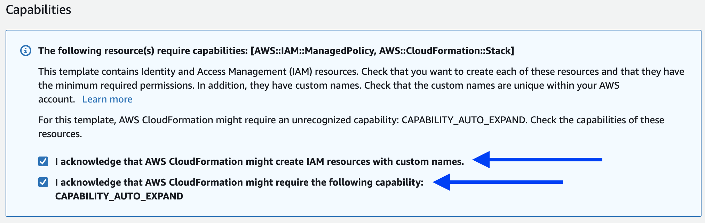

The CloudFormation template will launch the following:

* Elasticsearch Service cluster
* API Gateway
* Amazon Cognito UserPool and related settings
* S3 Buckets to hold the Content Designer web app, Lex-Web-Ui web app, and QnABot metrics
* An Amazon Lex Bot to handle questions and answers
* Lambda functions support the Content Designer and Lex Fulfillment
* Kibana Dashboard to display usage metrics  
* Kinesis Firehouse used as an alternate mechanism to store metrics in S3
* IAM Roles and Policies to support access to the resources

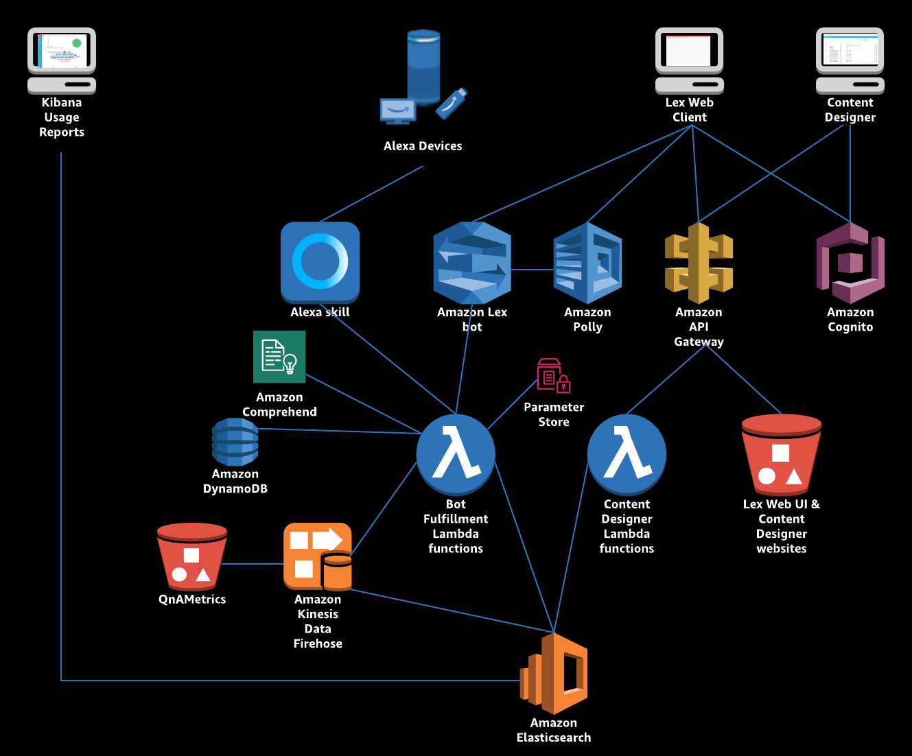

### Checkpoint:

This Checkpoint only applies to step 1A where you are installing QnABot from a CloudFormation template into your own account.

If you are completing step 1B please proceed to running the commands below starting with Elasticsearch Service. 
You will not need to wait 25 minutes for setup to complete as this stack has been pre-installed. 

If you have just launched the CloudFormation stack, it will take 25 minutes to complete.  Periodically check on the stack creation process in the 
CloudFormation Dashboard. If no stack shows up immediately, click the refresh button at the top right hand corner of 
your screen.  Your stack should show status **CREATE\_COMPLETE** in roughly 25 minutes. 

If there was an [error](http://docs.aws.amazon.com/AWSCloudFormation/latest/UserGuide/troubleshooting.html#troubleshooting-errors) 
during the stack creation process, CloudFormation will rollback and terminate.  You can investigate and troubleshoot by 
looking in the Events tab.  Any errors encountered during stack creation will appear in the event stream as a failure.

Go ahead and start reading the next section while your stack is being created. Once the stack has been created you can 
explore resources using the AWS console for ElasticSearch, Lex, Lambda, Cognito. 

If you have cli access to your AWS account you can also use the following commands to explore the resources 
being created. Later in Step 3 you'll setup an AWS Cloud9 IDE which you can also use to run these commands.                                           

#### Helpful commands to look at your resources are shown below

##### Elasticsearch Service
<pre>
$ aws es list-domain-names
$ aws es describe-elasticsearch-domain --domain-name <b><i>DOMAIN-NAME</i></b>
</pre>

* Note: Use the domain name output from the first command to use as the DOMAIN-NAME in the second command.

##### AWS Lex Bot
<pre>
$ aws lex-models get-bots</b>
</pre>

The prior command will show the Lex Bot that has been created for you.

##### AWS Cognito UserPool
<pre>
$ aws cognito-idp list-user-pools --max-results 5
</pre>

* Note: The --max-results argument could need to be increased based on the number of existing cognito user pools in your account

##### AWS CloudFormation stack outputs
<pre>
$ aws cloudformation list-stacks
$ aws cloudformation describe-stacks --stack-name <b><i>YOURSTACKNAME</i></b>
</pre>

"TemplateDescription": "QnABot with admin and client websites - (Master v2.5.0)", 

You should also look to see the Outputs from your stack displayed in the Cloud Formation console. 
Notice a number of urls. There are two very important URLs:
* ContentDesignerURL
* ClientURL
* BotName
* DashboardURL

Fore more information on the stack this is launching refer to the AWS QnABot at [QnABot blog post](https://www.amazon.com/qnabot).  

[Step 2 - Manage questions, answers, test the simple bot](#step-2---manage-questions-answers-and-test-using-the-client-ui)

[*^ back to top*](#solar-association-deploying-and-customizing-a-ready-made-question-and-answer-bot)

## Step 1B

### You are attending at reInvent

Congratulations on attending re:Invent 2019. We provisioned an AWS account that you
can use during this workshop with an install of QnABot. You can log into this AWS account using the hash code 
handed out to you as you entered the workshop. Navigate to:

[Event Enginge Dashboard](https://dashboard.eventengine.run/)

Log into the AWS console using the links provided at EventEngine. 

The setup of QnABot is complete except for one small detail. 

The normal install of QnABot will send via email a url to the QnABot Designer UI along with the temporary 
password that has been set for you. You would normally use this link to reset the Admin password for the
QnABot Designer UI. Since QnABot was setup ahead of time you will need to manually reset the Content Designer UI Admin 
user password to a value you specify. You will be setting a new temporary password that will need to be changed
the first time you login to the QnABot Designer UI. 

### Setting a new temporary password for the Content Designer UI for your EventEngine Supplied AWS Account

Login to the EventEngine supplied AWS Account and provision a Cloud9 IDE. If you have not used Cloud9 IDE before, 
follow theses steps which are also covered again in Step 3. 

We are going to use the [AWS Cloud9 IDE](https://aws.amazon.com/cloud9/ "Cloud9") to assist us to reset the password.
Perform the following to setup a new AWS Cloud9 Environment. Note: You will not need to perform this again in step 3. 

#### Cloud9 Setup
   
1) Log into the AWS Console using your AWS Account

2) Set your region to N. Virginia (us-east-1)

3) Navigate to the Cloud9 Service

4) Click on create environment

5) Give this a name and description of <pre>QnABotWorkshop</pre>

6) Click Next step

7) Use the default of Create a new instance for environment (EC2)

8) Use the default of t2.micro

9) Use the default of Cost-saving setting - After 30 minutes (default)

10) Click Next step

11) Click Create environment
   
Your AWS Cloud9 environment will begin to be setup. Once its ready continue with the following.

In the Cloud9 console, open a new Terminal window using the "+" button. 

From this window perform the following steps.

List the Amazon Cognito user pool that has been provisioned for you. 

``` 
aws cognito-idp list-user-pools --max-results 5
```
This command outputs json. Looks for that attributes named "Id" and "Name".  similar to
``` 
"Id": "us-east-1_tdc8N6oyZ",
```
Next execute the command below. You can specify any password you wish although it should be at least 
8 characters in length, have at least one uppercase letter, one lowercase letter, one number, and one 
special character. An acceptable password is "MyPassword2019_" as shown in the
command. This password will be required when you login to the designer UI later in step 2 the first time. This 
command will set a new temporary password that you will change the first time you login to the QnABot Designer UI.
``` 
aws cognito-idp admin-set-user-password --user-pool-id [YourUserPoolIdFromJson] --username Admin --password MyPassword2019_
```
[*^ back to top*](#solar-association-deploying-and-customizing-a-ready-made-question-and-answer-bot)
* * *

## Step 2 - Manage questions, answers, and test using the client ui

### In this step you're going to set your Designer UI admin password, login to the Designer UI, and add some questions and answers

***NOTE: QnABot Stack complete in ~25 minutes after launch.*** Before proceeding make sure the stack is complete.

1) Either Open the link in the email CloudFormation sent to you (running in your own account) or open the link fro the ContentDesigner UI
available in outputs from the QnABot stack. 

2) The user name is <pre>Admin</pre>

3) The password is the temporary password either sent to you via email or you set via step 1B.

4) After the first login, you will be asked to update the password. The requirements are:
    * 8 characters minimum length
    * Numbers, special character, uppercase and lowercase letters

5) Once logged in, click on "Add" to input a new question. Use a Item Id of 
    <pre>
    sun.1
    </pre>

6) The first question we want the Bot to respond to is 
    <pre>
    Tell me about our Sun
    </pre>
    This represents our most frequently asked question. 

7) The bot needs to answer with <pre>Our sun is 4.6 billion years old. Its considered a yellow dwarf with a diameter of 1,392,684 
kilometers and a circumference of 4,370,005 kilometers. It has a mass that is equal to 333,060 earths and a surface 
temperature of 5,500 degrees celsius. Really Hot!</pre>

8) Once you've added the first question and its answer, naturally you want to test it out. Using the Content Designer UI, 
click on the menu item in the upper left hand corner and select the "QnABot client". 

A sample web based client will appear. In the chat area type in: <pre>Tell me about the sun</pre> and press enter. You'll see your 
question answered. If you have headsets available, plug these in and click on the mic button. Then speak to the bot
saying:<pre>Tell me about the sun</pre> The Bot should respond with audio as well. 

9) Lets add one more question 

    * Item id: <pre>sun.2</pre>
    * Q: <pre>How old is the Sun?</pre>
    * A: <pre>Our sun is 4.6 billion years old</pre>

10) Test out the second question.  

11) Click on The Test tab to bring up the Test area in the Designer UI.

12) Enter a question <pre> How old is the sun </pre>

13) Click on the Search button. Look at the results. Notice the score column. The answer selected by the QnABot will be the answer with highest matching score.

    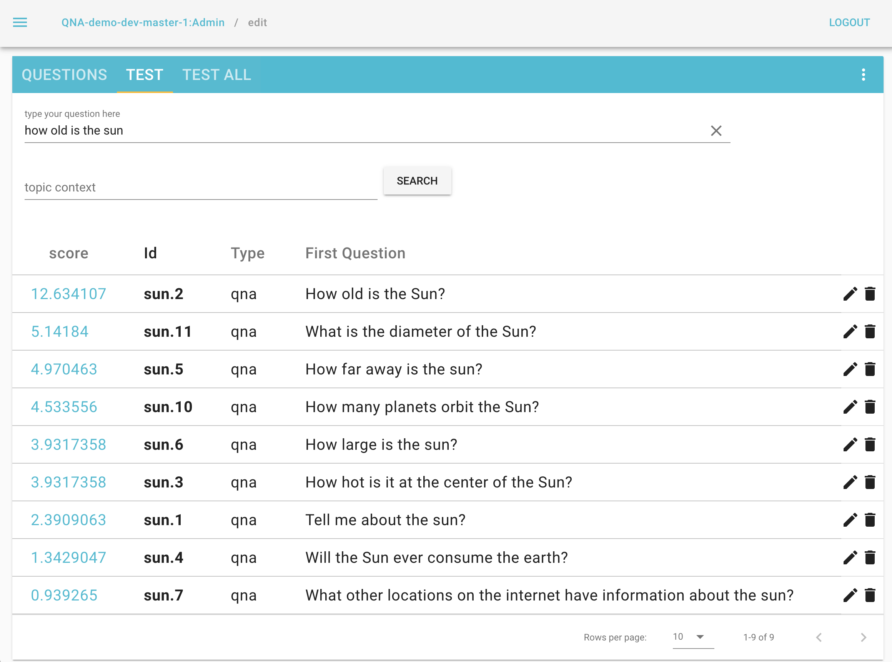

14) For a small percent of questions, the Amazon Lex service does not match a Lex Intent for the question asked. 
  Usually the response is, "Sorry, I did not understand that". When you encounter these errors, the Designer UI should 
  be used to rebuild the Lex Bot. Lets rebuild the Lex Bot now to show you how this is done. This action takes
  all the presently defined questions and inserts them directly into a Slot Value used in Lex. After a rebuild
  Lex should be able to match the question to the intent correctly and call the qnabot correctly. Invoke the 
  menu item show in the images below to rebuild the Lex Bot. 

    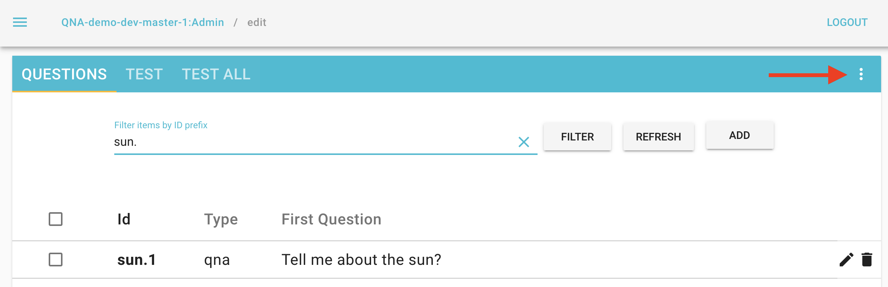

15) Another error you might see is "You stumped me! Sadly I don't know how to answer your question." This error 
comes from QnaBot. QnaBot could not find an acceptable match in the knowledge base managed by elasticsearch. 
You'll need to add a new question to the knowledge that provides an appropriate answer.

16) The new version of QnABot (2.4.0 and higher) and Lex-Web-Ui (0.14.8) support 
default implementations of Thumbs Up, Thumbs Down, and Help. These are loaded as 
Questions into QnABot. Use the Designer UI Import Menu. Click on Examples/Extensions
and click on the Load button next to QnaUtility. You'll see several new questions
that handle Thumbs Up, Thumbs Down, and Help added to the list of Questions. 

    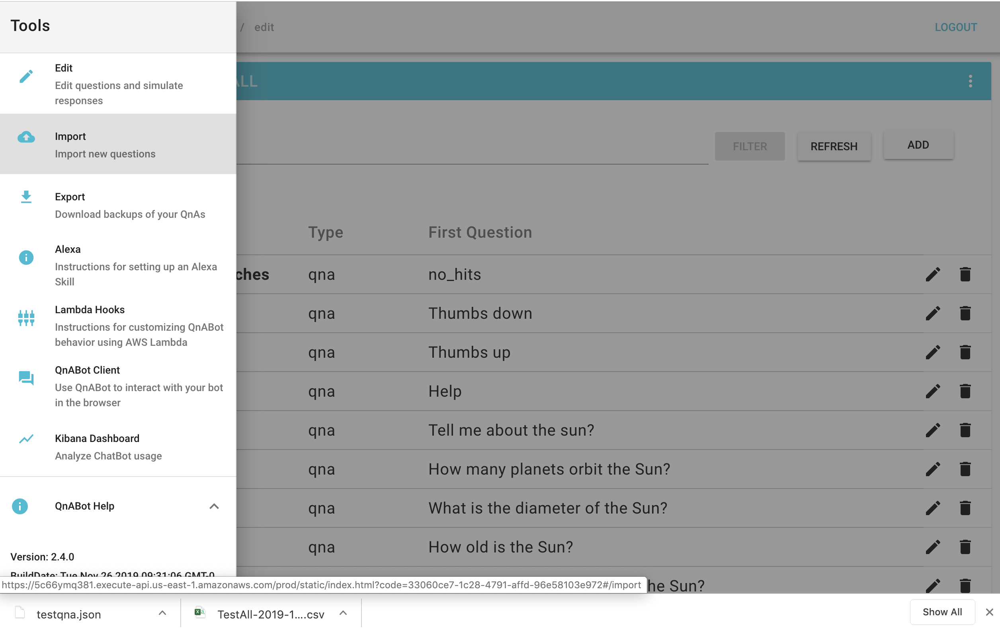
    
    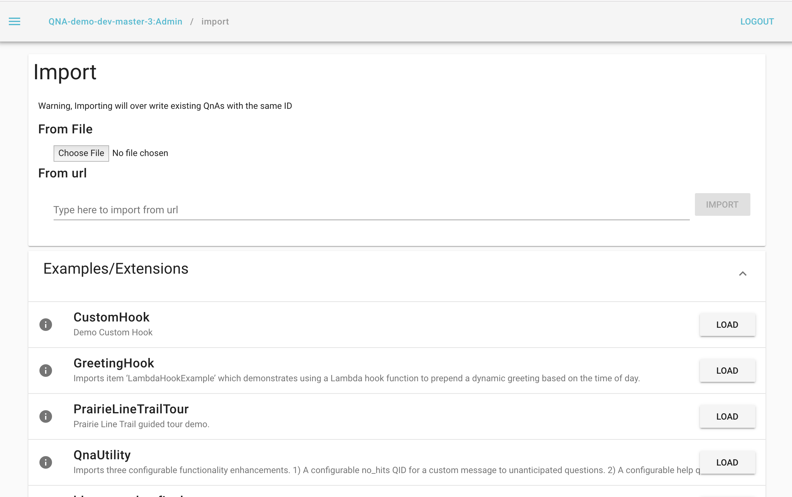

    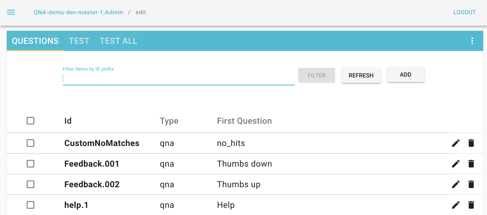


### Checkpoint:

You've now been able to add questions that your bot can respond to. 

Your bot's configuration can be exported using the Designer UI to a json file and downloaded to your system. You can also import a json file
containing QnABot configuration using the Designer.

1) Use 'Export' and once complete then click on the download arrow next to available file.

2) Use 'Import' to the import a configuration file from the following url:

    <pre>
    https://raw.githubusercontent.com/aws-samples/aws-ai-qna-bot/master/workshops/reinvent2019/samples/sun-questions-qna-step-2.json
    </pre>
 
This file contains a set of preconfigured questions. 

* Note: An import will overwrite existing questions with the same Question ID. 

[*^ back to top*](#solar-association-deploying-and-customizing-a-ready-made-question-and-answer-bot)

* * *

## Step 3 - Integrate QnABot into your website:

### Here's what you're going to work on in step 3: Deploy the Lex-Web-Ui and integrate a snippet of code into an html page.

Solar Association does not yet have a website and you've been tasked to create one. Lets deploy a simple 
website with just two files using Amazon S3 to host the website. The two files will be index.html and solar.png. 

We are going to use the [AWS Cloud9 IDE](https://aws.amazon.com/cloud9/ "Cloud9") to assist us. 

If you have already setup Cloud9 in Step 1B you can skip these Cloud9 setup instructions.  If not, perform the following to setup a new AWS Cloud9 Environment. 

#### Cloud9 Setup
   
1) Log into the AWS Console using your AWS Account

2) Set your region to N. Virginia (us-east-1)

3) Navigate to the Cloud9 Service

4) Click on create environment

5) Give this a name and description of <pre>QnABotWorkshop</pre>

6) Click Next step

7) Use the default of Create a new instance for environment (EC2)

8) Use the default of t2.micro

9) Use the default of Cost-saving setting - After 30 minutes (default)

10) Click Next step

11) Click Create environment
   
Your AWS Cloud9 environment will begin to be setup. Once its ready continue with the following.

#### Setup the Web Site

1) From the AWS Cloud9 console open the QnABotWorkshop environment
    * Under getting started select Clone Git Repository
    * In the terminal window that pops up complete the clone command to be
    <pre>
    git clone https://github.com/aws-samples/aws-ai-qna-bot.git
    </pre>

2) Run a script in your Cloud9 IDE that runs CloudFormation to setup an S3 bucket to host the website and uploads two files

    Running this script requires the ability to set the file's acl in the S3 bucket to public-read. The S3 Bucket
    will not be public-read. Only the files uploaded will be public-read. Before running this 
    script, at a minimum set "Block public access to buckets and objects granted through new access control lists (ACLs)"
    to "Off" in the account's S3 Block public access (Account Settings). 
    
    * Open the AWS S3 Console
    * On the left select, "S3 Block public access (account settings)"
    * Make sure "Block public access to buckets and objects granted through new access control lists (ACLs)" is not selected
    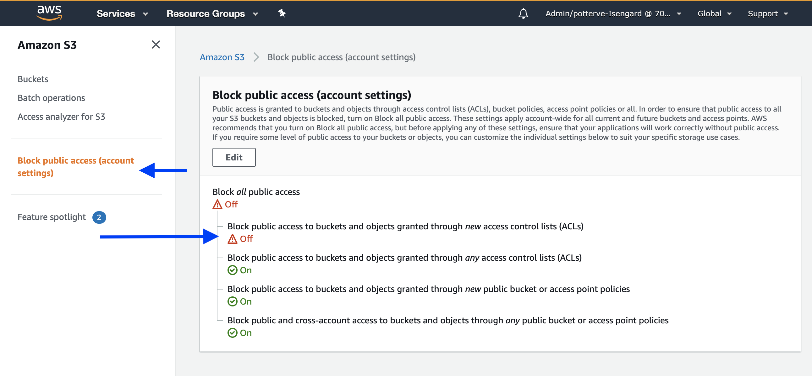
    
    Once you have confirmed and/or updated your settings in S3 you can run the following in your Cloud9 IDE bash window. 
    After Step 3 in the workshop has been completed, set your S3 Block public access (account settings) to desired values. 

    <pre>
    cd ~/environment/aws-ai-qna-bot/workshops/reinvent2019/scripts
    ./setupwebsite.sh
    </pre>

    You'll see output similar to the following. 
    
    *Note: Do not copy these values from the readme. Instead use the values from your cloud9 bash window.*
    
    <pre>
    S3 Bucket: 
    qnabotworkshop-website-s3bucket-8gu5l0vyt777

    LEX WEB UI PARENT ORIGIN: 
    https://qnabotworkshop-website-s3bucket-example-do-not-copy.s3.amazonaws.com

    Website URL:
    https://qnabotworkshop-website-s3bucket-example-do-not-copy.s3.amazonaws.com/index.html

    upload: ../web/index.html to s3://qnabotworkshop-website-s3bucket-example-do-not-copy/index.html
    upload: ../web/solar.png to s3://qnabotworkshop-website-s3bucket-example-do-not-copy/solar.png
    
    </pre>

    * Note the LEX WEB UI PARENT ORIGIN. You'll use this as input to the ***WebAppParentOrigin*** when configuring the Lex-Web-Ui.
    * Note the Website URL. You can open this by clicking on the link from the IDE. You should now see artwork representing the Sun. 

3) Record the URI to your LEX WEB UI PARENT ORIGIN reported above. It will be similar to the following:

 
    *Note: Do not copy these values from the readme. Instead use the values from your cloud9 bash window.*
    
    ```
    https://qnabotworkshop-website-s3bucket-example-origin-do-not-use.s3.amazonaws.com
    ```

    This value will be used for ***WebAppParentOrigin*** when configuring the Lex-Web-Ui. 

4) Record the name of the Lex bot created in Workshop Step 1 to use as input to the next
    CloudFormation template. In your Cloud9 IDE run
    <pre>
    aws lex-models get-bots
    </pre>
    
    Look for a name similar to the stack name you used to create the QnABot. You can always find 
    the name of the Bot using CloudFormation in the outputs section for the stack you created in Step 1.

5) Deploy the lex-web-ui

    1) Launch the [lex-web-ui](https://console.aws.amazon.com/cloudformation/home?region=us-east-1#/stacks/new?stackName=lex-web-ui&templateURL=https://s3.amazonaws.com/aws-bigdata-blog/artifacts/aws-lex-web-ui/artifacts/templates/master.yaml "Lex Web Ui") stack 
    2) Leave parameters defaulted except for 
        * Stack name <pre>lex-web-ui-qnabot-workshop </pre>
        * CodeBuildName <pre>lex-web-ui-qnabot-workshop </pre>
        * BotName <pre> **The botname obtained from AWS Console or from command line aws lexmodels get-bots**</pre>
        * WebAppParentOrigin <pre> **URI** of the website you created previously </pre>
            * Note: The **URI** ends with .com and does not include the path /index.html
            
        * WebAppConfBotInitialText <pre> You can ask me for information on the Sun. Just type questions for me or click on the mic and ask me.</pre>
        * WebAppConfBotInitialSpeech <pre> Ask me questions about the Sun </pre>
        * WebAppConfToolbarTitle <pre> Sun Info </pre>
    3) Create the stack

    A new stack will launch which you can see in the CloudFormation console. This will take four or five minutes to 
    finish. When its done, use the AWS Console to take a look at the stack Outputs
    
    * WebAppUrl
    * SnippetUrl
    
    These outputs provide links to web pages that provide access to the chat bot.
    
    ***WebAppUrl*** provides a sample fullpage view of the chat bot. Click on this link and try 
    out chatting as well. 
    
    ***SnippetUrl*** provides the crucial code that we'll put into our simple website. 
    
6) Click on the SnippetUrl. You should see a snippet area that looks like the following.
    ```
        <script src="[YOUR-HOSTNAME]/lex-web-ui-loader.min.js"></script>
        <script>
          var loaderOpts = {
            baseUrl: 'https://lex-web-ui-qna-workshop-codebuilddep-webappbucket-6x7u4dwjv673.s3.amazonaws.com/'
          };
          var loader = new ChatBotUiLoader.IframeLoader(loaderOpts);
          loader.load()
            .catch(function (error) { console.error(error); });
        </script>
    ```    
7) Copy the contents returned by your snippet url into your clipboard

8) In the Cloud9 IDE open 
    ```
    QnaBotWorkshop/aws-ai-qna-bot/workshops/reinvent2019/web/index.html 
    ```

9) Paste your clipboard into index.html just below the '\<body\>' tag

10) Save the modified file
    * Note, ignore the Cloud9 IDE warning 'ChatBotUiLoader is not defined'. It is defined in the referenced javascript.

11) From a terminal window in Cloud9 IDE make sure you cd to the 
    ```
    cd ~/environment/aws-ai-qna-bot/workshops/reinvent2019/scripts
    ```

12) Then in the terminal run

    <pre>
    ./setupwebsite.sh
    </pre>

    This will push the changes made to index.html up to S3 hosting the website.
    
13) Open or Refresh the solar web page. You will now have embedded the open source lex-web-ui
on the Solar Association web site. Try chatting again and asking the bot questions.

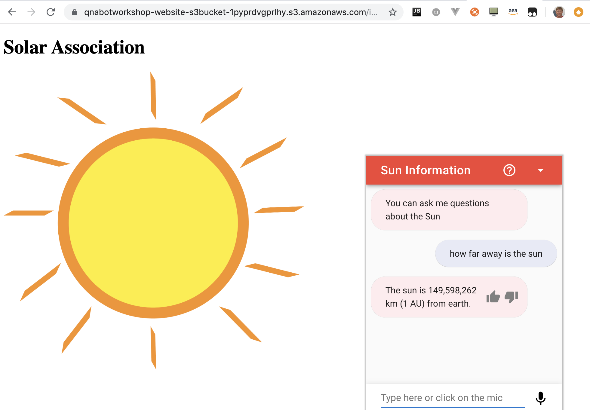

### Improving the look and feel of your bot

The QnABot in conjunction with the lex web ui support some advanced features that will help 
to improve look and feel as well as provide assisted navigation.  

#### Markdown

1) Edit a question in your QnABot using the Designer. Select Advanced. Scroll down until you 
see Alternate Answers / Markdown. Add markdown to your answer
    <pre>
        # For H1
        ## For H2
        *Italic Characters*
    </pre>

2) You can also generate simple tables to display. Try adding markdown to one of your questions and go 
back to the solar associations web page to try it out. 
    <pre>
    ## Some facts 
    |Property             | Value              | 
    |:--------------------|-------------------:|
    | Age                 | 4.6 Billion Years  |
    | Type                | Yellow Dwarf (G2V) |
    | Diameter            | 1,392,684 km       |
    | Surface Temperature | 5,500 °C           |
    </pre>

3) Add a link using markdown into the Alternate Answers Markdown field
    <pre>
    [NASA](https://www.nasa.gov) 
    </pre>
    
#### Response Card and Buttons

Response cards are a great way to augment a response. You might want to display an
image to a user on an Echo Show or on the web site, or perhaps you'd like to display buttons 
to help the user navigate easily.

1) Edit a question in the Designer, click on Advanced, and scroll down to Response Card. 

2) Provide a title. It is a required field. 

    <pre>
    Suggestions
    </pre>
    * Note: the Lex Web UI can be configured to always hide the title. This is a parameter
    available in the Cloud Formation template. Sometimes hiding the title improves
    the appearance. If you do hide titles, use the Response Card subtitle to take 
    the place of the title. It will always be rendered. 

3) Add an image link
    <pre>
    https://spaceplace.nasa.gov/review/gallery-sun/SOHO_composite_L.en.jpg
    </pre>

4) Add a button for the response card

    * Buttons are a great way to help the user navigate the chatbot. You can provide the user 
    with the next response they might want to give. For directional flows you can also 
    provide a number of different items they want to select next. 

    * Each button can be configured with the text to display in the button and the value that
    will be sent back to Lex if the button is clicked. 
    
5) Click on update once the changes have been made and then close once the update is successful.

6) Go back to the solar web page and type in the question you have been editing to see the 
photo response.

### Load in pre-configured questions for the end of Step 3
Use 'Import' to the import a configuration file from the following url:

```
https://raw.githubusercontent.com/aws-samples/aws-ai-qna-bot/master/workshops/reinvent2019/samples/sun-questions-qna-step-3.json
```
 
This file contains the questions preconfigured for the step. 

* Note: An import will overwrite existing questions with the same Question ID. 

### Quiz

Outside of the workshop you can implement simple multiple choice quiz using the quiz functionality. See the 
[Questionnaire Blog Post.](https://aws.amazon.com/blogs/machine-learning/create-a-questionnaire-bot-with-amazon-lex-and-amazon-alexa/ "Quiz")

### Guided navigation

Outside of the workshop you can implement a tour / guided navigation. See the 
[Guided navigation Blog Post.](https://aws.amazon.com/blogs/machine-learning/creating-virtual-guided-navigation-using-a-question-and-answer-bot-with-amazon-lex-and-amazon-alexa/ "Guided")

### Checkpoint:

At this point you should be comfortable with embedding the QnABot on your website using
the lex-web-ui. You should also be comfortable improving the experience of the bot
using the advanced configuration features such as markdown, response cards with images,
and buttons. 

[*^ back to top*](#solar-association-deploying-and-customizing-a-ready-made-question-and-answer-bot)
* * *

## Step 4 - Integrate QnABot into an Amazon Connect call center

### Here's what you're going to work on in step 4: Create an Amazon Connect call center and wire in the QnABot bot.  
  
1) Open Connect [console:](https://console.aws.amazon.com/connect)  

    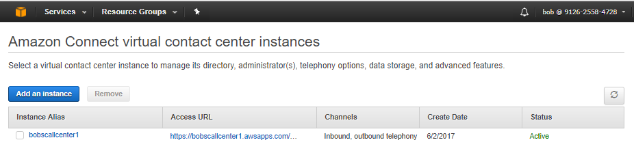

2) Add an instance - I used 'qnabot' as the name, but you will have to use a globally unique name, e.g.: qnabot-*yourname*  

    

3) Skip the 'create new administrator' step - we can always get to administrative functions from AWS console.  
  
    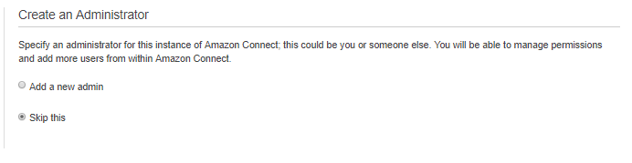
  
4) Choose to handle incoming calls with Amazon Connect  
  
      
  
5) Accept defaults for Data Storage, and choose 'Create Instance' on the Review and Create page:  
  
    
  
6) When the Success screen comes up, choose "Get Started"  
  
    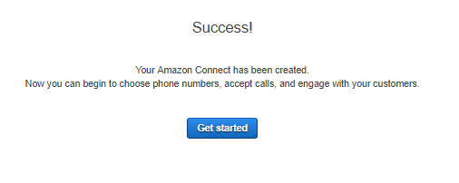  
  
7) And "Let's Go!"  
  
    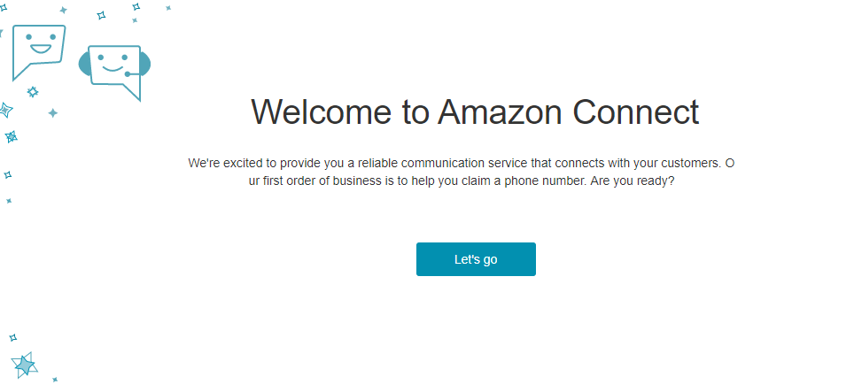
  
8) Claim a phone number.. Choose 'United States', 'Direct Dial' or 'Toll Free', and select a number from the list offered. Then 'Next':  
  
    
  
9) Play with the default call center as suggested. Or just choose 'Continue' to get on with integrating QnABot.  
  
    
  

10) Now we must make the QnABot accessible to our new call center. Open the Amazon Connect console in a new tab (https://console.aws.amazon.com/connect), select our new call center, choose "Contact Flows" and add the QnABot Lex bot.

    
  
11) Go back to the call center admin page. From the Dashboard view, select 'Contact flows':  
  
    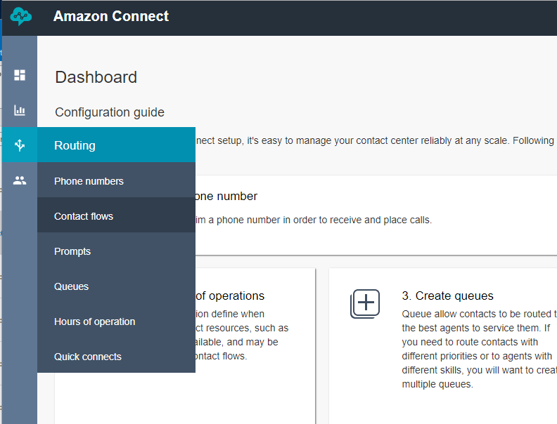
  
12) then 'Create contact flow'  
  
    
  
13) Enter contact flow name, eg: "QnaBot"  
  
    
  
14) From the Cloud9 IDE, open the workshops/reinvent2019/connect-assets folder and download the qnabot-sample file 
to your local system.

15) Back in the Contact Flow you just created, Click on the Down Arrow next to Save, and then select Import(beta) and 
load the sample contact flow you just downloaded to your system. After loading the contact flow it will look similar
to the image below. 

```
~/environment/workshops/reinvent2019/connect-assets-qnabot-sample
```

  

This flow contains a number of items that drive the logic in Connect. You'll notice the use of 'Get customer input' to
interact with the QnABot. This widget is used twice in the contact flow. You need to update the Name of the bot 
used by the flow and the Intents which are used within the bot. The sample contact flow needs to be updated. 

To do that first open up the AWS Lex Console so that you an obtain the intent names for your QnABot.

Then click on each of the Get customer input widgets. First change the Bot it is using. It should automatically show 
the available QnABot.

Next in the AWS Lex Console click on the QnABot. It will open and show you the two intents associated with the bot. 
You'll need to cut and paste each intent name from the AWS Lex Console for QnABot into the intents section in the 'Get 
customer input' widget. Update both intents. Be sure to save the changes to each widget. 

You'll also notice the use of the "Disconnect / hang up" widget at the end of the call flow. 

In this example, we have the Connect call flow looping back to QnABot. The call flow sets a Lex attribute named 
connectKeepAlive to true on each iteration. QnABot can disconnect this loop by setting the attribute named 
connectKeepAlive to false when the bot wishes to disconnect. 

To set connectKeepAlive to false you can use the following "HandleBar" template to set a session attribute. 

```
{{setSessionAttr 'connectKeepAlive' 'false'}}
```

The sample contact flow looks for this attribute and loops back to QnABot as long as the attribute is true. To 
implement this disconnect, add a new question to QnABot. The question should be "Goodbye". The answer should be

```
{{setSessionAttr 'connectKeepAlive' 'false'}}Goodbye. Thanks for calling.
```


This is a very simple example. Sometimes one will implement additional Lex bots to prompt for Yes/No answers directly
within Connect.

14) Finally save the Contact flow and then publish the Contact flow. 
  
15) Go to "Routing"→"Phone numbers":  
  
    
  
16) Choose the phone number to open the Edit Phone number form. Select the "QnABot" contact flow that we just created, and choose 'Save'. 
  
    
  
  
17) Try it now... Call the phone number for your new call center, and ask QnABot a question (ideally a question that you already entered into the Designer!)  
    * Note - It takes a little bit of time before the new contact flow is ready. If you
    get the default contact flow, wait 30 seconds or so and try again.  
  
### Checkpoint:

Solar Association now has a phone number that can be used to answer questions configured
into the bot. Yay. Cross that off the list. 
  
[*^ back to top*](#solar-association-deploying-and-customizing-a-ready-made-question-and-answer-bot)
* * *
  
## Step 5 - Integrate Alexa

### Here's what you're going to work on in step 5: Implement your new QnA bot as an Alexa skill.  
  
QnABot also works with Alexa, allowing your users to get answers from your content via any Alexa enabled device, including Amazon FireTV, Amazon Dash Wand, and any of the Amazon Echo family of devices.
  
1) To enable Alexa, first create an Alexa skill for QnABot using the Amazon Developer Console. QnABot can’t automatically create the Alexa skill at this time, so we’ve provided instructions. Log in to the QnABot Content Designer (as explained earlier), and choose Alexa from the tools menu ( ☰ ):  

    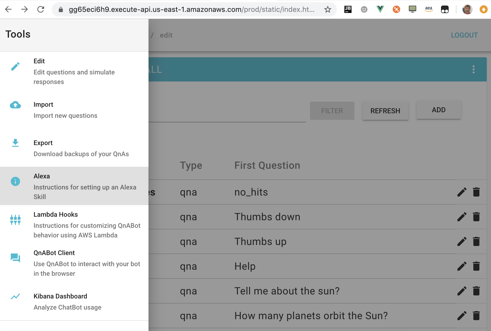
  

### Checkpoint:

Cool. Now you can ask Sun questions using your Alexa Skill and keep these easily updated.

[*^ back to top*](#solar-association-deploying-and-customizing-a-ready-made-question-and-answer-bot)

* * *
  
## Step 6 - Integrate SMS:

### Here's what you're going to work on in step 6:

* Setup a new Twilio free trial account
* Acquire a new phone number to send messages to
* Setup the Twilio channel for QnABot 
* Setup Twilio with a WebHook to send messages via Lex to QnABot
* Test out the integration

The first item to complete is to setup a free trail account at Twilio. This trial account will provide enough
resource to perform a limited experiment with the integration from a single verified phone number . 

1)Navigate to the following URL
  [Twilio Account Signup](https://www.twilio.com/try-twilio)
2) Provide the account details and start your trial.
  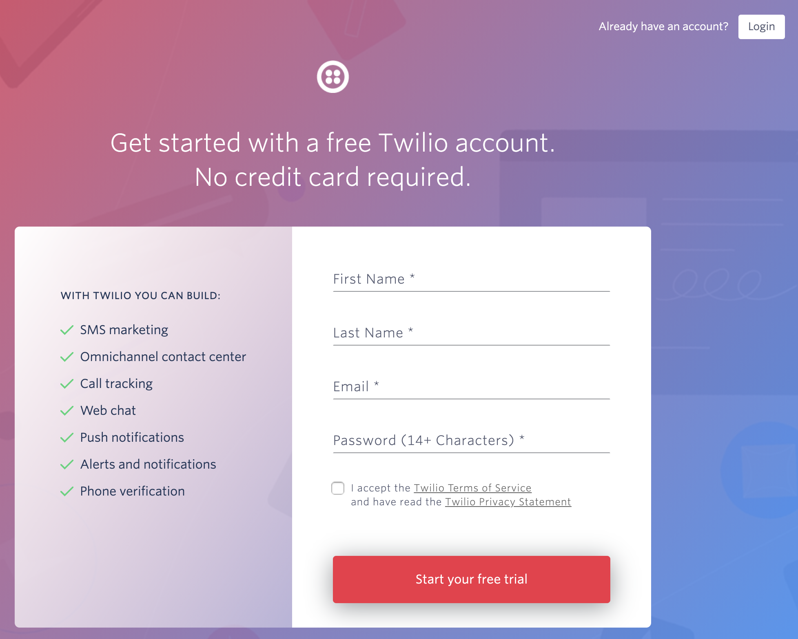
3) Verify the new account setup via the email Twilio sends.
4) Verify your phone number using the code sent to you.
  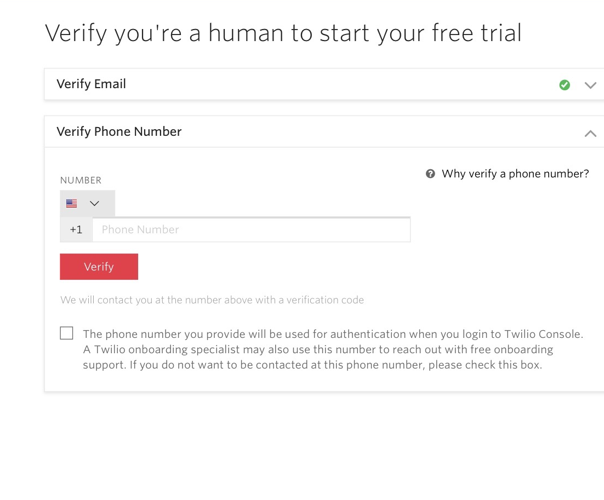
5) Select Yes for "Do you write code?"
6) Select NODE.JS
7) Select "Use Twilio in a project"
8) Select "Send or receive a SMS" for "What do you want to do first?"

Your free Trial Account should now be setup. 
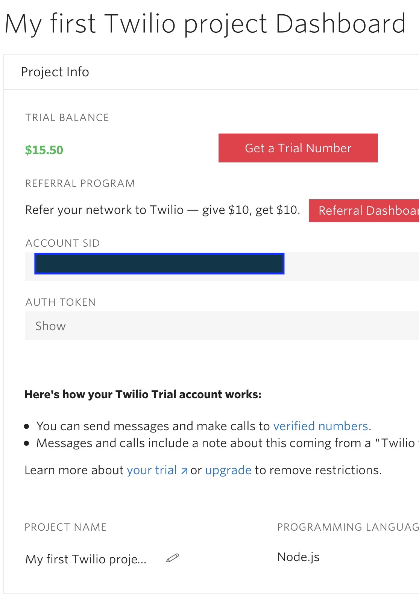

From your Twilio project dashboard 

1) Obtain a Trial Number
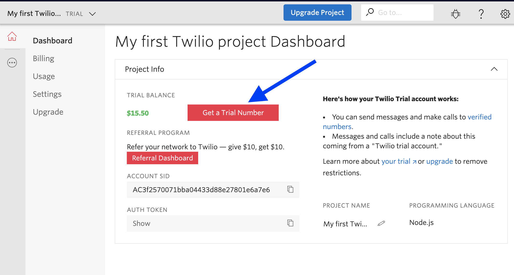
2) Find your ACCOUNT SID and AUTH TOKEN
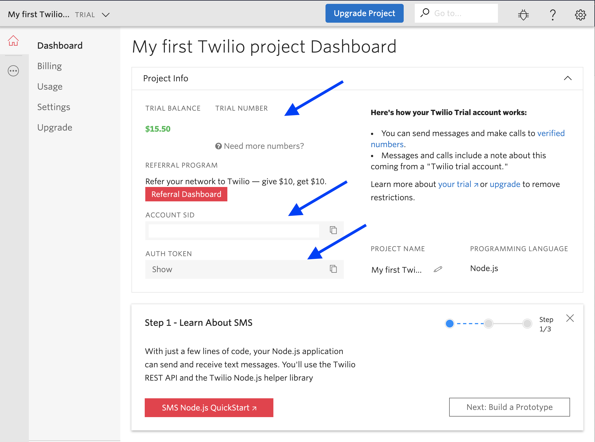

Navigate to the Amazon Lex Console

1) Open your QnABot
2) Select the channels tab
3) Select the Twilio channel on the left
4) Fill in the Twilio channel properties including the Account SID and Auth Token obtained from Twilio. Click on Activate.
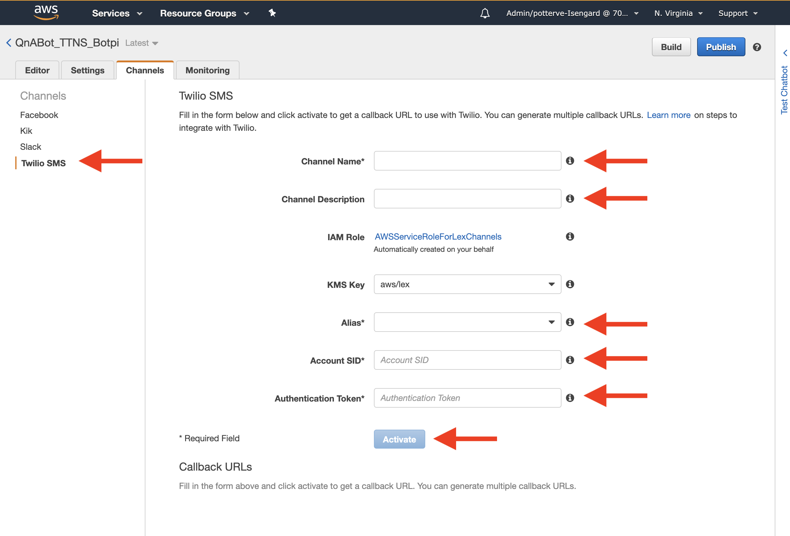

At the bottom of your Amazon Lex Twilio channel properties page, copy the next Endpoint URL
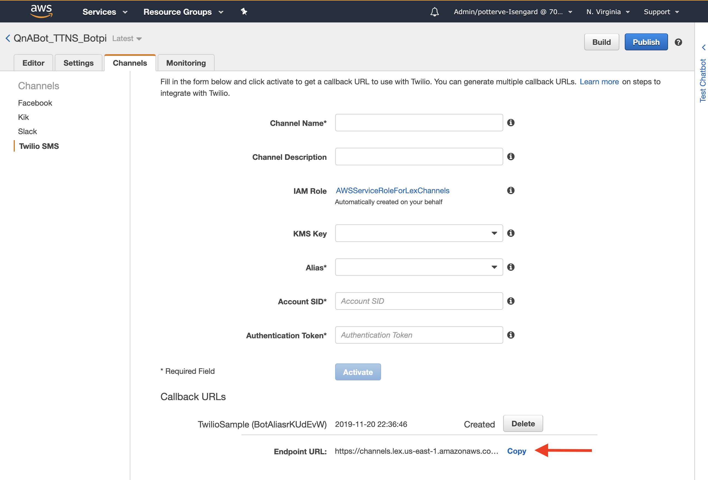

Back in the Twilio page
1) Click on the all products and services button "..."
2) Open the Phone Numbers page under the Super Network menu item
3) Click on your active number
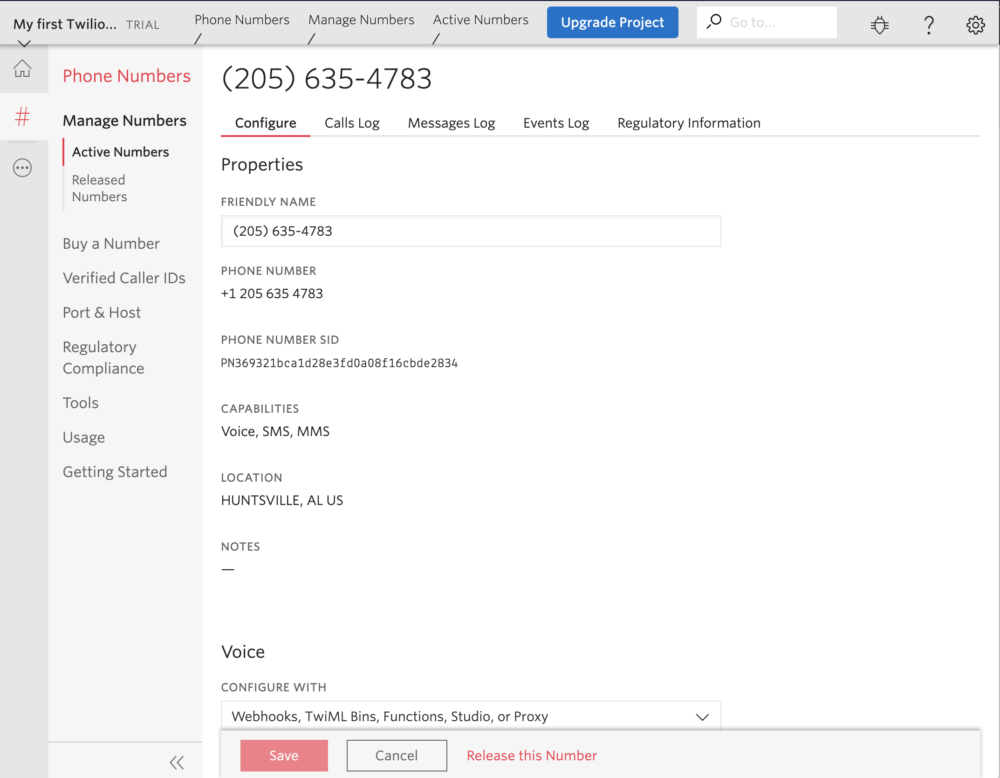
4) Scroll down and file in the AWS endpoint url as the WebHook for Messaging
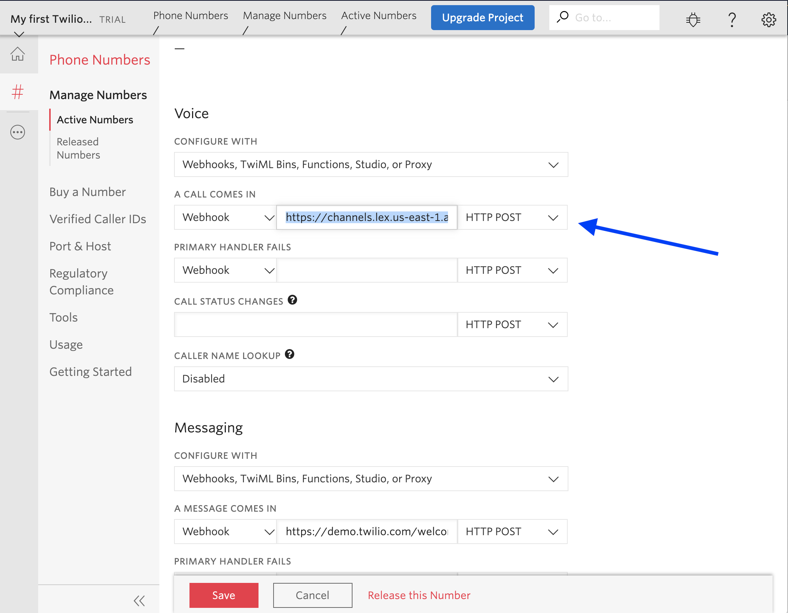
5) Click on Save

Test out your integration. 
1) Open your message app on your mobile device
2) Send a question to your new Twilio phone number
3) QnABot should respond with the appropriate answer

### Checkpoint:

Super. If everything is setup, now you have a text message based channel for your QnABot. You can text your questions
to the bot. 

If you have time and a valid Facebook app, you can integration a Facebook channel as well. 

[*^ back to top*](#solar-association-deploying-and-customizing-a-ready-made-question-and-answer-bot)

* * *
  
## Step 7 - Monitor Usage with Kibana and CloudWatch:

### Here's what you're going to work on in step 7: 
* Enable Feedback in QnaBot - By default feedback is not enabled in QnABot. This step will
  walk you through enabling the standard Feedback mechanism.
* Use a preconfigured Kibana deployment to find out what your users have been up to with respect to your 
  chat bot.
  
### Enable Feedback
1) Log into the Designer UI
2) Pull down the upper left menu and select Import from the upper left
3) Expand the Examples/Extensions at the bottom
4) Click on the load button across from 'QnaUtility'
5) Wait for the load of QnaUtility.json to complete (should be very quick).
   You'll see new question ids of Feedback.001, Feedback.002, and CustomNoMatches with questions 'Thumbs Down', 'Thumbs Up', and 'no_hits'. 
6) Once this process is complete, after asking a question and getting an answer,
 users can give feedback to the system by clicking on the thumbs up or thumbs down buttons or saying or typing 'thumbs up', or 'thumbs down'. This feedback will be seen in the Kibana dashboard. 
7) Try the following from your chat bot web client
```
How hot is the sun
```

Click on the Thumbs up button. 

Ask another question and leave feedback once more.
```
How hot is mars
```
Click on the Thumbs down button.

The above steps will will prime the system with some feedback to display in Kibana.

### Launch Kibana
1) Log into the Designer UI
2) Pull down the upper left menu and select select Kibana Dashboard
3) Once Kibana appears for the first time select Dashboard on the left
4) Next click on Open
5) Select the 'Default'

    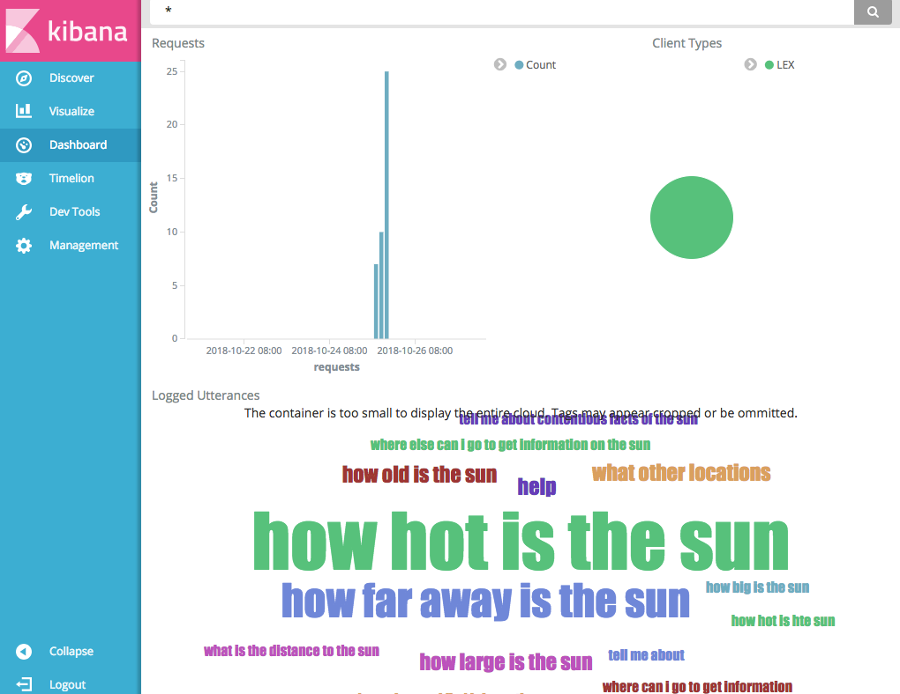

### Standard Dashboard
* Requests
* Client types
* Frequent utterances (tag cloud)
* Answers with positive or negative feedback (needs to be enabled in the Designer UI)

### Build a query that finds all utterances that did not resolve to a question

1) See if you can build a query in Kibana that finds utterances a user made that did not
match any question?

    * In Kibana, click on Discover
    
    * Switch to the qnametrics index
    
    * In the query area enter 
    <pre>
    entireResponse.got_hits:0
    </pre>
    Add utterance as a selected field
    
    * Note: Any document in the metrics index that does not have a qid did not match a question in
elastic search. 

    * Note: Sometimes Lex does not always pass utterances to the bot. 

        The message __Sorry, I did not understand that__ is due to Lex not matching an 
        intent to send this to. In QnABot there are two intents now including a Fallback Intent. This message was
        present in prior versions of QnABot and indicated that Lex could not match an Intent. However, since QnABot v2.4.0 
        and higher, QnABot should always be called by Lex with the additiona of the Fallback Intent. 

        The message __You stumped me! Sadly I don't know how to answer your question.__ comes from QnABot. 
        You should find the utterances of this sort captured in the Kibana query above. 


### Experiment with other queries

Try implementing other Kibana queries using the fields available in the metrics index. 

### Open the CloudWatch QnABot Dashboard for service level monitoring

In the AWS Console open CloudWatch

Click on Dashboards

Click on the existing QnABot Dashboard

   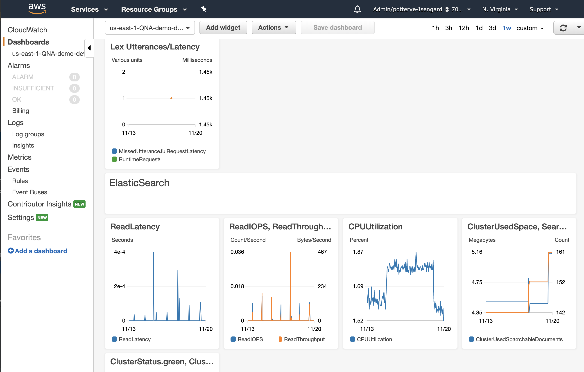

### Checkpoint:

You learned how to enable feedback, you learned how to use Kibana to see how users are exercising 
your bot and how to look for questions that the system is not matching against. 

[*^ back to top*](#solar-association-deploying-and-customizing-a-ready-made-question-and-answer-bot)

* * *

## Step 8 - Customize with Lambda:

### Here's what you're going to work on in step 8:

Solar Association wants to provide quick access to Solar Flare information. In particular
the Association wants to let users know when the last solar flare events were detected. For this workshop,
implement two adjustments to your questions. 

* Add to any answer if a Solar flare has been detected in the last 30 days. 

* Add a new question, 'When were the last solar flares detected?' 

To do this we are going to use a public api from [NASA API](https://api.nasa.gov/index.html "NASA API") named [DONKI](https://api.nasa.gov/api.html#DONKI "NASA API")
to obtain information on Solar Flares.


[NASA API Example](https://api.nasa.gov/DONKI/FLR?startDate=2017-01-01&endDate=2019-12-30&api_key=DEMO_KEY "Example call")

The API takes two parameters, startDate and endDate. endDate defaults to current UTC Time 
so we can leave this empty unless we want to provide a question and answer for a specific
time range.  

* Note: This API uses a DEMO_KEY and limits the caller to 30 requests per hour for a given IP Address.

The challenge is to write a NodeJS based (or python or your favorite Lambda supported language)
that calls this api and augments an answer with whether a solar flare has occurred in the past
30 days. We've provided a default implementation in NodeJS.

The Lambda hook should also generate a response that lists the time the last several
solar flares were detected using a markdown table format.  

### Lambda Hook Setup

1) Using the Cloud9 IDE, setup the lambda function by deploying a preconfigured CloudFormation template using sam

    ```$xslt
    cd ~/environment/aws-ai-qna-bot/workshops/reinvent2019/code/solarflare
    npm install
    cd ../../scripts
    ./solarflare-setup.sh
    ./solarflare-pkg.sh
    ./solarflare-deploy.sh
    ```
    * Note: This function is defined in templates/solarflare-master.yaml. The solarflare-pkg.sh and solarflare-deploy.sh
    builds and uploads code for a Lambda function that will start with the name 'qna-'.
    
### Lambda Hook Inputs and Return structure

The event object passed to the Lambda has two properties:

* event.req the normalized request object
* event.res the normalized response object (edit this to change the response)

The Lambda handler must return the modified event object. The general sections to modify are shown below.

### Looking at the provided source code

1) In your Cloud9 IDE open the file <pre>QnaBotWorkshop/aws-ai-qna-bot/workshops/reinvent2019/code/solarflare/app.js</pre>

2) You'll see four TODO areas that you'll need to replace. You can write your own code or use the
code provided below.
  

#### TODO 1 Calling the NASA API after setting up the parameters used in the url. Log the output if debug is enabled.
<pre>
    debug("Calling via axios");
    const finalUrl = baseurl + '?startDate=2017-01-01' + '&api_key=' + process.env.api_key;
    let res = await axios(finalUrl, axiosConfig);
    debug("RESPONSE RECEIVED: ", JSON.stringify(res.data, null, 2));
</pre>

#### TODO 2 Check for the existence of an argument that indicates how many recent solar flares should be returned
<pre>
    // if lambdahook argument requests last solar flares, walk the returned flares up to
    // count provided adding to output using markdown
    let recentCount = 0;
    if (event.res.result.args &&
      event.res.result.args.length > 0 &&
      event.res.result.args[0] &&
      event.res.result.args[0].length > 0) {
      recentCount = parseInt(event.res.result.args[0]);
    }
</pre>    

#### TODO 3 Return markdown based on the API results if an argument was passed indicating how many recent solar flares to return

<pre>
    if (recentCount > 0) {
      //walk the return data and provide dates for the requested number of solar flares
      let cnt = 0;
      if (res.data.length > 0) {
        let messageMarkDown = '';
        let plainMessage = '';
        let ssmlMessage = '';
        for (let i = res.data.length - 1; i >= 0 && cnt < recentCount; i--) {
          const t = moment(res.data[i].beginTime);
          messageMarkDown += "\n* " + t.format('MM-DD-YYYY');
          plainMessage += "\n" + t.format('MM-DD-YYYY');
          if (cnt+1 === recentCount || i === 1) {
            ssmlMessage +=', and '+ t.format('MM-DD-YYYY');
          } else {
            ssmlMessage +=', '+ t.format('MM-DD-YYYY');
          }
          cnt++;
        }

        // for markdown using lex-web-ui specific attribute
        event.res.session.appContext.altMessages.markdown= messageMarkDown;
        
        // for Alex and lex-web-ui set message and tyhpe to SSML
        ssmlMessage = '<speak>' + ssmlMessage + '</speak>';
        event.res.message = ssmlMessage;
        event.res.type = 'SSML';
        
        // always include a plainMessage for fallback / Alexa Show
        event.res.plainMessage = plainMessage;
      }
    } else {
</pre>

#### TODO 4 - Else no augment was passed. Just update the message with an alert if a solar flare has been detected in the last 30 days

<pre>
      // check dates for recent solar flares.
      let recentFlares = false;
      let recentFlaresEventTime = '';

      let oneMonthAgo = moment().subtract(30, 'days');
      debug('computed month ago: ' + oneMonthAgo);
      res.data.forEach((o) => {
        debug(`reported event time: ${o.beginime}`);
        let beginTime = moment(o.beginTime);
        debug('parsed beginTime: ' + beginTime);
        if (beginTime > oneMonthAgo) {
          recentFlares = true;
          recentFlaresEventTime = o.beginTime;
        }
      });
      if (recentFlares) {
        debug('recent flares detected');
        event.res.message += ' Alert. Recent Solar Flare has been reported on ' + recentFlaresEventTime;
      } else {
        debug('recent flares not reported in the last 30 days');
      }
    }
</pre>
    
###  Test your code for valid syntax

1) Make sure your nodejs version is version 8.12.0 or higher and sam are available
<pre>
cd ~/environment/aws-ai-qna-bot/workshops/reinvent2019/scripts
source ./update-nodejs-version.sh
</pre>

2) Run tests to validate syntax

<pre>
cd ~/environment/aws-ai-qna-bot/workshops/reinvent2019/code/solarflare
npm test
</pre>

If the tests are successful, continue with the next section to redeploy your function. 

* Note: the full solution is available in app-solution.js. You can copy this over app.js if needed

### Redeploy the code changes you just made

1) Execute the following commands to redeploy the updated function.

<pre>
cd ~/environment/aws-ai-qna-bot/workshops/reinvent2019/scripts
./solarflare-pkg.sh
./solarflare-deploy.sh
</pre>

* Note: Copy the Function ARN reported by solarflare-deploy.sh. You'll use this value to configure the Lambda hooks.

Once your package is redeployed the next step will be to add the Lambda hook to existing questions and add a new
question.

### Adding the Lambda Hook to existing questions

1) Edit any question

2) Click on advanced and find the Lambda section

3) Paste the ARN of the function as the ARN of the Lambda hook

4) Save and update the question

4) Use the Lex-Web-Ui to ask the question you just modified.
    * Note - The function alerts only if one occurred 
    during the last 30 days. No difference in output will be detected. 

5) Verify the function executed in CloudWatch logs
    * Note - You can check in CloudWatch logs to see that the NASA API was called and responded correctly. 

### Adding the Lambda Hook to the new question

1) Add a new question with multiple ways of asking the question
    Item Id: <pre>sun.8</pre>
    Questions:
    <pre>
    When did the last solar flare occur?
    Tell me when the last solar flares occured?
    How recent were the last solar flares?
    Have solar flares occurred recently?
    </pre>
    Answer:
    <pre> We had problems looking this up - in normal process this text will be replaced </pre>

2) Click on Advanced and scroll down to the Lambda section

3) Paste the ARN of the function you copied earlier as the ARN of the Lambda hook.

4) Fill the Argument with a value of 3

4) Use the Lex-Web-Ui to ask the question you just added

5) Verify the function executed in CloudWatch logs

6) Verify the output contains a table withe 3 rows in the markdown

### Checkpoint:

If you have succeeded with this step you now have a functioning lambda hook that can be added to existing questions.
Once added to a question, the function will execute each time the question is selected as the response to the 
user.

If no arguments are supplied, the function will check for flares that might have occurred in the last 30 days and 
report an incident.

If an argument (N) is supplied as an integer, the function will return N most recent solar flare dates. 


### If desired, load in pre-configured questions with Lambda support for the end of Step 7

Use 'Import' to the import a configuration file from the following url:

```
https://raw.githubusercontent.com/aws-samples/aws-ai-qna-bot/master/workshops/reinvent2019/samples/sun-questions-qna-step-7.json
```
 
This file contains the questions preconfigured for the step. 

* Note 1: An import will overwrite existing questions with the same Question ID. 

* Note 2: Two questions reference lambda functions. You need to update the ARN of these functions
after importing the sample file with the ARN of the function you have created in step 7. The question
ids to update are sun.8 and sun.2.

* * *


[*^ back to top*](#solar-association-deploying-and-customizing-a-ready-made-question-and-answer-bot)

* * *

## Step 9 - Extending QnABot to leverage Enterprise Search with Kendra:

QnABot version 2.6.0 and later optionally supports integration with Amazon Kendra. For the workshop perform the following steps:

1) Enable Amazon Kendra in your account

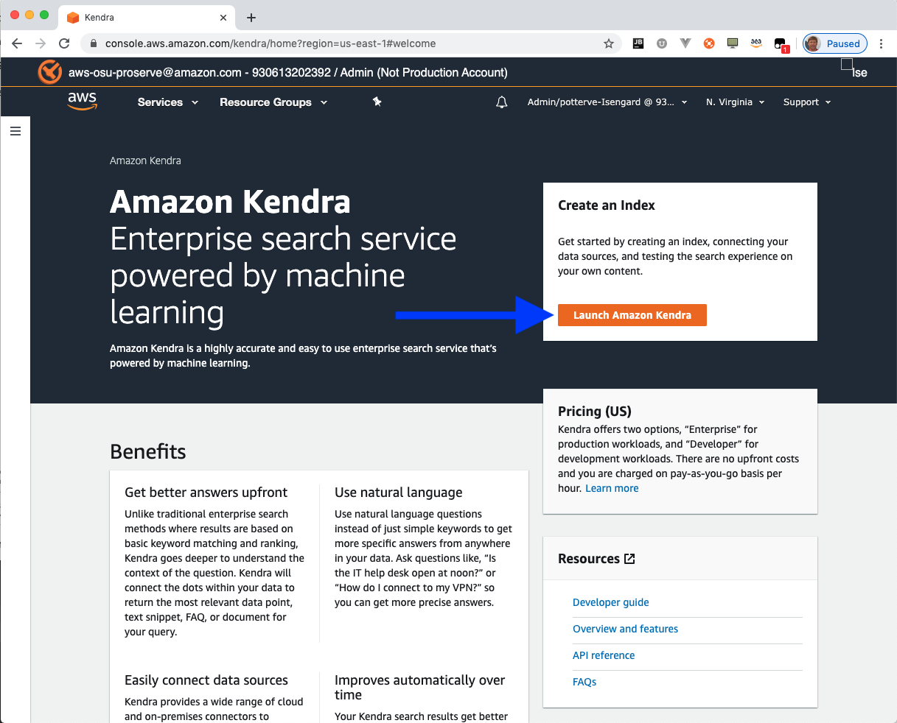

2) Create an Index

***Also Note that Kendra can take upwards of 30 minutes to create an index.*** 

While the Index is being created be sure to checkout other steps in the Workshop.

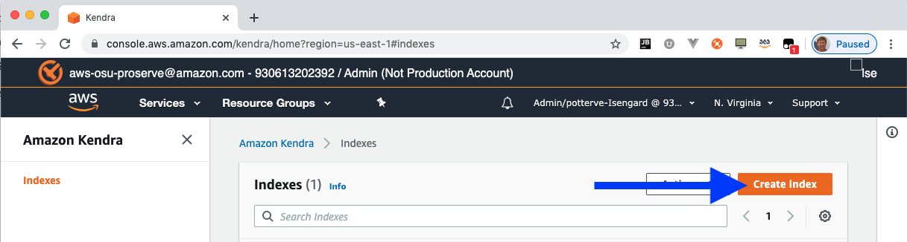
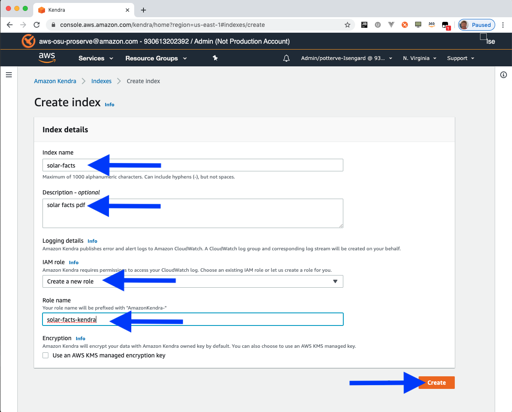

3) Create an S3 bucket that starts with the name 'qna' which will hold objects that Kendra will index. Then upload the pdfs from workshops/reinvent2019/kendra-assets 
to this bucket. As long as the bucket starts with 'qna', QnABot can provide signed urls to access the content
that Kendra has indexed.    

4) From the Kendra Console open the new Kendra Index you created and add a data source that targets your S3 bucket. 
When you "Add a Data Source" and select Amazon S3 as the Connector, make sure to select "Create a new role" to give Kendra
permission to access this S3 buckert. 

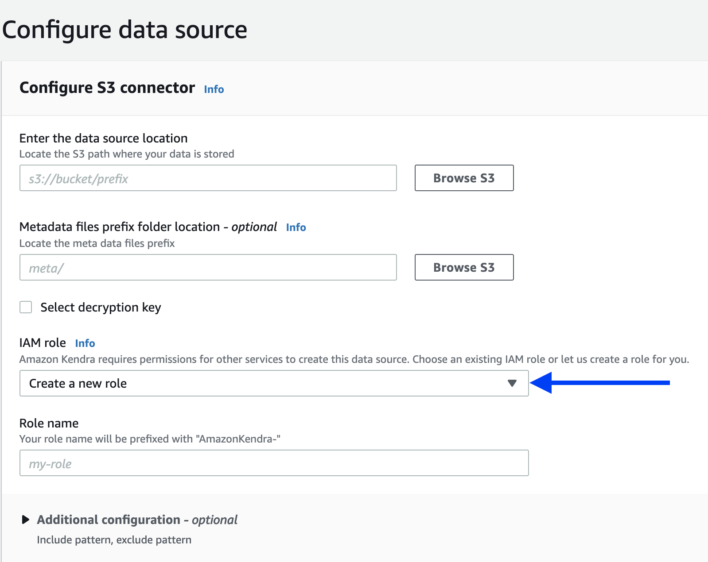

***Make sure this new data source is synced before proceeding.***

5) Set Custom Property 'ALT_SEARCH_KENDRA_INDEXES'

This custom property will contain a string value that specifies an array of 
Kendra indexes to search. At least one index must be specified. Until this custom property 
is set in QnABot, use of Kendra as a fallback mechanism will return an error. 

You can override this setting using SSM Parameter Store to add a new key/value pair as a custom property. 
Find your custom property name from the QnABot CF stack outputs. The key in the QnABot CF stack outputs is 
'CustomSettingsSSMParameterName'. It will have a value similar to 

```
CFN-CustomQnABotSettings-EOVHQJcYx9Ms
```

Find your CustomSettingsSSMParameterName property name in CloudFormation. Open the AWS Systems Manager console. 
Navigate to ParameterStore. Filter the list using your custom property name name. Open and Edit the parameter. 

Add the following content but use the Kendra IndexId rather than the ID below. This is a json object. You may already
have set a new custom property if you performed step 10 below. As such you may need to 
add to the object a new key/value pair rather than replacing the entire string. 

```
{"ALT_SEARCH_KENDRA_INDEXES":"[\"857710ab-9637-4a46-910f-9a1456d02596\"]"}
```

**Note the Escaped Quote marks around the array of Kendra index ids are required**

**Don't forget to use your Kendra Index ID rather than the one in the sample**

6) Test out a question

```
What are the layers of the Sun?

Is there such a thing as sunspots?
``` 

You'll notice that elastic search has no curated answers for these questions. Instead of saying sadly we could not answer the question,
kendra is searched and the answer and discovered text is returned. The links are clickable as well. By default,
signed URLs are used to access the document and are set to expire in 5 minutes.

***Important note. Please delete your data source and kendra index when done with this exercise. You have 30 days trial but
after that charges to the account will occur.***

[*^ back to top*](#solar-association-deploying-and-customizing-a-ready-made-question-and-answer-bot)
 
* * *

## Step 10 - Supporting multiple languages in QnABot:

QnABot version 2.6.0 supports use of multiple languages. 

Once enabled, if the user enters a question in a language other than english, QnABot will attempt to return an answer in 
the other language. Its does this by using AWS Comprehend to identify the language from the text provided. If Comprehend
can identify the language based on a configured minimum confidence, QnABot will serve up content based on that locale.
It converts the question to English from the source language and performs a lookup of the answer in Elastic Search 
just as it normally does. Once it finds the question, QnABot will serve up the configured answer. The answers help
the process by specifying locale specific content as described in 3 below. 

Users can also set a preferred language whereby QnABot will always attempt to respond with content in the chosen
locale.  If the user sets the preferred language to be Spanish, QnABot will always try and serve up content using
Spanish if possible. 

By default this feature is disabled. Use the following three steps to enable and configure this feature. Step 1 enables 
the feature. Step 2 loads in two questions from this extension that allow the user to select a preferred language. The 
defaults supplied in this question are English, Spanish, French, German, and Italian. For this step in the workshop
perform all 3. 

1) Custom Property

a) QnABot uses a property named ENABLE_MULTI_LANGUAGE_SUPPORT. It is a boolean and has a default value of false. 
You can override this setting using SSM Parameter Store to add a new key/value pair as a custom property. 
Find your custom property name from the QnABot CF stack outputs. The key in the QnABot CF stack outputs is 
'CustomSettingsSSMParameterName'. If will have a value similar to 

```
CFN-CustomQnABotSettings-EOVHQJcYx9Ms
```

b) Find your CustomSettingsSSMParameterName property name in CloudFormation. Open the AWS Systems Manager console. 
Navigate to ParameterStore. Filter the list using your custom property name name. Open and Edit the parameter. 

Set the value to be the following and save the changes.

```
{"ENABLE_MULTI_LANGUAGE_SUPPORT":true}
```

2) Use the Designer UI to import the Sample/Extension named Language / Multiple Language Support. 

This will add two questions to the system: Language.000 and Language.001. 

Language.000 provides a question that allows the user to set the current sessions preferred output saying a simple word 
such as French, German, or Spanish, or Italian. 

Language.001 resets the preferred language. This can be performed by saying or typing 'reset language' or 'detect language'. 
You can also input using your language of choice assuming AWS Translate can translate the input back to English. 

Once you've imported this extension question try typing the question 'Spanish'. You should see a Spanish response. 

Next enter 'English' and you will have switched your preference back to English. 

Next enter 'reset language' and your preference will be reset and auto detection will occur again.

The answer for Language.000 uses the following handlebar syntax

```
{{#setLang 'fr' false}} D'accord. J'ai défini votre langue préférée sur l'anglais. {{/setLang}}
{{#setLang 'es' false}} Okay. He configurado tu idioma preferido al inglés.  {{/setLang}}
{{#setLang 'de' false}} In Ordnung. Ich habe Ihre bevorzugte Sprache auf Englisch eingestellt. {{/setLang}}
{{#setLang 'it' false}} Ok. Ho impostato la tua lingua preferita sull'inglese.{{/setLang}}
{{#setLang 'en' true}} Ok. I've set your preferred language to English. {{/setLang}}
```

The helper function setLang performs the necessary processing based on the language/locale detected by Comprehend. To
add support for other languages just extend the answer in Language.000 with additional locales. 

3) In order to serve up content 

Last step is to modify answers in questions to respond in multiple languages. Lets modify the question sun.1, 
'Tell me about the Sun' to support an answer in Spanish. 

a) In the Content Designer open the question sun.1.

Replace the answer with

```
{{#ifLang 'es'}}
Nuestro sol tiene 4.600 millones de años. Se considera una enana amarilla con un diámetro de 1,392,684 kilómetros y una circunferencia de 4,370,005 kilómetros. Tiene una masa que es igual a 333,060 tierras y una temperatura superficial de 5,500 grados centígrados. ¡Muy caliente!
{{/ifLang}}
{{#defaultLang}}
Our sun is 4.6 billion years old. Its considered a yellow dwarf with a diameter of 1,392,684 kilometers and a circumference of 4,370,005 kilometers. It has a mass that is equal to 333,060 earths and a surface temperature of 5,500 degrees celsius. Really Hot!
{{/defaultLang}}
```

b) Under Advanced, replace the markdown field with

```
{{#ifLang 'es'}}
## Algunos hechos
* Nuestro sol tiene 4.600 millones de años.
* Se considera una enana amarilla
* Tiene una masa igual a 333,060 tierras.
{{/ifLang}}
{{#defaultLang}}
## Some facts
* Our sun is 4.6 billion years old
* It is considered a yellow dwarf
* It has a mass that is equal to 333,060 earths
{{/defaultLang}}
```

c) Under advanced, replace the SSMl with 
```
{{#ifLang 'es'}}
<speak> Our Sun is 4.6 billion years old. It is considered a yellow dwarf and has a mass that is equal to 333,060 earths.</speak>
{{/ifLang}}
{{#defaultLang}}
<speak> Our Sun is 4.6 billion years old. It is considered a yellow dwarf and has a mass that is equal to 333,060 earths.</speak>
{{/defaultLang}}
```

Notice the use of the handlebar function ifLang. It takes locale as a parameter. This tells QnABot to serve up the 
Spanish answer if the detected input language is Spanish or if the user has set a preference of Spanish.

Also notice the use of the function defaultLang. This function needs to be positioned last in the answer block and will be
the default response should the question not be configured with the user's preferred language or the detected language. 

d) Save this question and try asking 'Tell me about the Sun'. You'll see an English response.

e) Try asking 'Cuéntame sobre el sol'. This should respond with a Spanish answer.

f) Invoke the input 'Spanish' to switch your preference to Spanish and then the question 'Tell me about the Sun'. 
You should observe the Spanish answer. 

g) Invoke the input "reset language" and then 'Tell me about the Sun'. You should observe an English response. 

[*^ back to top*](#solar-association-deploying-and-customizing-a-ready-made-question-and-answer-bot)

* * *

## Step 11 - New Features:

QnABot version 2.4.0 provides some significant new features.

November 2019 (v2.4.0) – Customizable configuration settings, minimized need to rebuild Lex bot when adding new content, 
improved accuracy using keyword filters, configurable response when answer isn’t found, improved handling of user 
feedback with integrated thumbs up/down buttons in web client, automated question testing in Content Designer, 
support variable substitution and conditional answers using ‘handlebars’ templates in Content Designer.

For a description of these features be sure to checkout the blog post at [New Features](https://aws.amazon.com/blogs/machine-learning/creating-a-question-and-answer-bot-with-amazon-lex-and-amazon-alexa/#new-features-log)

[*^ back to top*](#solar-association-deploying-and-customizing-a-ready-made-question-and-answer-bot)

* * *

## Finished! Please fill out evaluation cards!

Congratulations on completing the labs, or at least giving it a good go.  Thanks for helping Solar Universal publish a 
chatbot and reduce the load on its call center! 

* * *

## Workshop Cleanup

This is really important because if you leave stuff running in your account, it will continue to generate charges.  
Certain things were created by CloudFormation and certain things were created manually throughout the workshop.  
Follow the steps below to make sure you clean up properly.

Delete manually created resources throughout the laUbs:

* Use your AWS Cloud9 IDE's terminal to remove the sample web site
```
cd aws-ai-qna-bot/workshops/reinvent2019/scripts
./removewebsite.sh
```
* Use the AWS Cloud9 Dashboard to Delete your development environment

* Use the Amazon Connect console to delete your call center instance

* Remove any Twilio resources used to establish an SMS channel

Finally, [delete the CloudFormation stacks](http://docs.aws.amazon.com/AWSCloudFormation/latest/UserGuide/cfn-console-delete-stack.html) 
launched at the beginning of the workshop to clean up the rest.  If the stack deletion process encountered errors, look at the Events tab in the CloudFormation dashboard, and you'll see what steps failed.  It might just be a case where you need to clean up a manually created asset that is tied to a resource goverened by CloudFormation.
* Use the AWS CloudFormation console to delete the QnABot stacks you launched
  * lex-web-ui
  * qnabotworkshop
  
[*^ back to the top*](#solar-association-deploying-and-customizing-a-ready-made-question-and-answer-bot)
